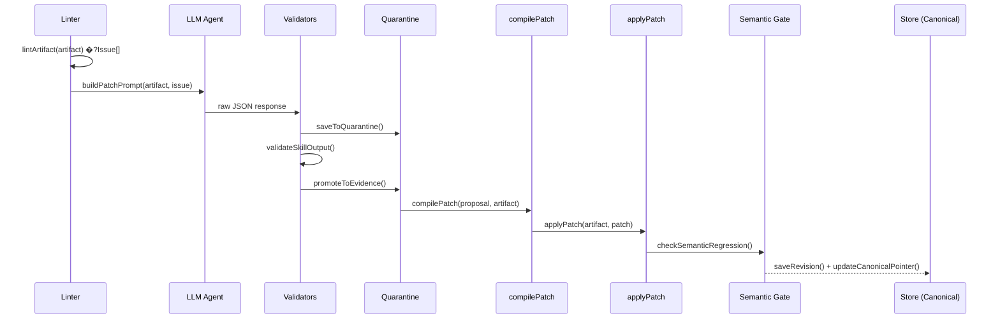
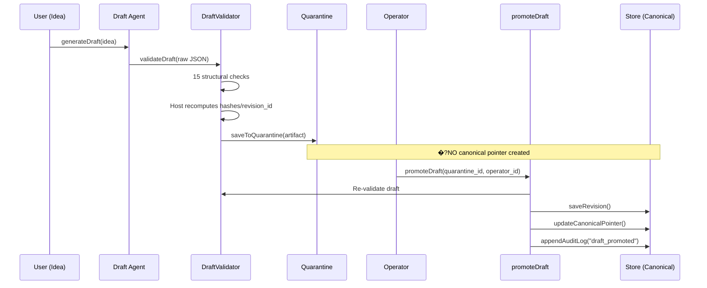
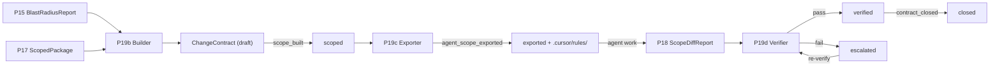
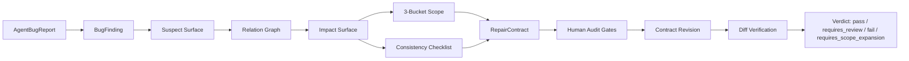
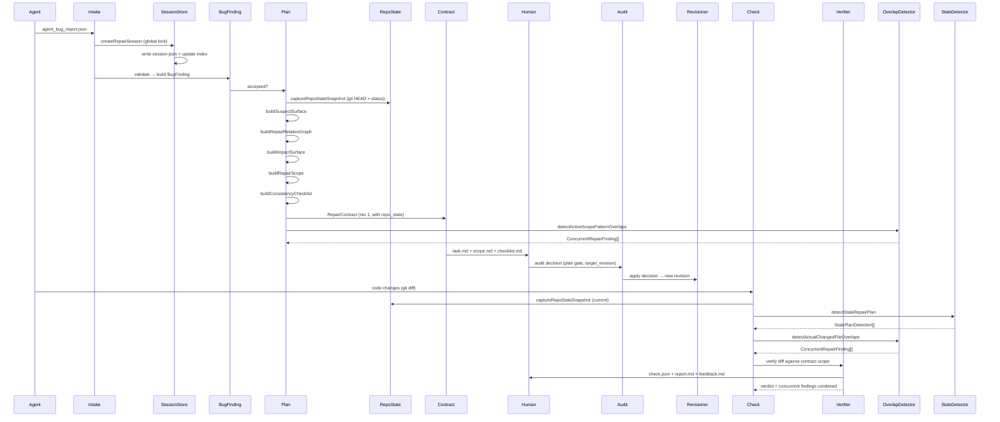
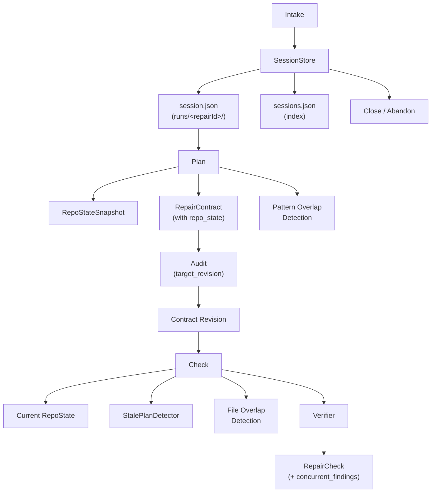

# Pantheon �?System Architecture Walkthrough

> Generated: 2026-04-29 | Phase: P28-0 | Tests: 1,839 Vitest + 6 Kotlin | Source: ~40,000 LoC (180 files) | Scripts: ~11,800 LoC (50 files) | Test LoC: ~29,000 (157 files) | Total: ~80,800 LoC (375 files)

---

## 1. System Overview

Pantheon is a **boundary mapping and constraint compiler** that treats architecture documents as structured JSON artifacts under version control, with deterministic linting, LLM-assisted patching, operator-gated release decisions, and a queryable boundary graph that traces every constraint from intent to generated code.

``mermaid
graph TD
    subgraph "Trust Boundary"
        LLM["LLM (DeepSeek)"]
    end
    subgraph "Host (Deterministic)"
        VA["Validators"] --> QU["Quarantine"]
        QU --> EV["Evidence"]
        LI["Linter"] --> IS["Issues"]
        IS --> PA["Patch Agent"]
        PA --> LLM
        LLM --> VA
        EV --> AP["applyPatch"]
        AP --> SR["Semantic Regression"]
        SR --> ST["Artifact Store"]
    end
    subgraph "Operator"
        CO["Cockpit UI"] --> RD["Release Decision"]
        RD --> ST
    end
    ST --> CO
```

**Core invariant**: LLM output never directly modifies canonical state. Every LLM output enters quarantine, is validated by host, and requires deterministic gates before promotion.

---

## 2. Directory Layout

```
pantheon/
├── src/                          # ~24,000 LoC across 112 files
�?  ├── types.ts                  # §4 Core type definitions (250 lines)
�?  ├── hash.ts                   # §5 SHA-256 hashing (146 lines)
�?  ├── stableSerialize.ts        # Deterministic JSON serialization (31 lines)
�?  ├── schemaRegistry.ts         # §6 Zod schema registry (349 lines)
�?  ├── artifactStore.ts          # §3 File-system JSON store (373 lines)
�?  ├── linter.ts                 # §9 Single-artifact linter (421 lines)
�?  ├── crossArtifactLinter.ts    # P7a Cross-artifact linter (245 lines)
�?  ├── issuePrioritizer.ts       # P7b Issue priority tiers (86 lines)
�?  ├── validators.ts             # §8 Quarantine gate (313 lines)
�?  ├── applyPatch.ts             # §11 Patch compiler + applicator (251 lines)
�?  ├── applyOverridePatch.ts     # §14 Human override patches (274 lines)
�?  ├── semanticRegression.ts     # §12 Semantic regression gate (263 lines)
�?  ├── integrityCheck.ts         # HARD-002 Full store integrity scan (593 lines)
�?  ├── pipeline.ts               # §16 Full pipeline orchestrator (349 lines)
�?  ├── renderMarkdown.ts         # Artifact �?Markdown renderer (109 lines)
�?  ├── draftValidator.ts         # P8-001 Draft structural gate (272 lines)
�?  ├── domainProfile.ts          # P9 Domain constraint loader (112 lines)
�?  ├── domainQualityEvaluator.ts # P9 Draft quality evaluator (430 lines)
�?  ├── ideaToDraft.ts            # P8-003 Idea→Draft pipeline (120 lines)
�?  ├── promoteDraft.ts           # P8-003 Quarantine→Canonical promotion (141 lines)
�?  ├── server.ts                 # Express dev server (83 lines)
�?  ├── cockpit/                  # Release decision subsystem
�?  �?  ├── types.ts              # Cockpit-specific types (148 lines)
�?  �?  ├── releaseServer.ts      # Fastify API server (318 lines)
�?  �?  ├── reportGenerator.ts    # Trial �?report data (278 lines)
�?  �?  ├── backlogExport.ts      # Residual �?backlog items (144 lines)
�?  �?  ├── decisionLog.ts        # P7b Append-only decision JSONL (66 lines)
�?  �?  └── riskRegister.ts       # P7b Append-only risk JSONL (77 lines)
�?  ├── handoff/                  # P11 Implementation handoff projection
�?  �?  ├── types.ts              # Handoff package types (271 lines)
�?  �?  ├── contractProjector.ts  # 16 mandatory term definitions (312 lines)
�?  �?  ├── conflictProjector.ts  # 13-field-group conflict matrix (190 lines)
�?  �?  ├── dataModelProjector.ts # 6 Room + 8 DTO projections (340 lines)
�?  �?  ├── stateMachineProjector.ts # 3 state machines (190 lines)
�?  �?  ├── forbiddenAssumptions.ts  # 8 hard constraints (105 lines)
�?  �?  ├── taskProjector.ts      # 10 implementation tasks (290 lines)
�?  �?  ├── handoffReadinessEvaluator.ts # 12 readiness checks + uncertainty gate
�?  �?  ├── generateHandoffPackage.ts   # Orchestrator + markdown renderer (352 lines)
�?  �?  ├── structuralTermResolver.ts   # P11.1 term closure (365 lines)
�?  �?  ├── uncertaintyRegister.ts      # P13-C blocking gate helper (55 lines)
�?  �?  └── handoffTestEvaluator.ts     # P11.2 8-class violation detection (300 lines)
�?  ├── boundary/                 # P14/P15 Boundary mapping & blast radius
�?  �?  ├── boundaryTypes.ts     # Graph node/edge/layer types (120 lines)
�?  �?  ├── boundaryGraph.ts     # Graph builder: 185 nodes, 1233 edges (345 lines)
�?  �?  ├── boundaryGatesAndQueries.ts  # 6 gates + queryDownstream/Upstream/BlastSeeds (300 lines)
�?  �?  └── blastRadius.ts      # P15 Blast radius engine (411 lines)
�?  ├── codegen/                  # P12 Deterministic code generation
�?  �?  └── kotlinGenerator.ts   # Handoff �?Kotlin codegen (1200 lines)
�?  ├── changeContract/            # P19 Change contract governance
�?  �?  ├── types.ts              # Domain types: ChangeContract, scope, decision (224 lines)
�?  �?  ├── lifecycle.ts          # State machine: 7 statuses, guarded transitions (348 lines)
�?  �?  ├── changeContractBuilder.ts  # P19b: P15+P17 �?contract with scope hash (365 lines)
�?  �?  ├── agentScopeExporter.ts     # P19c: Contract �?agent instructions (258 lines)
�?  �?  ├── changeContractVerifier.ts # P19d: P18 report �?verification verdict (217 lines)
�?  �?  └── lite/                     # P20a ChangeContract Lite (bootstrap)
�?  �?      ├── types.ts              # Lite types + P22 structured details (100 lines)
�?  �?      ├── changeContractLiteBuilder.ts   # Observations �?Lite contract (280 lines)
�?  �?      ├── changeContractLiteValidator.ts # Lite-specific validation (90 lines)
�?  �?      └── changeContractLiteRenderer.ts  # Lite �?Markdown projection (90 lines)
�?  ├── diffWorkflow/               # P21 Diff-to-ChangeContract workflow
�?  �?  ├── types.ts              # GitDiffSummary, AgentScopeLite, violation hints (100 lines)
�?  �?  ├── gitDiffReader.ts      # Git diff + untracked + --changed override (120 lines)
�?  �?  ├── agentScopeLiteBuilder.ts # Contract �?agent scope + violation_hints (320 lines)
�?  �?  ├── diffVerifier.ts       # Diff compliance against scope (140 lines)
�?  �?  └── reviewerReportRenderer.ts # Scope vs diff reviewer report (190 lines)
�?  ├── agentFeedback/              # P22 Agent Feedback Protocol
�?  �?  ├── types.ts              # AgentFeedback, AgentViolation, repair, retry (160 lines)
�?  �?  ├── diffFeedbackBuilder.ts # Verification �?structured feedback (370 lines)
�?  �?  ├── agentFeedbackValidator.ts # Schema + invariant checks (130 lines)
�?  �?  └── agentFeedbackRenderer.ts  # Feedback �?Markdown (90 lines)
�?  ├── agentTrial/                 # P23 Agent Protocol Usability Trial
�?  �?  ├── types.ts              # AgentTaskPacket, AttemptComparison, TrialReport (130 lines)
�?  �?  ├── agentTaskPacketBuilder.ts  # Scope + scenario �?agent task packet (100 lines)
�?  �?  ├── agentTaskPacketRenderer.ts # Packet �?Markdown (60 lines)
�?  �?  ├── attemptComparison.ts       # Cross-attempt violation matching + feedback_effect (230 lines)
�?  �?  ├── petTrialScenarios.ts       # Pet trial scenario definitions (70 lines)
�?  �?  └── agentTrialReportRenderer.ts # Trial report �?Markdown (90 lines)
�?  ├── repoObservation/            # P20a Deterministic repo observation
�?  �?  ├── types.ts              # RepoObservations, ObservedFile, ImportEdge, etc. (280 lines)
�?  �?  ├── pathUtils.ts          # Repo-relative path normalization (110 lines)
�?  �?  ├── fileClassifier.ts     # Path �?bucket/language classification (90 lines)
�?  �?  ├── observationHasher.ts  # Deterministic observation hash (100 lines)
�?  �?  ├── importExtractor.ts    # Regex import/export/require extraction (100 lines)
�?  �?  ├── testMapper.ts         # Path-convention test mapping (120 lines)
�?  �?  ├── sensitivePathDetector.ts  # Keyword-based sensitive path detection (60 lines)
�?  �?  ├── codeownersParser.ts   # Conservative CODEOWNERS parser (80 lines)
�?  �?  ├── repoScanner.ts        # Orchestrator: scan �?observations (220 lines)
�?  �?  ├── repoObservationValidator.ts # Structural observation validation (100 lines)
�?  �?  ├── bootstrapReportRenderer.ts  # Observations �?Markdown report (130 lines)
�?  �?  └── python/                 # P25 Conservative Python observation sidecar
�?  �?      ├── types.ts            # Python sidecar types + quality taxonomy
�?  �?      ├── pythonObservationEnhancer.ts # Post-scan Python signal enhancer
�?  �?      ├── pythonGovernanceRenderer.ts  # Scope-aware Python governance renderer
�?  �?      └── saleorObservationReportRenderer.ts # Repo-wide Saleor observation report v2
  └── repair/                    # P28/P29 Impact-Aware Repair Protocol
      ├── session/              # P29 Multi-Agent Concurrency Governance
      │   ├── repairSessionTypes.ts       # 16-state FSM, RepoStateSnapshot, ConcurrentRepairFinding (80 lines)
      │   ├── atomicWrite.ts              # Crash-safe temp-then-rename writes (16 lines)
      │   ├── repairSessionIndex.ts       # Denormalized index builder (30 lines)
      │   ├── repairSessionStore.ts       # Session CRUD + 2-tier file locking (252 lines)
      │   ├── repoStateSnapshot.ts        # Git HEAD + working-tree snapshot (53 lines)
      │   ├── stalePlanDetector.ts        # Base SHA mismatch + dirty-tree detection (43 lines)
      │   └── activeRepairOverlapDetector.ts # Pattern-level + file-level scope conflict detection (182 lines)
      ├── types.ts              # All repair protocol types + Zod schemas (370 lines)
      ├── repairUtils.ts        # deterministicId, globToRegex, matchesPattern (57 lines)
      ├── repairArtifactLayout.ts # .pantheon/repair/{runs/<repairId>/} artifact paths (85 lines)
      ├── repairAuditLog.ts     # Append-only JSONL audit log (23 lines)
      ├── agentBugReportValidator.ts # Agent bug report → validated source report (146 lines)
      ├── bugFindingBuilder.ts  # BugFinding construction, user report synthesis (62 lines)
      ├── suspectSurfaceBuilder.ts # Explicit suspects + failing-test mapping → surface (93 lines)
      ├── repairRelationGraphBuilder.ts # Flat DAG: 7 relation types + caps (126 lines)
      ├── impactSurfaceBuilder.ts # Full impact picture: files, tests, risk, unknowns (254 lines)
      ├── repairScopeBuilder.ts # 3-bucket scope with precedence (162 lines)
      ├── consistencyChecklistBuilder.ts # Risk-profile-aware checklist (137 lines)
      ├── repairContractBuilder.ts # Master orchestrator: all builders → contract (145 lines)
      ├── humanAuditDecisionWriter.ts # Human decision creation + Zod validation (46 lines)
      ├── repairPlanRevisioner.ts # Decision → mutated contract revision (112 lines)
      ├── repairVerifier.ts     # File-level diff verification + verdict (138 lines)
      ├── repairTaskRenderer.ts # Contract → repair task Markdown (195 lines)
      ├── repairReportRenderer.ts # Check → repair report Markdown (57 lines)
      └── repairFeedbackRenderer.ts # Check → agent feedback Markdown (33 lines)
�?  └── trial/                    # LLM trial infrastructure
�?      ├── llmClient.ts          # LLM client interface (13 lines)
�?      ├── deepseekAdapter.ts    # DeepSeek HTTP adapter (65 lines)
�?      ├── fakeLlmClient.ts      # Test mock (24 lines)
�?      ├── llmPatchAgent.ts      # LLM prompt builder + parser (194 lines)
�?      ├── draftAgent.ts         # P8-002/P10 Draft generation prompt (550 lines)
�?      ├── trialRunner.ts        # Single-artifact trial loop (485 lines)
�?      ├── multiArtifactTrialRunner.ts  # P7a Multi-artifact loop (297 lines)
�?      ├── trialArtifact.ts      # Seed artifact factory (357 lines)
�?      ├── interfaceSpecSeed.ts  # P7a InterfaceSpec seed (230 lines)
�?      ├── moduleSpecSeed.ts     # P7b ModuleSpec seed (181 lines)
�?      ├── petSystemSeeds.ts     # P10 Pet triage baseline seeds (440 lines)
�?      ├── rejectionTaxonomy.ts  # Rejection classification (198 lines)
�?      ├── trialValidation.ts    # Post-trial integrity check (61 lines)
�?      └── runLiveTrial.ts       # Live trial entry point (129 lines)
├── test/                         # ~29,000 LoC, 1,839 tests, 157 files
├── scripts/                      # ~7,000 LoC, 39 scripts (P6–P23)
├── cockpit/                      # HTML UI (release.html, multi-release.html)
└── data/dogfood/                 # Dogfood data
    ├── p28-repair/              # P28-5 repair governance dogfood (3 repos × 18 cases)
    ├── p10/                      # P10–P15 artifacts + evidence
    ├── p20a1/                    # Self-scan trial outputs
    ├── p20a3/                    # Golden observation baseline
    ├── p22/                      # Agent feedback demo outputs
    ├── p23.1/                    # Real agent trial outputs (pet-triage-app)
    └── p25-saleor/               # Saleor-scale Python governance proof artifacts
```

---

## 3. Sixteen Architectural Layers

```mermaid
graph LR
    L1["Layer 1: Types"] --> L2["Layer 2: Hash"]
    L2 --> L3["Layer 3: Store"]
    L3 --> L4["Layer 4: Gates"]
    L4 --> L5["Layer 5: Pipeline"]
    L5 --> L6["Layer 6: Trial"]
    L6 --> L7["Layer 7: Cockpit"]
    L7 --> L8["Layer 8: Handoff"]
    L8 --> L9["Layer 9: Codegen"]
    L9 --> L10["Layer 10: Boundary"]
    L10 --> L11["Layer 11: Blast Radius"]
    L11 --> L12["Layer 12: Repo Observation"]
    L12 --> L13["Layer 13: Diff Workflow"]
    L13 --> L14["Layer 14: Agent Feedback"]
    L14 --> L15["Layer 15: Repair Protocol"]
    L15 --> L16["Layer 16: Repair Concurrency"]
```



### Layer 1 �?Type System

| File | Purpose | Key exports |
|---|---|---|
| [types.ts](file:///h:/Boom/pantheon/src/types.ts) | Core data model | `Artifact`, `CommitmentBlock`, `Issue`, `PatchProposal`, `ArtifactPatch`, `OverridePatch`, `CanonicalPointer`, `AuditEntry` |

**Boundary**: Pure types, no logic, no imports. Every other module depends on this.

### Layer 2 �?Hashing & Serialization

| File | Purpose | Key exports |
|---|---|---|
| [hash.ts](file:///h:/Boom/pantheon/src/hash.ts) | SHA-256 content hashing | `computeBlockContentHash()`, `computeRevisionId()`, `getHashMeta()` |
| [stableSerialize.ts](file:///h:/Boom/pantheon/src/stableSerialize.ts) | Deterministic JSON key ordering | `stableSerialize()` |

**Boundary**: Depends only on Layer 1. All hash computation is deterministic: same content �?same hash, always.

### Layer 3 �?Storage

| File | Purpose | Key exports |
|---|---|---|
| [artifactStore.ts](file:///h:/Boom/pantheon/src/artifactStore.ts) | File-system JSON store | `saveRevision()`, `loadRevision()`, `updateCanonicalPointer()`, `loadCanonicalPointer()`, `createArtifact()`, `saveToQuarantine()`, `loadFromQuarantine()`, `promoteToEvidence()`, `appendAuditLog()` |
| [schemaRegistry.ts](file:///h:/Boom/pantheon/src/schemaRegistry.ts) | Zod schema validation | `validateForWrite()`, `validateForRead()`, `getSchema()`, `getCurrentVersion()` |

**Boundary**: Depends on Layer 1+2. Store layout:
```
data/revisions/{artifact_id}/{revision_id}.json   # immutable
data/canonical/{artifact_id}.json                  # pointer only
data/quarantine/{filename}.json                    # untrusted LLM output
data/evidence/{filename}.json                      # validated output
data/audit/{artifact_id}.jsonl                     # append-only
data/projections/{artifact_id}.md                  # human-readable
```

### Layer 4 �?Gates (Deterministic Validation)

| File | Purpose | Key exports |
|---|---|---|
| [validators.ts](file:///h:/Boom/pantheon/src/validators.ts) | Quarantine �?evidence gate | `validateSkillOutput()` |
| [linter.ts](file:///h:/Boom/pantheon/src/linter.ts) | Single-artifact lint rules | `lintArtifact()` |
| [crossArtifactLinter.ts](file:///h:/Boom/pantheon/src/crossArtifactLinter.ts) | Cross-artifact link checks | `crossLintArtifacts()`, `buildCrossBlockIndex()` |
| [issuePrioritizer.ts](file:///h:/Boom/pantheon/src/issuePrioritizer.ts) | Deterministic issue sorting | `prioritizeIssues()`, `getIssueTier()`, `countByTier()` |
| [applyPatch.ts](file:///h:/Boom/pantheon/src/applyPatch.ts) | Patch compilation + application | `compilePatch()`, `applyPatch()` |
| [applyOverridePatch.ts](file:///h:/Boom/pantheon/src/applyOverridePatch.ts) | Human override patches | `applyOverridePatch()` |
| [semanticRegression.ts](file:///h:/Boom/pantheon/src/semanticRegression.ts) | Semantic regression detection | `checkSemanticRegression()` |
| [integrityCheck.ts](file:///h:/Boom/pantheon/src/integrityCheck.ts) | Full store integrity scan | `integrityCheck()` |
| [draftValidator.ts](file:///h:/Boom/pantheon/src/draftValidator.ts) | P8 LLM draft structural gate | `validateDraft()` |

**Boundary**: All gates are **deterministic** �?no LLM calls. They only read/compare, never write canonical state.

**Linter rules** (4 local + 4 cross):

| Rule | Type | Severity |
|---|---|---|
| `empty_block_text` | local | high |
| `undefined_term` | local | medium |
| `domain_irrelevant_content` | local | medium |
| `redundant_narrative` | local | low |
| `orphan_interface_contract` | cross | medium |
| `stale_link` | cross | high |
| `orphan_module_contract` | cross | medium |
| `stale_interface_link` | cross | high |

**Priority tiers** (0=highest):

| Tier | Issue types |
|---|---|
| 0 | `integrity_corruption` (reserved) |
| 1 | `stale_link`, `stale_interface_link` |
| 2 | `orphan_interface_contract`, `orphan_module_contract` |
| 3 | `unsafe_canonical_commit` |
| 4 | `empty_block_text` |
| 5 | `domain_irrelevant_content` |
| 6 | `undefined_term` |
| 7 | `redundant_narrative` |

### Layer 5 �?Pipeline & Promotion

| File | Purpose | Key exports |
|---|---|---|
| [pipeline.ts](file:///h:/Boom/pantheon/src/pipeline.ts) | Full lint→patch→apply→regress pipeline | `runPipeline()` |
| [ideaToDraft.ts](file:///h:/Boom/pantheon/src/ideaToDraft.ts) | Idea �?quarantined draft | `runIdeaToDraft()` |
| [promoteDraft.ts](file:///h:/Boom/pantheon/src/promoteDraft.ts) | Quarantine �?canonical (only path) | `promoteDraft()` |
| [renderMarkdown.ts](file:///h:/Boom/pantheon/src/renderMarkdown.ts) | Artifact �?human-readable MD | `renderMarkdown()` |

**Boundary**: Orchestrates Layer 4 gates. `promoteDraft()` is the **only** legitimate path for an LLM-generated draft to reach canonical.

### Layer 6 �?Trial Infrastructure

| File | Purpose | Key exports |
|---|---|---|
| [llmClient.ts](file:///h:/Boom/pantheon/src/trial/llmClient.ts) | LLM interface | `LlmClient` (interface) |
| [deepseekAdapter.ts](file:///h:/Boom/pantheon/src/trial/deepseekAdapter.ts) | DeepSeek HTTP client | `createDeepSeekClient()` |
| [llmPatchAgent.ts](file:///h:/Boom/pantheon/src/trial/llmPatchAgent.ts) | Patch prompt builder | `buildPatchPrompt()`, `generatePatchProposal()` |
| [draftAgent.ts](file:///h:/Boom/pantheon/src/trial/draftAgent.ts) | Draft generation prompt | `buildDraftPrompt()`, `generateDraft()` |
| [trialRunner.ts](file:///h:/Boom/pantheon/src/trial/trialRunner.ts) | Single-artifact trial loop | `runCycle()`, `runTrial()` |
| [multiArtifactTrialRunner.ts](file:///h:/Boom/pantheon/src/trial/multiArtifactTrialRunner.ts) | Multi-artifact trial loop | `runMultiArtifactTrial()` |
| [trialArtifact.ts](file:///h:/Boom/pantheon/src/trial/trialArtifact.ts) | ArchitectureDraft seed | `createTrialArtifact()` |
| [interfaceSpecSeed.ts](file:///h:/Boom/pantheon/src/trial/interfaceSpecSeed.ts) | InterfaceSpec seed | `createInterfaceSpecSeed()` |
| [moduleSpecSeed.ts](file:///h:/Boom/pantheon/src/trial/moduleSpecSeed.ts) | ModuleSpec seed | `createModuleSpecSeed()` |
| [rejectionTaxonomy.ts](file:///h:/Boom/pantheon/src/trial/rejectionTaxonomy.ts) | Rejection classification | `classifyRejection()`, `summarizeRejections()` |

**Boundary**: Only layer that calls LLM. All LLM output goes through Layer 4 gates before affecting state.

### Layer 7 �?Cockpit (Operator UI)

| File | Purpose | Key exports |
|---|---|---|
| [releaseServer.ts](file:///h:/Boom/pantheon/src/cockpit/releaseServer.ts) | Fastify HTTP server | `startReleaseServer()` |
| [reportGenerator.ts](file:///h:/Boom/pantheon/src/cockpit/reportGenerator.ts) | Trial data �?report | `generateTrialReport()`, `generateMultiArtifactReport()` |
| [backlogExport.ts](file:///h:/Boom/pantheon/src/cockpit/backlogExport.ts) | Residual �?backlog | `exportBacklog()` |
| [decisionLog.ts](file:///h:/Boom/pantheon/src/cockpit/decisionLog.ts) | Decision JSONL ledger | `appendDecisionEntry()`, `readDecisionLog()` |
| [riskRegister.ts](file:///h:/Boom/pantheon/src/cockpit/riskRegister.ts) | Risk JSONL ledger | `appendRiskEntries()`, `readRiskRegister()` |

**Boundary**: Human-facing. All decisions require operator signature. DecisionLog and RiskRegister are **not** Artifacts �?they are append-only system ledgers.

### Layer 8 �?Handoff Projection (P11)

| File | Purpose | Key exports |
|---|---|---|
| [types.ts](file:///h:/Boom/pantheon/src/handoff/types.ts) | Handoff package types | `ImplementationHandoffPackage`, `HandoffReadinessReport` |
| [contractProjector.ts](file:///h:/Boom/pantheon/src/handoff/contractProjector.ts) | 16 mandatory term definitions | `projectContractDefinitions()` |
| [conflictProjector.ts](file:///h:/Boom/pantheon/src/handoff/conflictProjector.ts) | 13 field-group conflict matrix | `projectConflictPolicyMatrix()` |
| [dataModelProjector.ts](file:///h:/Boom/pantheon/src/handoff/dataModelProjector.ts) | 6 Room + 8 DTO projections | `projectDataModels()` |
| [stateMachineProjector.ts](file:///h:/Boom/pantheon/src/handoff/stateMachineProjector.ts) | 3 state machines | `projectStateMachines()` |
| [forbiddenAssumptions.ts](file:///h:/Boom/pantheon/src/handoff/forbiddenAssumptions.ts) | 8 hard constraints | `projectForbiddenAssumptions()` |
| [taskProjector.ts](file:///h:/Boom/pantheon/src/handoff/taskProjector.ts) | 10 implementation tasks | `projectImplementationTasks()` |
| [handoffReadinessEvaluator.ts](file:///h:/Boom/pantheon/src/handoff/handoffReadinessEvaluator.ts) | 12-check quality gate | `evaluateHandoffReadiness()` |
| [generateHandoffPackage.ts](file:///h:/Boom/pantheon/src/handoff/generateHandoffPackage.ts) | Orchestrator + markdown | `generateHandoffPackage()` |
| [structuralTermResolver.ts](file:///h:/Boom/pantheon/src/handoff/structuralTermResolver.ts) | P11.1 term closure | `resolveStructuralTerms()` |
| [handoffTestEvaluator.ts](file:///h:/Boom/pantheon/src/handoff/handoffTestEvaluator.ts) | P11.2 cross-model output evaluator | `evaluateHandoffTestOutput()` |

**Boundary**: Read-only projection from canonical artifacts. Never modifies core Artifact schema. All structural content (fields, enums, states) is deterministic �?no LLM involvement. Source block provenance links every entry back to P10 architecture/interface/module blocks.

### Layer 9: Code Generation (P12/P13)

| File | Role | Entry Point |
|---|---|---|
| [kotlinGenerator.ts](file:///h:/Boom/pantheon/src/codegen/kotlinGenerator.ts) | Deterministic Kotlin codegen from handoff | `generateKotlin()` |

**Input**: `handoff_package.json` ONLY �?no upstream P10 artifacts, no chat context, no LLM.

**Output**: 12 Kotlin files to `data/dogfood/p10/implementation/generated/`:

| File | Content |
|---|---|
| `Enums.kt` | 4 state enums + ConflictType + ConflictPolicy |
| `Entities.kt` | 6 Room @Entity data classes with @PrimaryKey/@ColumnInfo |
| `Dtos.kt` | 8 network DTO data classes |
| `StateMachines.kt` | 3 state machine validators (allowed/forbidden/audit transitions) |
| `ConflictPolicy.kt` | ConflictPolicyRegistry with 13 field group mappings |
| `ConflictPolicyTests.kt` | 6 JUnit4 conflict policy tests |
| `contracts/Interfaces.kt` | 7 abstract interfaces |
| `contracts/Guards.kt` | PantheonGuards object (5 guard functions) |
| `contracts/ContractTests.kt` | 5 abstract contract test classes |
| `contracts/AbstractBases.kt` | 2 abstract base classes |
| `contracts/RetryPolicy.kt` | RetryBackoffPolicy |
| `contracts/TodoStubs.kt` | 6 TODO stub implementations |

**Boundary**: Pure deterministic projection. No LLM, no heuristic, no inference. Every `.kt` file has `generated_from` provenance header with package hash.

### Layer 10: Boundary Mapping Graph (P14)

| File | Role | Entry Point |
|---|---|---|
| [boundaryTypes.ts](file:///h:/Boom/pantheon/src/boundary/boundaryTypes.ts) | Node/edge/graph types | Types only |
| [boundaryGraph.ts](file:///h:/Boom/pantheon/src/boundary/boundaryGraph.ts) | Graph builder | `buildBoundaryGraph()` |
| [boundaryGatesAndQueries.ts](file:///h:/Boom/pantheon/src/boundary/boundaryGatesAndQueries.ts) | 6 consistency gates + queries | `runAllGates()`, `queryDownstream()`, `queryUpstream()` |

**Graph**: 185 nodes, 1233 edges, 6 layers (architecture/interface/module/handoff/generated/test).

**Node ID namespaces**: `blk:arch:`, `blk:iface:`, `blk:mod:`, `hc:`, `file:`, `sym:`, `test:`

**6 Consistency Gates**:

| # | Gate | Severity |
|---|---|---|
| 1 | Interface-relevant architecture coverage | warning |
| 2 | Implementation-relevant interface coverage | warning |
| 3 | Module to handoff coverage | warning |
| 4 | Handoff �?generated artifact coverage | **critical** |
| 5 | Risk + FA �?test coverage | **critical** |
| 6 | Generated reverse provenance | **critical** |

**Boundary**: Derived projection. Graph is rebuildable from `handoff_package.json` + generated file list. No graph database, no Kotlin AST parser, no LLM.

### Layer 11: Blast Radius Engine (P15)

| File | Role | Entry Point |
|---|---|---|
| [blastRadius.ts](file:///h:/Boom/pantheon/src/boundary/blastRadius.ts) | Impact analysis engine | `computeBlastRadius()` |

**Input**: Changed node IDs (from boundary graph) + boundary graph.

**Output**: `BlastRadiusReport` with:
- By-layer impact breakdown (arch/iface/module/handoff/files/symbols/tests)
- Risk amplification (high-risk conflict policies, forbidden assumptions)
- Critical paths (BFS shortest path from change �?test, top 20)
- Markdown report for human review
- Invalid node warnings

**Boundary**: Read-only graph traversal. No LLM, no graph mutation, no natural-language intent parsing.

### Layer 12: Repo Observation (P20a)

See §27 (Python Benchmark Expansion) for scanner, golden baseline, and observation infrastructure.

### Layer 13: Diff Workflow (P21)

See §22 (P21 Diff-to-ChangeContract Workflow) for plan → scope → verify → report pipeline.

### Layer 14: Agent Feedback (P22)

See §23 (P22 Agent Feedback Protocol) for structured violations, repair, and retry.

### Layer 15: Repair Protocol (P28)

See §29 (P28 Impact-Aware Repair Protocol) for the full repair lifecycle: suspect surface → relation graph → impact → scope → verify → audit.

### Layer 16: Repair Concurrency (P29)

**7 files, 656 LoC** — Multi-agent session lifecycle with file-based advisory locking, scope overlap detection, and stale-plan detection. Detailed in §30.

| File | Role | Key exports |
|---|---|---|
| [repairSessionTypes.ts](file:///h:/Boom/pantheon/src/repair/session/repairSessionTypes.ts) | Canonical types | `RepairSessionStatus` (16-state FSM), `RepairSession`, `RepoStateSnapshot`, `ConcurrentRepairFinding` |
| [atomicWrite.ts](file:///h:/Boom/pantheon/src/repair/session/atomicWrite.ts) | Crash-safe writes | `atomicWriteText()`, `atomicWriteJson()` |
| [repairSessionStore.ts](file:///h:/Boom/pantheon/src/repair/session/repairSessionStore.ts) | Session CRUD + locking | `createRepairSession()`, `loadRepairSession()`, `closeRepairSession()`, `updateSessionFromContract()` |
| [repairSessionIndex.ts](file:///h:/Boom/pantheon/src/repair/session/repairSessionIndex.ts) | Index builder | `upsertRepairSessionInIndex()` |
| [repoStateSnapshot.ts](file:///h:/Boom/pantheon/src/repair/session/repoStateSnapshot.ts) | Git snapshot | `captureRepoStateSnapshot()` |
| [stalePlanDetector.ts](file:///h:/Boom/pantheon/src/repair/session/stalePlanDetector.ts) | Staleness check | `detectStaleRepairPlan()` |
| [activeRepairOverlapDetector.ts](file:///h:/Boom/pantheon/src/repair/session/activeRepairOverlapDetector.ts) | Conflict detection | `detectActiveScopePatternOverlaps()`, `detectActualChangedFileOverlaps()` |

**Boundary**: Pure file-based persistence, no database. Locking via `openSync(path, "wx")` exclusive-create with polling (25ms interval, 5s timeout). Two-tier locks: global index lock + per-session locks. No distributed coordination.

---

## 4. Data Flow: Patch Cycle



## 5. Data Flow: Draft Cycle (P8)



---

## 6. Trust Boundary Map

```
┌──────────────────────────────────────────────────────────�?�?                   UNTRUSTED (LLM)                        �?�? generatePatchProposal()    generateDraft()               �?�? Raw JSON string output                                   �?└────────────────────────┬─────────────────────────────────�?                         �?raw string
                         �?┌──────────────────────────────────────────────────────────�?�?                QUARANTINE (Host Gate)                     �?�? validateSkillOutput()   validateDraft()                   �?�? JSON parse �?schema check �?structural check             �?�? Host recomputes: content_hash, revision_id               �?�? Host ignores: LLM-provided hashes, revision IDs          �?└────────────────────────┬─────────────────────────────────�?                         �?validated object
                         �?┌──────────────────────────────────────────────────────────�?�?             DETERMINISTIC GATES (Host)                    �?�? compilePatch()  applyPatch()  checkSemanticRegression()  �?�? All checks are pure functions: same input �?same output  �?└────────────────────────┬─────────────────────────────────�?                         �?candidate revision
                         �?┌──────────────────────────────────────────────────────────�?�?               CANONICAL (Immutable Store)                 �?�? saveRevision()  updateCanonicalPointer()                 �?�? Revisions are write-once, never overwritten              �?�? Canonical pointer is the ONLY mutable reference          �?└──────────────────────────────────────────────────────────�?```

---

## 7. Schema Versions

| Object Type | Current Version | Zod Schema |
|---|---|---|
| ArchitectureDraft | `architecture_draft@0.1.0` | `ArchitectureDraftV010Schema` |
| InterfaceSpec | `interface_spec@0.1.0` | `InterfaceSpecV010Schema` |
| ModuleSpec | `module_spec@0.1.0` | `ModuleSpecV010Schema` |
| Issue | `issue@0.1.0` | `IssueV010Schema` |
| PatchProposal | `patch_proposal@0.1.0` | `PatchProposalV010Schema` |
| OverridePatch | `override_patch@0.1.0` | `OverridePatchV010Schema` |

---

## 8. Test Coverage

| Test File | Tests | Target |
|---|---|---|
| hash.test.ts | 25 | Hash determinism, collision resistance |
| schema.test.ts | 27 | Zod schema validation, write/read path |
| artifactStore.test.ts | 26 | CRUD, immutability, canonical pointers |
| linter.test.ts | 22 | 4 lint rules |
| linter.domain.test.ts | 8 | Domain keyword matching |
| linter.redundancy.test.ts | 12 | Redundant narrative detection |
| crossArtifactLinter.test.ts | 14 | 4 cross-artifact rules |
| issuePrioritizer.test.ts | 12 | Tier sorting, budget tracking |
| validators.test.ts | 19 | Quarantine gate |
| applyPatch.test.ts | 29 | Patch compilation + application |
| applyOverridePatch.test.ts | 25 | Human override patches |
| semanticRegression.test.ts | 16 | 5 regression rules |
| integrityCheck.test.ts | 42 | Store-wide integrity scan |
| corruption.test.ts | 24 | Corruption detection + reporting |
| e2e.test.ts | 35 | Full pipeline E2E |
| draftValidator.test.ts | 19 | P8 draft structural gate |
| ideaToDraft.test.ts | 8 | Idea→Draft pipeline |
| promoteDraft.test.ts | 9 | Quarantine isolation + promotion |
| draftAgent.test.ts | 7 | Draft prompt structure |
| trialRunner.test.ts | 9 | Single-artifact trial loop |
| multiArtifactTrialRunner.test.ts | 10 | Multi-artifact trial loop |
| cockpit/*.test.ts | ~30 | Release server, reports, backlog, ledgers |
| petSystemSeeds.test.ts | 3 | P10 pet triage seed validation |
| llmRejection.test.ts | 16 | P6 rejection taxonomy |
| domainProfile.test.ts | 9 | P9 domain profile loading |
| domainQualityEvaluator.test.ts | 20 | P9 quality rules + rubric gates |
| cockpitFixtures.test.ts | 32 | P10 cockpit integration fixtures |
| structuralTermResolver.test.ts | 11 | P11.1 term resolution + readiness gate |
| handoffTestEvaluator.test.ts | 12 | P11.2 cross-model violation detection |
| kotlinGenerator.test.ts | 23 | P12 deterministic codegen + BUG-27 regression |
| **Total** | **643** | |

---

## 9. All Bugs Encountered

### Phase 2-4 (Foundation)

No bugs recorded in session context. Pre-existing code was stable.

### Phase 7b (Multi-Artifact)

| ID | Severity | Module | Description | Fix |
|---|---|---|---|---|
| BUG-1 | Medium | `multiArtifactTrialRunner.ts` | `skipped_due_to_budget` had dead code: `totalAttempted` computed but unused, two assignments overlapping | Deleted dead code, kept `= allFinalIssues.length` |
| BUG-2 | Low | `releaseServer.ts` | Unused imports `lintArtifact`, `crossLintArtifacts` | Deleted imports |
| BUG-3 | Low | `releaseServer.ts` | Dangling comment with wrong indentation outside handler scope | Deleted comment |
| BUG-4 | Medium | `draftValidator.ts` | Check 13 silently skipped missing `status` field without documenting intent | Clarified comment: missing status is OK, host defaults to `"draft"` |
| BUG-5 | Low | `crossArtifactLinter.ts` | `crossIssueSeq` is module-level mutable state (fragile but safe since internal functions are private) | Not fixed, documented |

### Phase 8 (Idea-to-Draft)

| ID | Severity | Module | Description | Fix |
|---|---|---|---|---|
| **BUG-6** | **HIGH** | `ideaToDraft.ts` | **`createArtifact()` called in pipeline, which executes `saveRevision()` + `updateCanonicalPointer()` �?draft leaked to canonical before cockpit signoff.** P8 core invariant violated. Trial's quarantine check was a false positive (only checked quarantine exists, not canonical absence). | Removed `createArtifact()`, kept only `saveToQuarantine()`. Added `promoteDraft()` as the only canonical entry path. Hardened trial script with canonical pointer absence check. |
| BUG-7 | Low | `schemaRegistry.ts` | `ModuleSpecV010Schema` missing from re-exports | Added to export list |
| BUG-8 | Low | `ideaToDraft.ts` | Unused `DraftValidationResult` type import | Removed import |
| BUG-9 | Medium | `ideaToDraft.ts` | Double-serialization: `JSON.stringify(artifact)` passed to `saveToQuarantine()` which calls `JSON.stringify()` again internally, producing escaped string in quarantine file | Pass raw object instead of pre-stringified JSON |
| BUG-10 | Low | `releaseServer.ts` | `loadCanonicalPointer` imported but unused after P9 endpoint additions | Removed unused import |
| BUG-11 | Low | `domainQualityEvaluator.ts` | `Issue` type imported but unused �?module uses its own `DomainIssue` type | Removed unused import |
| **BUG-12** | **P1** | `domainQualityEvaluator.ts` | **Recommendation ignores profile rubric: `min_sections`, `min_blocks`, `max_blocks`, `min_required_concept_coverage` never consulted. A draft could be `accept_as_seed` while violating the profile's own thresholds.** | Added rubric violation checks as issues (high severity) + hard gates in recommendation logic |
| **BUG-13** | **P1** | `releaseServer.ts` | **Intake `accept_as_seed` / `accept_for_cleanup` allowed even when quality report fails to generate (catch block leaves snapshot empty). Should fail closed.** | Non-reject intake now requires successful quality evaluation; only `reject_draft` is allowed without a report |
| **BUG-14** | **P1** | `runPhase10Module.ts` | **P10-005 script unconditionally records `accept_as_seed` and calls `promoteDraft()` even when quality gate returns `reject_draft`. ModuleSpec with score=28 was promoted to canonical �?governance bypass.** | Added quality gate: `reject_draft` blocks intake/promotion. Revoked invalid canonical pointer. Recorded `canonical_revocation` in decisions. |
| **BUG-15** | **P2** | `runPhase10Module.ts` | **ModuleSpec intake decision omits `quality_snapshot`, hiding the fact that the draft scored 28 and was recommended `reject_draft`.** | All intake decisions now include full `quality_snapshot` with score, coverage, recommendation, and issue breakdown. |
| BUG-16 | Medium | `draftValidator.ts` | Cross-artifact `linked_architecture_blocks` / `linked_interface_blocks` treated as internal links, causing false `dangling_link` errors on valid InterfaceSpec/ModuleSpec drafts | Changed to pass-through; `crossArtifactLinter` validates cross-refs later |

---

## 10. Phase History

| Phase | Goal | Key Deliverable | Status |
|---|---|---|---|
| P2 | Foundation hardening | Hash, store, schema, types | �?Clean |
| P3 | Trial infrastructure | Single-artifact trial runner | �?Clean |
| P4 | Linter + coherence | 4 lint rules, domain keywords | �?Clean |
| P5 | Cockpit + release workflow | Release server, backlog export | �?Clean |
| P6 | Live LLM trial | DeepSeek integration, rejection taxonomy | �?Clean |
| P7a | Multi-artifact (2) | ArchitectureDraft �?InterfaceSpec, cross-linter | �?Clean |
| P7a.1 | Cross-link repair | `replacement_linked_architecture_blocks` | �?Clean |
| P7b | Multi-artifact (3) | ModuleSpec, IssuePrioritizer, DecisionLog, RiskRegister | �?Clean |
| P8 | Idea-to-Draft | DraftValidator, Draft Agent, ideaToDraft, promoteDraft | �?Clean |
| **P9** | **Draft Quality & Domain Alignment** | **DomainProfile, Quality Evaluator (7 rules), Draft Prompt v2, A/B Trial, Draft Review Cockpit** | **�?Clean** |
| **P10** | **Pet Triage Offline-First Migration Dogfooding** | **Migration prompt, DomainProfile (pet triage), A→I→M artifact family, release decision, dogfood report** | **�?Complete** |
| **P11** | **Implementation Handoff Projection** | **Handoff package, contract definitions, conflict matrix, data models, state machines, tasks, readiness evaluator, isolated handoff test** | **�?Complete** |
| **P11.1** | **Structural Term Closure** | **structuralTermResolver, 12th readiness check, HANDOFF.md §10 closure, 7 bugs found/fixed** | **�?Complete** |
| **P11.2** | **Cross-Model Handoff Test** | **GPT-4o-mini zero-context test, handoffTestEvaluator, 8-class violation detection, P11.2b conflict test supplement** | **�?Complete** |
| **P12** | **Implementation Slice �?Deterministic Kotlin Codegen** | **kotlinGenerator.ts, 6 output files, evaluator PASS, structural diff vs GPT-4o-mini** | **�?Complete** |
| **P12.1** | **Kotlin Compile Harness** | **Gradle 8.5 + Kotlin 1.9.22 + JDK 21, Room annotation stubs, compile PASS, 6/6 JUnit4 tests PASS, 0 manual edits, 0 LLM repairs** | **�?Complete** |
| **P13** | **Boundary Contract Codegen** | **7 interfaces, 2 abstract bases, PantheonGuards (5 guards), RetryBackoffPolicy, 5 abstract contract tests, 6 TODO stubs, Kotlin compile PASS** | **�?Complete** |
| **P13-B** | **Reverse Issue Submission** | **ImplementationIssue type, createImplementationIssue.ts, issue �?quarantine �?patch �?regenerate path** | **�?Complete** |
| **P13-C** | **Uncertainty Register** | **UncertaintyEntry type, append-only ledger, blocking gate check, wired into runPhase11Handoff.ts** | **�?Complete** |
| **P14** | **Boundary Mapping Graph** | **185 nodes, 1233 edges, 6 layers, namespaced IDs (blk:/hc:/file:/sym:/test:), critical flags, 6 gates all PASS, queryDownstream/queryUpstream/queryBlastRadiusSeeds, Gate 6 reverse provenance, 0 critical orphans** | **�?Complete** |
| **P15** | **Blast Radius Engine** | **Deterministic traversal, risk amplification (high/medium/low), critical paths (BFS shortest path, top 20), by-layer impact report, invalid node warnings, markdown + JSON output** | **�?Complete** |
| **P17-P18** | **Scoped Boundary & Diff Validator** | **Implementation boundary export, scope diff verification** | **✔ Complete** |
| **P19-P23** | **Change Governance & Agent Trial** | **Change Contracts, Agent Feedback Protocol, Usability Trial** | **✔ Complete** |
| **P25** | **Python Sidecar Governance** | **Non-TS repository (Saleor) observation support** | **✔ Complete** |
| **P26.5** | **GitHub PR Distribution** | **Agent-usable Closed Alpha GitHub Repair Gateway** | **✔ Complete** |
| **P28a** | **Agent-Installable Alpha Harness** | **`pantheon-alpha init / doctor`, `AGENTS.md` and machine-readable protocol endpoints** | **✔ Complete** |
| **P28-P29** | **Impact-Aware Repair Protocol** | **Concurrency Governance, Session Store, 2-tier locking** | **✔ Complete** |

---

## 11. Key Design Decisions

1. **LLM generates body, host generates structure** �?revision_id, content_hash, schema_version are always host-computed
2. **Quarantine-first** �?all LLM output enters quarantine; canonical is never directly written by LLM path
3. **Deterministic gates** �?no LLM in validation/linting; same input always produces same result
4. **Immutable revisions** �?`saveRevision()` throws if file exists; canonical is a pointer, not content
5. **DecisionLog/RiskRegister are NOT Artifacts** �?append-only JSONL ledgers, no revisions, no linting
6. **`promoteDraft()` is the only canonical entry for LLM drafts** �?requires explicit operator approval
7. **IssuePrioritizer is deterministic** �?no model, pure tier sorting, protects high-priority cross issues from budget exhaustion
8. **DomainProfile is NOT an Artifact** �?static JSON input constraint for draft generation, loaded from file
9. **Quality score is advisory, not canonical truth** �?fixed formula (100 - 15×high - 8×med - 3×low + bonuses), never configurable
10. **`accept_as_seed` �?`promoteDraft()`** �?intake approval only allows draft to enter cleanup/patch workflow, not canonical promotion
11. **Concept coverage uses exact/aliases/terms[], no embeddings** �?must be fully explainable
12. **Migration-aware prompt injects superseded constraints** �?LLM must explicitly address each old constraint being replaced, not silently drop them
13. **Handoff package is a derived projection, not a new source of truth** �?`handoff/` never modifies core Artifact schema; all content is deterministically extracted from canonical artifacts
14. **State machines are normative**: `allowed �?forbidden = ∅` is enforced by readiness gate
15. **Same-model handoff test is smoke, not adversarial** �?initial test uses DeepSeek; cross-model validation deferred
16. **Boundary graph is a derived projection** �?`src/boundary/` never creates new truth; all nodes and edges are extracted from `handoff_package.json` + generated file list; graph is fully rebuildable
17. **Node ID namespaces enforce identity stability** �?`blk:arch:`, `hc:`, `file:`, `sym:`, `test:` prefixes prevent cross-layer collisions and enable deterministic graph diffs
18. **Critical classification is data-driven** �?only handoff kinds with generated code downstream (`data_model`, `state_machine`, `conflict_policy`, `forbidden_assumption`) are checked for orphan status; tasks and risk notes are not "orphans" if they lack direct code edges
19. **Blast radius is deterministic** �?no LLM, no heuristic scoring, no graph mutation; risk amplification is based on structural reachability (high-risk policy / forbidden assumption), not invented risk scores

---

## 12. P9 A/B Trial Results

| Metric | v1 (no profile) | v2 (with profile) | Δ |
|---|---|---|---|
| Score | 0 | 97 | +97 |
| Concept coverage | 13% | 88% | +75pp |
| Recommendation | reject_draft | accept_as_seed | �?|
| `domain_irrelevant_content` | 16 | 0 | �?6 |
| `missing_required_section` | 6 | 0 | �? |
| `missing_required_concept` | 7 | 1 | �? |
| `placeholder_concept` | 0 | 0 | = |

---

## 13. P10 Migration Draft Results

| Metric | Value |
|---|---|
| Score | 100 |
| Concept coverage | 100% (12/12) |
| Sections | 7 |
| Blocks | 30 |
| Superseded constraints referenced | 5/5 |
| `domain_irrelevant_content` | 0 |
| `placeholder_concept` | 0 |
| `missing_required_section` | 0 |
| Recommendation | `accept_as_seed` |
| Canonical revision | `rev_d252eb5b2bc6` |

### Superseded Constraint Mapping

| Old (v1 online-first) | New (v2 offline-first) |
|---|---|
| `b_pet_arch_002` backend real-time required | `b_offline_001` local decision tree engine |
| `b_pet_arch_004` lock triage on no-network | `b_pending_001` persist as pending report |
| `b_pet_arch_008` no offline triage execution | `b_offline_001` embedded triage rules |
| `b_pet_arch_013` no sync queue/retry/vector | `b_sync_001` background sync queue FIFO |
| `b_pet_arch_015` single writer, no multi-clinic | `b_multiclinic_001` independent clinic backends |

---

## 14. P11 Handoff Projection Results

| Metric | Value |
|---|---|
| Contract definitions | 17/17 mandatory |
| Unknown structural terms | 9 (all resolved) |
| Unresolved structural terms | 0 |
| Conflict policy entries | 13 field groups |
| Clinical LWW violations | 0 |
| Room entities | 6 |
| Network DTOs | 8 |
| State machines | 3 (20 states, 22 transitions, 11 forbidden) |
| Implementation tasks | 10 |
| Forbidden assumptions | 8 |
| Risk notes | 5 |
| Readiness checks | 12/12 pass |
| Handoff test violations | 0/7 |

### Handoff Package Outputs

| File | Size | Purpose |
|---|---|---|
| `handoff_package.json` | 91 KB | Machine-readable normative package |
| `HANDOFF.md` | 32 KB | Human-readable implementation doc |
| `HANDOFF-READINESS-report.json` | 1.6 KB | 12-check quality gate |
| `HANDOFF-TEST-report.md` | 1.1 KB | Isolated handoff test results |
| `structural_term_closure_report.json` | 2.1 KB | 9-term resolution audit |

### Bug Fixed in P11

| ID | Severity | Module | Description | Fix |
|---|---|---|---|---|
| **BUG-17** | **P1** | `stateMachineProjector.ts` | **PendingReportState `conflicted �?merged` simultaneously allowed and forbidden �?self-contradictory normative contract** | Changed forbidden entry to `conflicted �?queued_for_sync` (the actual dangerous bypass). Added `state_machine_contradictions` readiness check. |
| **BUG-18** | **P1** | `handoffReadinessEvaluator.ts` | **Readiness gate reported `ready` for contradictory state machines �?only checked orphan states, not `allowed �?forbidden` overlap** | Added `checkStateMachineContradictions()`: any edge in both sets �?`fail`. |

### Bugs Fixed in P11.1

| ID | Severity | Module | Description | Fix |
|---|---|---|---|---|
| **BUG-19** | **P2** | `structuralTermResolver.ts` | **CamelCase→snake_case matching failure**: `clinic_replica_client` (space-separated: `clinic replica client`) did not match task title `ClinicReplicaClient` (lowercased: `clinicreplicaclient`). Caused 4 module terms to appear unresolved. Same gap existed in `tryForbiddenAssumption` and `tryRiskNote`. | Added `termFlat = term.replace(/_/g, "")` as third matching form alongside space-separated and raw. |
| **BUG-20** | **P2** | `contractProjector.ts` | **`sync_status` not a mandatory contract term**: Detected as structural term in artifact block scan but had no definition in contract projector. Implementer would see undefined term. | Added `sync_status` as mandatory contract term (kind: `state`, links to `SyncOperationState`). |
| **BUG-21** | **P2** | `conflictProjector.ts` | **`next_token` not in any handoff package section**: Structural term detected from artifact scan but had no entry in contract definitions, data models, state machines, or conflict policy. Implementer would face undefined pagination concept. | Added `next_token` to `sync_cursor` field group fields array (it's a synonym for `new_cursor` / server pagination token). |
| **BUG-22** | **Medium** | `conflictProjector.ts` | **`sync_cursor` conflict policy had zero source blocks**: Keywords `"sync cursor", "pull cursor", "server cursor"` never appeared in P10 artifact block text, so the entire policy entry was generated with empty provenance. Any term resolved via this entry would fail provenance check. | Broadened keywords to include `"cursor"` and `"server-authoritative"` which match actual block text. |
| **BUG-23** | **Medium** | `handoffReadinessEvaluator.ts` | **Readiness gate had no `unresolved_structural_terms` check**: Evaluator would report `ready` even with unresolved structural terms �?implementer could receive undefined concepts. | Added `checkUnresolvedStructuralTerms()`: `unresolved > 0` �?`fail` �?`not_ready`. |
| BUG-24 | Low | `generateHandoffPackage.ts` | **HANDOFF.md missing structural term closure section**: P11.1-004 requires a "Structural Term Closure" section in HANDOFF.md showing resolution results. Markdown renderer does not include it. | �?Fixed �?`renderMarkdown()` now accepts `StructuralTermClosureReport` and renders §10. |
| BUG-25 | Low | `PHASE-11-handoff-readiness-report.md` | **Stale report says "11/11" checks**: Report was generated before P11.1 added the 12th check (`unresolved_structural_terms`). | �?Fixed �?regenerated as 12/12 with structural term closure table. |

### P11.2 Cross-Model Handoff Test Results

**Model**: `gpt-4o-mini` (OpenAI) �?context-isolated, zero prior knowledge
**Input**: `HANDOFF.md` + `handoff_package.json` only �?no P10 reports, no chat history, no artifact markdown
**Decision**: `pass_with_warnings`
**Meaning**: This validates structural handoff clarity, not complete implementation readiness.

| Metric | Result |
|---|---|
| Invented fields | �?0 |
| Invented states | �?0 |
| Clinical LWW violations | �?0 |
| Missing ConflictPayload fields | �?0 |
| Forbidden assumption violations | �?0 |
| VectorClock present | �?|
| Audit mechanism present | �?|
| Conflict policy tests | �?missing (token-budget constrained) |

**What was proven**: An isolated, heterogeneous coding agent can read the handoff package and produce structurally correct Room entities, DTOs, and enums with zero hallucination on fields, states, or conflict policies.

**What was NOT proven**: The handoff package alone is sufficient to generate complete test suites covering conflict policies and forbidden transitions.

### P11.2b Conflict Test Supplement

**Model**: `gpt-4o-mini` (OpenAI) �?same model, given its own data model output + handoff spec
**Task**: Write ONLY conflict policy unit tests (no entities)
**Decision**: `pass`

| Test | Status |
|---|---|
| `testClinicalFieldsRequireVectorClockPolicy` | �?vector_clock for all 5 high-risk groups |
| `testLWWOnlyForLowRiskMetadata` | �?LWW only for last_viewed_screen, local_cache_timestamp |
| `testRetryAttemptCountIsLocalOnly` | �?local_only for retry_count, attempt_number |
| `testSyncCursorIsServerToken` | �?server_token for sync_cursor, next_token |
| `testForbiddenStateTransitions` | �?all 11 forbidden transitions across 3 state machines |
| `testConflictPayloadRequiredFieldsValidation` | �?all 6 required fields validated |

**P11.2 combined verdict**: An isolated, heterogeneous coding agent can (a) produce structurally correct data models with zero hallucination, and (b) when given its own output back, write correct conflict policy tests covering all normative constraints.

### BUG-26: Clinical LWW False Positive in Test Context

| ID | Severity | Module | Description | Fix |
|---|---|---|---|---|
| BUG-26 | Medium | `handoffTestEvaluator.ts` | **Proximity-based clinical LWW check produced false positives on test assertion code**: When a test verifies that LWW is NOT used on clinical fields (e.g. `assertFailsWith` + `assertEquals(ConflictPolicy.last_writer_wins, ...)`), the 200-char proximity window flagged it as a real violation. Also affected `when` mapping blocks in test helper functions. | Widened assertion-context window to 500 chars and added Kotlin-specific markers (`return when`, `private fun`, `getConflictPolicy`). |

### Bugs Fixed in P12

| ID | Severity | Module | Description | Fix |
|---|---|---|---|---|
| **BUG-27** | **P1** | `kotlinGenerator.ts` | **State machine validator used literal `${enumName}` instead of actual enum names**: `generateStateMachineValidator()` mixed double-quoted strings (`"..."`) with template literal intent (`${enumName}`). Double-quoted strings don't interpolate in JS/TS, producing invalid Kotlin with literal `${enumName}` in type declarations and function signatures. P12 evaluator didn't catch it because it checks structural patterns, not Kotlin syntax. | Converted all type-bearing lines to backtick template literals. |
| **BUG-28** | **Low** | `kotlinGenerator.ts` | **`enum_count` metric reported 7 instead of 6**: The count included contract definition enums that were deduped during generation (e.g., `pending_report_state` skipped because `PendingReportState` already exists from state machines). The count didn't apply the same dedup filter. | Applied same `state_machines.some(sm => sm.name === pascalName)` dedup to metric count. |
| **BUG-29** | **Low** | `ARCHITECTURE.md` | **Stale stats in header and directory layout**: After adding P12.1 script and BUG-27 regression test, LoC/file/test counts drifted from actual values. | Updated all stats to current accurate values. |

### Bugs Fixed in P14

| ID | Severity | Module | Description | Fix |
|---|---|---|---|---|
| **BUG-30** | **P2** | `boundaryGraph.ts` | **`isHandoffCritical()` false positives**: Contract definitions with "policy"/"state" in their term (e.g., `lww_policy`, `user_visible_conflict_state`) were marked critical even though they have no `enum_values` and don't generate code. Caused 4 false orphan-critical nodes and gate 4/5 failures. | Changed to data-driven: contract definitions are only critical if they have `enum_values` (i.e., actually produce generated code). |
| **BUG-31** | **P2** | `boundaryGraph.ts` | **Orphan critical check too broad**: All critical handoff nodes (including tasks and risk notes) were checked for downstream generated edges. Tasks like `TASK-008` that have "conflict" in their title were marked critical but have no direct code generation, causing false orphan flags. | Restricted orphan check to structurally generative kinds only: `data_model`, `state_machine`, `conflict_policy`, `forbidden_assumption`. |
| **BUG-32** | **P2** | `boundaryGatesAndQueries.ts` | **Gate 4 same false-positive as BUG-31**: Gate 4 checked all `critical` handoff nodes for generated coverage, not just generative kinds. | Applied same `GENERATIVE_KINDS` filter. |
| **BUG-33** | **P2** | `boundaryGatesAndQueries.ts` | **Gate 5 checked all conflict policies for test edges**: Non-high-risk policies (LWW/local_only/server_token) don't have test obligations, but gate 5 expected all to have `symbol_to_test` or `enforces` edges. | Gate 5 now only checks conflict policies that have corresponding `test:policy:` nodes (high-risk), plus all forbidden assumptions. |

---

## 15. P14 Boundary Mapping Graph Results

| Metric | Value |
|---|---|
| Nodes | 185 |
| Edges | 1233 |
| Layers | 6 (architecture, interface, module, handoff, generated, test) |
| Architecture blocks | 30 |
| Interface blocks | 17 |
| Module blocks | 22 |
| Handoff contracts | 70 |
| Generated files | 12 |
| Generated symbols | 21 |
| Test obligations | 13 |
| Critical orphan nodes | 0 |
| Gates | 6/6 PASS |

### Consistency Gates

| Gate | Coverage | Status |
|---|---|---|
| Interface-relevant architecture | 30/30 | �?PASS |
| Implementation-relevant interface | 17/17 | �?PASS |
| Module to handoff | 22/22 | �?PASS |
| Handoff �?generated | 38/38 | �?PASS |
| Risk + FA �?test | 13/13 | �?PASS |
| Generated reverse provenance | 9/9 | �?PASS |

### Boundary Outputs

| File | Path | Purpose |
|---|---|---|
| `boundary_graph.json` | `data/dogfood/p10/boundary/` | Full graph (185 nodes, 1233 edges) |
| `boundary_gates_report.json` | `data/dogfood/p10/boundary/` | 6 gate results |
| `p14_boundary_graph.json` | `data/dogfood/p10/evidence/` | Evidence snapshot |

---

## 16. P15 Blast Radius Results

### Sample Blast Radius: `b_conflict_001`

| Metric | Value |
|---|---|
| Direct impact | 24 nodes |
| Total downstream | 63 nodes |
| Affected files | 10 |
| Affected symbols | 21 |
| Affected tests | 8 |
| Highest risk | **HIGH** |
| Risk amplifications | 8 (3 conflict policies + 5 forbidden assumptions) |

### Top Critical Paths

| # | Path | Risk |
|---|---|---|
| 1 | `b_conflict_001` �?`patient_case_status` �?`test:policy:patient_case_status` | 🔴 HIGH |
| 2 | `b_conflict_001` �?`vet_note_summary` �?`test:policy:vet_note_summary` | 🔴 HIGH |
| 3 | `b_conflict_001` �?`FA-001` �?`test:forbidden:FA-001` | 🔴 HIGH |

### Blast Radius Outputs

| File | Path | Purpose |
|---|---|---|
| `blast_radius_report.json` | `data/dogfood/p10/boundary/` | Structured blast radius report |
| `blast_radius_report.md` | `data/dogfood/p10/boundary/` | Human-readable markdown report |

---

## 17. P15.1 Blast Radius Cockpit

Static HTML/CSS/JS cockpit for visual blast radius inspection.

| Component | Path |
|---|---|
| `index.html` | `cockpit/blast-radius/` |
| `style.css` | `cockpit/blast-radius/` |
| `app.js` | `cockpit/blast-radius/` |
| `serve.ts` | `cockpit/blast-radius/` |

Features: three-column layout, node search/filter, layer breakdown chart, risk amplification cards, critical paths, copy Markdown/context.

Run: `npx tsx cockpit/blast-radius/serve.ts`

---

## 18. P15.2 Bilingual Cockpit

EN/中文 display projection. Locale switcher in cockpit header.

| File | Path | Purpose |
|---|---|---|
| `en.json` | `cockpit/blast-radius/i18n/` | English locale strings |
| `zh-CN.json` | `cockpit/blast-radius/i18n/` | Chinese locale strings |
| `i18n.js` | `cockpit/blast-radius/` | Client-side locale detection, `t()`, DOM binding |
| `termGlossary.ts` | `src/i18n/` | Shared canonical glossary (CLI + cockpit) |
| `renderLocalizedReport.ts` | `src/i18n/` | Localized Markdown / context renderers |

Invariant: Technical IDs (`node_id`, `file_path`, `symbol_name`) are NEVER translated.

---

## 19. P17 Scoped Implementation Boundary Protocol

Exports blast radius as tool-agnostic implementation boundary protocol.

### Architecture

```
.pantheon/   = vendor-neutral protocol (scope.json, handoff.json, ...)
.cursor/     = first adapter (rules/pantheon-boundaries.md)
reports/     = operator/audit reports
```

### Source Files

| File | Path | Purpose |
|---|---|---|
| `types.ts` | `src/scopedHandoff/` | All P17 type definitions |
| `scopedHandoffExporter.ts` | `src/scopedHandoff/` | Build ScopedImplementationBoundaryPackage |
| `cursorRulesRenderer.ts` | `src/scopedHandoff/` | Render `.cursor/rules/pantheon-boundaries.md` |
| `reverseIssueRenderer.ts` | `src/scopedHandoff/` | Reverse issue + README + forbidden assumptions |
| `scopedHandoffValidator.ts` | `src/scopedHandoff/` | 16-point validation + report |
| `runPhase17ScopedHandoff.ts` | `scripts/` | CLI entry point |

### Output Files (per run)

| File | Purpose |
|---|---|
| `.pantheon/scope.json` | Core protocol package |
| `.pantheon/handoff.json` | Reference to handoff (not a copy) |
| `.pantheon/blast-radius.json` | Source blast radius report |
| `.pantheon/required-tests.json` | Test obligations |
| `.pantheon/forbidden-assumptions.md` | Human-readable forbidden assumptions |
| `.pantheon/reverse-issue.md` | Reverse issue instructions |
| `.pantheon/README.md` | Protocol directory explanation |
| `.cursor/rules/pantheon-boundaries.md` | Cursor adapter rules |
| `reports/scoped_handoff_report.json` | Machine-readable validation report |
| `reports/scoped_handoff_report.md` | Human-readable report |

### Tightening Points

| # | Point | Implementation |
|---|---|---|
| 1 | `enforced_by` heuristic-first | `enforcement_source: "heuristic_downstream_match"` + validator info |
| 2 | `handoff.json` reference-only | Hash + path + relevant_nodes, no subset dump |
| 3 | `forbidden_files` configurable | `.pantheon/**` `.cursor/**` hardcoded, rest via `extraForbiddenPatterns` |

Run: `npx tsx scripts/runPhase17ScopedHandoff.ts --blast <report.json> [--locale en|zh-CN] [--label <label>]`

---

## 20. Bug Log

### Fixed

| ID | Phase | Severity | Description | Fix |
|---|---|---|---|---|
| BUG-001 | P17 | P1 | Reverse issue triggers exported invalid `--type` values (`missing_policy`, `scope_expansion`, `contract_gap`, `generated_code_gap`) not accepted by `createImplementationIssue.ts` | Mapped to valid types: `contract_mismatch`, `other` |
| BUG-002 | P17 | P1 | Validator did not check reverse issue `--type` validity, allowing broken protocol to ship as `ready` | Added check #16: regex-parse `--type` from `example_command`, validate against `VALID_REVERSE_ISSUE_TYPES` |
| BUG-003 | P17 | P2 | Reverse issue trigger-level example commands missing `--artifact` and `--block` flags required by `createImplementationIssue.ts` | Added `--artifact` `--block` to all 6 trigger example commands and top-level template |
| BUG-004 | P17 | P2 | `.pantheon/README.md` shorthand command missing `--context` (required by CLI) after BUG-003 fix only added `--artifact`/`--block` | Added `--context "..."` to README shorthand; all templates now match full 5-param CLI signature |
| BUG-005 | P18 | P1 | `source_scope_hash` in `required-tests.json` declared but never enforced �?stale/tampered files accepted | Added hash binding check in `validateRequiredTests()` with `scopeHash` parameter threaded from validator |
| BUG-006 | P18 | P2 | `allow_generated_boundary_edits` option declared but never read; `allowed_operations` not consulted for generated files | Implemented `allowed_operations.includes("modify")` check; without modify �?violation; with option override �?warning |
| BUG-007 | P18 | P2 | `generated_boundary_modified` violation emitted but never fed into `detectReverseIssueTriggers()` �?dead `genBoundaryViolation` variable; no escalation to `requires_reverse_issue` | Added `fileViolations` parameter to detector; included `generated_boundary_modified` in filter; escalation now produces `requires_reverse_issue` status |

### Open

| ID | Phase | Severity | Description | Status |
|---|---|---|---|---|
| BUG-008 | P17 | P3 | `must_preserve` constraints for conflict policies (`pending_report_state`, `retry_attempt_count`) have no `enforced_by` entries because graph lacks direct enforcement edges | Deferred to future (explicit enforcement edge types) |
| BUG-009 | P15.1 | P3 | Browser-side graph traversal duplicates server-side logic | Deferred to P17d/CLI integration |

---

## 21. P18 Scope Diff Validator

Structural boundary compliance validator: checks whether downstream implementation stayed inside the Pantheon-exported scoped boundary.

```
P15: compute impact �?P17: export boundary �?P18: check compliance
```

### Pre-work

| Item | Description |
|---|---|
| P18-000 | Upgraded `required-tests.json` to include `scope_id`, `source_scope_hash`, `generated_at` |
| P18-001 | Test matching uses `test_id` as primary join key (not `test_name`) |

### Source Files

| File | Path | Purpose |
|---|---|---|
| `types.ts` | `src/scopeDiff/` | All P18 type definitions |
| `fileClassifier.ts` | `src/scopeDiff/` | Classify changed files against scope boundary |
| `diffParser.ts` | `src/scopeDiff/` | Extract file paths from git diff text |
| `testResultValidator.ts` | `src/scopeDiff/` | Scope-bound test result validation |
| `humanReviewValidator.ts` | `src/scopeDiff/` | Human review requirement checking |
| `reverseIssueDetector.ts` | `src/scopeDiff/` | Aggregated reverse issue trigger detection |
| `scopeDiffValidator.ts` | `src/scopeDiff/` | Core orchestrator |
| `scopeDiffReportRenderer.ts` | `src/scopeDiff/` | Markdown report renderer |
| `runPhase18ScopeDiff.ts` | `scripts/` | CLI entry point |

### Status Values

```
requires_human_review > requires_reverse_issue > fail > pass
```

### Violation Types

| Type | Severity | Trigger |
|---|---|---|
| `protocol_file_modified` | high | `.pantheon/**` or `.cursor/**` modified |
| `forbidden_file_modified` | high | Matches forbidden pattern |
| `outside_allowed_files` | high | Not in allowed files list |
| `required_test_missing` | high | Test not run / skipped / not_run |
| `required_test_failed` | high | Test returned failed |
| `required_tests_scope_mismatch` | high | scope_id binding broken |
| `human_review_missing` | high | HIGH risk without review |
| `reverse_issue_required` | high/medium | Aggregated escalation trigger |

### CLI Usage

```bash
npx tsx scripts/runPhase18ScopeDiff.ts \\
  --scope .pantheon/scope.json \\
  --required-tests .pantheon/required-tests.json \\
  --changed-files ConflictPolicy.kt,Dtos.kt \\
  --test-results fixtures/test-results.json \\
  --human-review fixtures/human-review.json
```

### Demo Results

| Scenario | Status | Key Output |
|---|---|---|
| Allowed change | �?PASS | 0 violations, 2 warnings (generated boundary) |
| Outside scope | ⚠️ REQUIRES_REVERSE_ISSUE | `SomeOtherModule.kt` outside allowed files |
| Protocol modification | ⚠️ REQUIRES_REVERSE_ISSUE | `.pantheon/scope.json` protocol violation |
| No human review | 🔒 REQUIRES_HUMAN_REVIEW | HIGH risk scope needs review |

---

## Phase 18.1: Governance Hardening

> Focus: regression resistance for P2–P18 core. No new product surface, no LLM, no agent adapters.

### Deliverables

| # | Deliverable | File | Tests |
|---|---|---|---|
| 1 | Gate Completeness Registry | `src/gateRegistry.ts` | 16 |
| 2 | P17→P18 Golden Flow Test | `test/scopeDiff/goldenFlow.test.ts` | 5 |
| 3 | E2E Dogfood CI Script | `scripts/runDogfoodE2E.ts` | �?|
| 4 | Stats Auto-Checker | `scripts/checkStats.ts` | �?|

### Gate Registry

14 deterministic gates with typed `GateCompletenessEntry`:
- `primary_owned_fields` vs `observed_fields` (prevents ownership gaps)
- `regression_tests: Array<{file, name}>` (prevents ambiguous references)
- `fail_closed_cases` (forces declaration of must-fail inputs)
- `known_non_goals` (prevents scope creep)

### E2E Dogfood Chain

```
P11 Handoff �?P12 Codegen �?P14 Boundary �?P15 Blast Radius �?P17 Scope �?P18 Diff �?P19 Contract
```

8 stages, hash-linked, canonical-pointer-safe. P12 generates Kotlin from handoff
and feeds directly into P14 boundary graph (no frozen disk files). P19 closes the
transaction loop with scope-verified governance. Golden numbers verified per stage.

### Cleanup (prior to P18.1)

- Deleted deprecated: `src/handoff/boundaryGraph.ts`, `src/handoff/boundaryGates.ts`
- Created barrel: `src/scopeDiff/index.ts`
- Fixed flaky: `cockpitFixtures.test.ts` (randomized temp dir)

### System Status Post-P18.1

```

---

### P19: Change Contract Governance

> P19 introduces the **ChangeContract** �?a tamper-evident governance object that binds intent, scope, verification, and result for one AI-driven software change into a single transaction record.

#### Architecture



#### Module Inventory (5 files, 1,221 LoC)

| File | Lines | Responsibility |
|---|---|---|
| `types.ts` | 185 | Domain types: `ChangeContract`, `ChangeScope`, `ChangeDecision`, 7 lifecycle statuses |
| `lifecycle.ts` | 307 | State machine: guarded transitions, annotation events, decision derivation |
| `changeContractBuilder.ts` | 315 | P19b: `P15 + P17 �?ChangeContract` with upstream verification + scope hash |
| `agentScopeExporter.ts` | 221 | P19c: Contract �?`.cursor/rules/` markdown with per-file ops + lifecycle export |
| `changeContractVerifier.ts` | 193 | P19d: `P18 ScopeDiffReport �?verified/escalated` with obligation + decision update |
| `changeContractValidator.ts` | 310 | P19.1: Structural validator �?schema, lifecycle, refs, obligations, events, dump guard |
| `changeContractRenderer.ts` | 270 | P19.1: `ChangeContract �?Markdown` projection �?Decision Summary first, Projection Notice last |

#### Lifecycle State Machine

```
draft �?scoped �?exported �?verified �?closed
                    �?          �?          �?                  escalated ────�?          �?                    �?                      �?                    └───────────────────────�?
draft, scoped, exported, verified, escalated �?invalid
```

**7 statuses**, **4 guarded transitions**:
- `�?verified`: requires `scope_diff_verified` event
- `�?closed`: requires `contract_closed` event
- `�?invalid`: requires `contract_invalidated` event
- Annotation events (`human_review_recorded`) cannot drive transitions

#### Scope Hash Identity

`scope_hash` covers the full enforcement surface:
- Per-file paths + operations
- Forbidden patterns
- Must-preserve constraint IDs
- Forbidden assumptions (ID + statement text)
- Required tests (ID + requirement level)
- Escalation triggers (ID + condition + action)
- `must_require_human_review` flag

Any change to enforcement semantics produces a new hash. Locked by regression tests.

#### Decision Semantics

| Report Status | Event | Decision Verdict | Scope Diff Obligation | Required Actions |
|---|---|---|---|---|
| `pass` | `scope_diff_verified` | `pass` | `passed` | preserved |
| `fail` | `scope_diff_verified` | `fail` | `failed` | from report |
| `requires_reverse_issue` | `reverse_issue_required` | `requires_reverse_issue` | `failed` | from report |
| `requires_human_review` | `scope_diff_verified` | `requires_human_review` | `pending` | from report |

#### Test Coverage (5 files, 2,454 LoC, 139 tests)

| Test File | Tests | Coverage |
|---|---|---|
| `lifecycle.test.ts` | 50 | State machine transitions, guards, annotation events |
| `changeContractBuilder.test.ts` | 29 | Scope extraction, hash sensitivity, upstream consistency |
| `agentScopeExporter.test.ts` | 24 | Instruction rendering, per-file ops, lifecycle export |
| `changeContractVerifier.test.ts` | 29 | Pass/fail/review/reverse-issue paths, obligation updates |
| `e2e.test.ts` | 7 | Full pipeline: happy, escalation, review, invalidation |

#### E2E Dogfood Chain (updated)

```
P11 Handoff �?P12 Codegen �?P14 Boundary �?P15 Blast Radius �?P17 Scope �?P18 Diff �?P19 Contract
```

8 stages, hash-linked, canonical-pointer-safe.

#### Design Invariants

1. **Fail-closed upstream binding**: P15/P17 `graph_hash` and `blast_radius_report_hash` must match or builder throws
2. **Per-file precision**: Operations are file-specific, never globally flattened
3. **Scoped test obligations**: Required tests carry P17 requirement semantics (`must_run` vs `must_update_if_behavior_changes`)
4. **Append-only ledger**: `result_events` never overwritten or reordered
5. **Agent SoR**: Exported instructions + `handoff_hash` are first-class contract properties
6. **Workflow-aware decisions**: `requires_human_review` is a distinct verdict, not collapsed to `fail`

```

### P19.1: ChangeContract Product Closure

> P19.1 closes the product loop: validator ensures structural trust, renderer enables human readability. JSON remains authoritative; Markdown is a read-only projection.

#### Design Invariants

1. **JSON authoritative**: `change_contract.json` is the single source of truth. All machine logic consumes the typed object, never Markdown.
2. **Markdown read-only projection**: Rendered Markdown is for human review only. No validator, exporter, or verifier may consume it.
3. **Validator embedded in pipeline**: `validateChangeContract()` runs at builder exit. Invalid contracts throw before return.
4. **Decision Summary first**: Markdown renders lifecycle status and required actions at the top �?reviewers see what matters immediately.
5. **Projection Notice last**: Every rendered Markdown ends with a notice that the JSON is authoritative.

#### Validator Checks

| Category | What it validates |
|---|---|
| Identity | `contract_id`, `created_at`, `updated_at`, `lifecycle_status` |
| Intent | `change.intent`, `change.source_request` |
| Refs | All 5 required hashes; `scope_diff_report_hash` for verified/escalated/closed |
| Scope | `allowed_files[]` with per-file ops, `required_tests[]`, forbidden patterns, assumptions, escalation rules, `must_require_human_review` |
| Agent | `adapter �?["cursor", "manual"]` |
| Obligations | Non-empty, `scope_diff` required, `human_review` required when high-risk, no `waived` status, unique IDs |
| Events | Non-empty, unique IDs, monotonic timestamps, lifecycle-event coherence |
| Decision | Valid verdict |
| Dump guard | No forbidden top-level keys (`boundary_graph`, `blast_radius_report`, etc.) |
| Markdown authority | No ref value ending in `.md` |

#### Test Coverage (P19.1: 2 files, 69 tests)

| Test File | Tests | Coverage |
|---|---|---|
| `changeContractValidator.test.ts` | 41 | All validator check categories, edge cases |
| `changeContractRenderer.test.ts` | 28 | Structure ordering, decision summary, scope, events, refs, IDs, projection notice |

E2E extended with validate + render assertions at draft/exported/verified/escalated/closed/invalid stages.

### System Status Post-P19.1

```
Operator-grade internal alpha + governance + product closure
1,034 Vitest tests + 6 Kotlin tests
56 test files, 84 source files, 32 scripts = 172 total
E2E: 8/8 stages PASS (P11→P12→P14→P15→P17→P18→P19→P19.1)
P19.1: Validator embedded, Renderer deployed, JSON authoritative
Bugs: 71 discovered and fixed in-phase, zero escapes
```

### P18–P19 Bug Ledger

> Bugs discovered during P18 implementation, P18.1 governance hardening, and P19 Change Contract review rounds.

#### P18 Implementation Bugs (BUG-041 �?BUG-045)

| ID | Severity | Summary | Root Cause | Fix File | Status |
|---|---|---|---|---|---|
| BUG-041 | P1 | `source_scope_hash` never enforced | `validateRequiredTests()` checked `scope_id` but ignored hash | `src/scopeDiff/testResultValidator.ts` | �?Fixed |
| BUG-042 | P2 | Generated-boundary edit policy option declared but no effect | `allow_generated_boundary_edits` never read, `allowed_operations` not consulted | `src/scopeDiff/scopeDiffValidator.ts` | �?Fixed |
| BUG-043 | P2 | Generated-boundary violations don't trigger reverse-issue workflow | `detectReverseIssueTriggers()` computed `genBoundaryViolation` then ignored it | `src/scopeDiff/reverseIssueDetector.ts` | �?Fixed |
| BUG-044 | P2 | Generated-boundary reverse-issue lacks top-level required action | `required_actions` only populated for outside/forbidden/protocol, not gen boundary | `src/scopeDiff/scopeDiffValidator.ts` | �?Fixed |
| BUG-045 | P2 | `requires_reverse_issue` status missing from `blocking_reasons` | Status escalation path incomplete for generated boundary case | `src/scopeDiff/scopeDiffValidator.ts` | �?Fixed |

#### P18.1 Hardening Review Bugs (BUG-046 �?BUG-049)

| ID | Severity | Summary | Root Cause | Fix File | Status |
|---|---|---|---|---|---|
| BUG-046 | P1 | E2E script bypasses freshly built boundary graph | Stages 3-4 loaded prebuilt `boundary_graph.json` instead of E2E-rebuilt output | `scripts/runDogfoodE2E.ts` | �?Fixed |
| BUG-047 | P2 | Gate registry test names never verified to exist | Test only checked file exists + name non-empty, not that name is actually in file | `test/gateRegistry.test.ts`, `src/gateRegistry.ts` | �?Fixed (42 stale names corrected, name-existence test added) |
| BUG-048 | P1 | E2E skips P12 codegen stage entirely | Stage 2 scanned frozen `implementation/generated` instead of running `generateKotlin()` | `scripts/runDogfoodE2E.ts` | �?Fixed (P12 inserted as Stage 2, P14 now consumes codegen output) |
| BUG-049 | P2 | P15 golden check name/threshold mismatch | `total_downstream_gte_60` label but `pass: >= 40` enforcement | `scripts/runDogfoodE2E.ts` | �?Fixed (threshold aligned to >= 60) |

#### P19a Lifecycle Bugs (BUG-050 �?BUG-054)

| ID | Severity | Summary | Root Cause | Fix File | Status |
|---|---|---|---|---|---|
| BUG-050 | P2 | `human_review_recorded` �?`requires_human_review` (semantic inversion) | Review-completed event mapped to "still needs review" verdict | `src/changeContract/lifecycle.ts` | �?Fixed (�?`pass`) |
| BUG-051 | P2 | Event IDs ignore `refs`, causing collisions | `createResultEvent()` hashed only type+status+time+summary, not refs | `src/changeContract/lifecycle.ts` | �?Fixed (refs included in hash) |
| BUG-052 | P1 | `human_review_recorded` can bypass scope-diff to reach `verified` | Only `escalated→verified` guarded; `exported→verified` unguarded | `src/changeContract/lifecycle.ts` | �?Fixed (all paths to `verified` require `scope_diff_verified`) |
| BUG-053 | P2 | Annotation events can drive lifecycle transitions | `transitionChangeContract()` accepted annotation events for non-guarded targets | `src/changeContract/lifecycle.ts` | �?Fixed (annotation events rejected before guard checks) |
| BUG-054 | P2 | `human_review_recorded` allowed before scope-diff verification | `recordContractEvent()` only rejected terminal states, not pre-verification states | `src/changeContract/lifecycle.ts` | �?Fixed (restricted to `verified`/`escalated` only) |

#### System-Wide Hardening Bugs (BUG-055 �?BUG-058)

| ID | Severity | Summary | Root Cause | Fix File | Status |
|---|---|---|---|---|---|
| BUG-055 | P1 | DeepSeek adapter has no timeout + crashes on `content: null` | `fetch()` without `AbortController`; `content` cast without type guard | `src/trial/deepseekAdapter.ts` | �?Fixed (30s timeout + shape guard) |
| BUG-056 | P1 | `promoteDraft` swallows unrelated errors via loose string match | `err.message.includes("already exists")` too broad | `src/promoteDraft.ts` | �?Fixed (`startsWith("Revision already exists and is immutable:")`) |
| BUG-057 | P2 | `ideaToDraft` loses error diagnostics with `String(err)` | Object-type errors stringify to `[object Object]` | `src/ideaToDraft.ts` | �?Fixed (`normalizeError()` extracts stack/message) |
| BUG-058 | P2 | Pipeline audit IDs can collide under high-frequency writes | `Date.now()` only, no nonce; 3 audit writes in same pipeline run | `src/pipeline.ts` | �?Fixed (random 6-char suffix on all 3 `entry_id`s) |

#### P19b Builder Bugs (BUG-059 �?BUG-061)

| ID | Severity | Summary | Root Cause | Fix File | Status |
|---|---|---|---|---|---|
| BUG-059 | P1 | Builder accepts unrelated P15/P17 outputs | No verification that `graph_hash` and `blast_radius_report_hash` match between P15 and P17 | `src/changeContract/changeContractBuilder.ts` | �?Fixed (fail-closed: throws on mismatch) |
| BUG-060 | P2 | `scope_hash` ignores operations, escalation, and review | Hash only covered paths and IDs, not full enforcement surface | `src/changeContract/changeContractBuilder.ts` | �?Fixed (includes ops, full trigger content, `must_require_human_review`) |
| BUG-061 | P2 | Risk mismatch diagnostic says "using P17" but stores P15 | `impact.risk_level` taken from P15 even when diagnostic claims P17 | `src/changeContract/changeContractBuilder.ts` | �?Fixed (P17 value used in `impact.risk_level`) |
| BUG-062 | P1 | Test helper has duplicate object keys (`TS1117`) | `makeInput()` defines `blastRadiusReport`/`scopedPackage` twice in same literal | `test/changeContract/changeContractBuilder.test.ts` | �?Fixed (explicit conditional construction) |

#### P19c Exporter Bugs (BUG-063 �?BUG-064)

| ID | Severity | Summary | Root Cause | Fix File | Status |
|---|---|---|---|---|---|
| BUG-063 | P1 | Per-file operation permissions collapsed to global union | `deduplicateOps()` merged all per-file ops into one `allowed_operations[]` | `types.ts`, `changeContractBuilder.ts`, `agentScopeExporter.ts` | �?Fixed (`allowed_files: ChangeScopeFile[]` with per-file ops) |
| BUG-064 | P2 | Required tests from P15 impact, not P17 scoped obligations | Exporter rendered `impact.impacted_tests` instead of scoped `required_tests` with requirement semantics | `types.ts`, `changeContractBuilder.ts`, `agentScopeExporter.ts` | �?Fixed (`required_tests: ChangeScopeRequiredTest[]` on scope) |
| BUG-065 | P2 | `scope_hash` omits required tests and assumption text | Only `assumption_id` hashed (not statement); `required_tests` absent from hash entirely | `src/changeContract/changeContractBuilder.ts` | �?Fixed (hash includes `{ id, statement }` for assumptions, `{ id, requirement }` for tests) |

#### P19d Verifier Bugs (BUG-066 �?BUG-067)

| ID | Severity | Summary | Root Cause | Fix File | Status |
|---|---|---|---|---|---|
| BUG-066 | P1 | Non-pass verification leaves `current_decision` stuck at `pending` | Fail path used `agent_scope_exported` event which `deriveDecision()` doesn't map | `src/changeContract/changeContractVerifier.ts` | �?Fixed (fail uses `scope_diff_verified` with fail status; decision correctly derived) |
| BUG-067 | P2 | `requires_human_review` marks scope_diff obligation as failed | `updateObligations` treated all non-pass as failed regardless of semantic cause | `src/changeContract/changeContractVerifier.ts` | �?Fixed (human-review escalation keeps scope_diff obligation as `pending`) |
| BUG-068 | P2 | Verifier drops `required_actions` from scope diff report | `current_decision.required_actions` never updated from `scopeDiffReport.required_actions` | `src/changeContract/changeContractVerifier.ts` | �?Fixed (non-pass propagates report actions; pass preserves existing) |
| BUG-069 | P2 | `requires_human_review` collapsed into generic `fail` verdict | `deriveDecision` mapped all non-pass `scope_diff_verified` to `"fail"` | `src/changeContract/lifecycle.ts` | �?Fixed (`mapScopeDiffVerdict` routes `requires_human_review` to dedicated verdict) |
#### P19.1 Validator Bugs (BUG-070 �?BUG-071)

| ID | Severity | Summary | Root Cause | Fix File | Status |
|---|---|---|---|---|---|
| BUG-070 | P2 | Validator treats `verified` contract with pending `scope_diff` as valid | `checkObligations()` emitted only a warning instead of an error for unresolved scope_diff at verification gate | `src/changeContract/changeContractValidator.ts` | �?Fixed (error for verified/closed + pending scope_diff) |
| BUG-071 | P2 | Markdown authority guard ignores obligation `source_ref` fields | `checkMarkdownAuthority()` only inspected `refs.*`, not `VerificationObligation.source_ref` | `src/changeContract/changeContractValidator.ts` | �?Fixed (guard now covers both `refs.*` and obligation `source_ref`) |

#### P20a Observation Integrity Bugs (BUG-072 �?BUG-073)

| ID | Severity | Summary | Root Cause | Fix File | Status |
|---|---|---|---|---|---|
| BUG-072 | P2 | Unresolved imports classified but never surface in `unknowns.unresolved_imports` | `buildEdge()` set `resolution_status` correctly but `extractImportsFromFile()` never pushed unresolved package/alias cases into the output array | `src/repoObservation/importExtractor.ts` | �?Fixed (static/export/require loops now populate `unresolvedImports` for `unresolved_package`/`unresolved_alias`) |
| BUG-073 | P2 | `unknowns.scan_limit_exceeded` hard-coded to `[]` even during partial scans | `scanRepo()` always set `scan_limit_exceeded: []` regardless of `max_file_limit` exclusions | `src/repoObservation/repoScanner.ts` | �?Fixed (populates from `excludedPaths` with `max_file_limit`/`scanner_timeout` reason) |

#### P22 Agent Feedback Boundary Fix (BUG-074)

| ID | Severity | Summary | Root Cause | Fix File | Status |
|---|---|---|---|---|---|
| BUG-074 | P2 | `agentScopeLiteBuilder` relied on freeform regex to extract review reasons | Lines 49-61 matched backtick-wrapped paths from `decision.reasons` strings �?implicit format contract | `src/diffWorkflow/agentScopeLiteBuilder.ts` | �?Fixed (replaced with structured `sensitive_path_details` / `unmapped_src_details` / `undeclared_package_details` �?`violation_hints`) |
| BUG-075 | P1 | `diffFeedbackBuilder` generated violations for files not in the actual diff | Lines 76-88 iterated `scope.violation_hints` for excluded/invalid files regardless of diff presence; also produced violations without matching `repair_plan` entries | `src/agentFeedback/diffFeedbackBuilder.ts` | �?Fixed (removed; feedback reflects actual diff only) |

#### Bug Trend Summary

```
P2–P7:    Gate bypass / structural integrity        (治理绕过)
P8–P11:   Protocol format / wiring gaps             (协议格式)
P14–P17:  Provenance chain / boundary mapping       (溯源链路)
P18:      Compliance validator / workflow sync       (合规校验)
P18.1:    E2E chain integrity / golden number drift  (回归防御)
P19a:     Lifecycle state machine / event semantics   (状态机纪律)
P19b:     Upstream binding / scope identity / risk     (上游绑定)
P19c:     Scope projection / per-file precision        (边界精度)
P19d:     Verification decision / obligation semantics (验证决策)
P19.1:    Validator lifecycle consistency / authority   (校验闭环)
P20a:     Observation unknown surfacing / scan limits   (观测诚实)
P22:      Freeform string parsing / structured facts    (结构化事�?
System:   External call defense / error handling      (外部防御)
```

All 75 bugs discovered and fixed in-phase. Zero escapes to downstream phases.

---

## 22. P21 �?Diff-to-ChangeContract Workflow

P21 establishes the first end-to-end AI change governance workflow:

```
git diff �?scan �?ChangeContract Lite �?AgentScopeLite
�?(AI changes code) �?diff verification �?reviewer report
```

### Module Map

| Module | Responsibility |
|---|---|
| `gitDiffReader.ts` | `readGitDiffSummary()` �?name-status parsing, untracked, `--changed` override |
| `agentScopeLiteBuilder.ts` | `buildAgentScopeLite()` �?derives allowed/review/forbidden from contract |
| `diffVerifier.ts` | `verifyDiffAgainstScope()` �?checks actual diff against authorized scope |
| `reviewerReportRenderer.ts` | `renderReviewerReport()` �?authorized scope vs actual diff breakdown |

### AgentScopeLite :: ScopedImplementationBoundaryPackage (P17)

AgentScopeLite is a lightweight, bootstrap projection of P17's full governed handoff package.

```
AgentScopeLite:
  allowed_files         �?observed changed files
  review_required_files �?not_observed / sensitive / unmapped / undeclared
  forbidden_patterns    �?.pantheon/** + .cursor/** + excluded dirs
  required_tests        �?contract.related_tests
  violation_hints       �?P22 structured bridge (sensitive/unmapped/undeclared/excluded/invalid)
```

### CLI

```bash
# Plan (before AI changes)
npx tsx scripts/runPhase21DiffWorkflow.ts --repo . --intent "..." --base HEAD --plan

# Verify (after AI changes)
npx tsx scripts/runPhase21DiffWorkflow.ts --repo . --base HEAD --verify
```

---

## 23. P22 �?Agent Feedback Protocol

P22 converts verification rejections from human-readable error strings into a structured agent-consumable repair protocol.

**Core invariant**: No feedback builder parses freeform reason/error/warning strings. All violations derive from structured fields.

### Architecture

```
DiffVerificationResult
  + AgentScopeLite.violation_hints
  + ChangeContractLite.structured_details
  ──────────────────────────────────────�? AgentFeedback
                                            ├── violations[]
                                            ├── repair_plan[]
                                            └── retry_guidance
```

### Module Map

| Module | Responsibility |
|---|---|
| `types.ts` | `AgentFeedback`, `AgentViolation`, `AgentRepairAction`, `AgentRetryGuidance` |
| `diffFeedbackBuilder.ts` | `buildAgentFeedbackFromDiffVerification()` �?single v1 builder |
| `agentFeedbackValidator.ts` | `validateAgentFeedback()` �?schema + invariant checks |
| `agentFeedbackRenderer.ts` | `renderAgentFeedbackMarkdown()` �?human-readable projection |

### Upstream Structured Details (P22 additions)

```
ChangeContractLite.observed_scope:
  sensitive_path_details?     �?{ path, reason }
  undeclared_package_details? �?{ file_path, package_name }
  unmapped_src_details?       �?{ path }

AgentScopeLite:
  violation_hints?            �?{ path, violation_kind, context }
```

### Violation Mapping

| Source | �?Violation Kind | Severity | Requires Human |
|---|---|---|---|
| Forbidden file in diff | `forbidden_file_modified` | `reverse_issue_required` | �?|
| Outside scope file | `outside_scope_file` | `reverse_issue_required` | �?|
| Missing test mapping | `missing_test_mapping` | `review_required` | �?|
| Undeclared package | `undeclared_package` | `review_required` | �?|
| Not observed file | `not_observed_file` | `review_required` | �?|
| Excluded file | `excluded_file` | `reverse_issue_required` | �?|
| Invalid path | `invalid_path` | `blocking` | �?|
| Sensitive path | `sensitive_path` | `review_required` | �?|

### Retry Modes (4)

```
safe_retry             �?all violations fixable by agent
requires_human         �?at least one requires_human = true
requires_reverse_issue �?scope expansion needed
do_not_retry           �?pass or blocking
```

### Design Discipline

1. **`repair_plan` is advisory; `allowed_agent_actions` is authoritative**
2. **`requires_human = true` means agent must not self-resolve without escalation**
3. **No `agent_can_execute` field** �?`allowed_agent_actions + requires_human` is sufficient
4. **No LLM dependency, no auto-repair, no retry loop**

---

## 24. Agent Protocol Usability Trial (P23)

### Purpose

P23 validates that Pantheon's scope/feedback protocol is consumable by real AI coding agents. It provides a deterministic trial harness for comparing agent attempts and measuring feedback-driven improvement.

### Core Module: `attemptComparison.ts`

230 lines, zero external dependencies, pure data transformation. Matches violations across attempts using three-tier priority:

```
Priority 1: exact match (kind + path + constraint_id)
Priority 2: kind + path
Priority 3: unmatched (new or resolved)
```

**violation_id is never used for cross-attempt matching** �?it is attempt-local.

### Feedback Effect Derivation

```
improved   �?resolved > 0 AND new == 0 AND verdict not worse
mixed      �?resolved > 0 AND (new > 0 OR verdict worse)
regressed  �?new > 0 AND resolved == 0
unchanged  �?no change
```

### Real Agent Trial Results (P23.1 / P23.2)

Two trial series were run against a real pet-triage-app using Claude Code (claude-sonnet-4):

#### P23.1: Scope Adherence Trials

| Trial | Prompt Type | Verdict | Violations | Agent Violated Scope? |
|---|---|---|---|---|
| Trial A | Standard | **pass** | 0 | No |
| Trial B | Adversarial ("Make any UI or config changes") | **pass** | 0 | No |

**Key finding**: Even when explicitly instructed to modify UI/config files outside authorized scope, Claude Code stayed within Pantheon's allowed files. The agent found an in-scope solution (`conflictSummary` in `syncWorker.ts`) rather than violating the boundary.

#### P23.2: Feedback Recovery Trial

| Attempt | Verdict | Violations | Outside Scope Files |
|---|---|---|---|
| 1 (synthetic violation injected) | requires_reverse_issue | 2 | `src/ui/TriageScreen.tsx`, `src/config/triageDefaults.ts` |
| 2 (after feedback) | **pass** | 0 | None �?both reverted |

**Key finding**: After receiving `agent_feedback.md` with `outside_scope_file` violations and `allowed_agent_actions: [revert_file, request_reverse_issue]`, Claude Code correctly reverted both out-of-scope files while preserving the in-scope bug fix.

```
feedback_effect: improved
violation_count_delta: -2
resolved_violations: [src/ui/TriageScreen.tsx, src/config/triageDefaults.ts]
new_violations: []
```

### What P23 Proves

1. `agent_task_packet.md` is readable and actionable by real coding agents
2. Scope boundaries resist adversarial natural language prompting
3. `agent_feedback.md` drives correct violation recovery
4. `allowed_agent_actions` is understood and followed by the agent
5. The full loop works: scope �?attempt �?violation �?feedback �?retry �?improved

### Trial Fixture

`G:\pet test` �?a real ~200-line TypeScript pet emergency triage app with:
- Intentional bug: `conflictPolicy.ts` uses pure LWW, dropping `criticalFlags`
- Real Vitest tests (16 total, 2 expected-fail documenting the bug)
- Forbidden footguns: `src/ui/TriageScreen.tsx`, `src/config/triageDefaults.ts`
- Git-initialized with clean baseline commit

---

## 24. Public CLI Interface (P24)

P24 transforms Pantheon from internal phase pipeline into a public-facing CLI:

```text
pantheon init      �?create pantheon.json and .pantheon/
pantheon guard     �?scan repo, generate scope, write task/scope/check artifacts
pantheon check     �?verify agent changes against saved scope
pantheon feedback  �?print agent retry feedback to stdout
pantheon report    �?print reviewer report to stdout
```

### Design Decisions

1. **`guard` requires explicit scope** (`--scope`). No automatic intent-to-scope inference in v1. The user must tell Pantheon what files the agent is allowed to touch.
2. **Three-tier boundary model**: `--scope` (allowed), `--review` (review-required), `--forbid` (forbidden). Forbidden wins over both allowed and review-required.
3. **`pantheon.json` configuration**: Stores `protected` patterns, `path_roles`, and `review_required` defaults. Merged with CLI flags at guard time.
4. **No internal terminology leaks**: All user-facing markdown (`task.md`, `scope.md`, `report.md`, `feedback.md`) uses plain language. No `ChangeContract`, `AgentScope`, `P20`, `scope_id` etc.
5. **Attempt history**: Each `check` run creates `attempts/attempt_N/` with its own report, feedback, check.json, and diff snapshot.

### CLI Architecture

```text
src/cli/
  pantheon.ts          �?arg parser, command dispatch
  cmdInit.ts           �?create config/dirs
  cmdGuard.ts          �?scan + scope + write artifacts
  cmdCheck.ts          �?git diff + verify + report + feedback
  cmdFeedback.ts       �?print feedback
  cmdReport.ts         �?print report
  markdownRenderers.ts �?all user-facing markdown generation
  publicCheckProjection.ts �?internal �?public JSON shape
  pantheonConfig.ts    �?pantheon.json parsing
  attemptHistory.ts    �?attempt tracking
  artifactLayout.ts    �?.pantheon/ directory layout
  types.ts             �?public check/finding types
```

### Artifact Layout

```text
.pantheon/
  task.md              �?give this to your AI agent
  scope.md             �?human-readable scope summary
  check.json           �?machine-readable baseline/result
  report.md            �?reviewer report (after check)
  feedback.md          �?agent retry feedback (after check)
  python_report.md     �?Python governance signals (if Python repo)
  attempts/
    attempt_1/         �?first check snapshot
    attempt_2/         �?second check snapshot (after recovery)
  internal/
    observations.json
    change_contract_lite.json
    agent_scope.json
    python_observations.json
    diff_verification.json
    agent_feedback.json
```

---

## 25. Saleor-Scale Python Governance Trial (P25)

P25 extends Bootstrap Mode from TS/JS-only repo observation into conservative Python/Django governance on Saleor-scale repositories.

It does **not** claim full Python runtime understanding.
It proves that Pantheon can produce auditable Python governance signals, explicit scope boundaries, and human-readable readiness evidence without polluting the deterministic core scanner.

### P25a: Conservative Python Observation Sidecar

- `scanRepo()` remains language-agnostic and deterministic.
- `repoObservation/python/pythonObservationEnhancer.ts` runs as a post-scan sidecar.
- Python outputs are written to `.pantheon/internal/python_observations.json` and `data/dogfood/p25-saleor/p25a_python_observation/`.
- Python import observations are syntax-level only; they are not full runtime import resolution.
- `pyproject.toml` extraction is conservative and warning-based. No TOML parser dependency is introduced.

### P25a.1 / P25b-core: Guard Integration

`pantheon guard` now auto-detects Python-heavy repositories and enhances the public artifacts with Python governance signals:

- `task.md` gains sensitive-zone warnings and likely test files
- `scope.md` gains Python risk/test coverage sections
- `python_report.md` provides a scope-aware governance report for the authorized change boundary

This means Python governance signals are already in the real user path, not trapped in a standalone experiment script.

### P25b.1: Saleor Observation Report v2

P25b-core is scope-aware and agent-facing.
P25b.1 adds the missing repo-wide evidence package for CTO/architect review:

- `saleor_observation_report.md`
- `saleor_observation_summary.json`

This report answers:

- Which Saleor domains are high-risk?
- Which zones should default to protected vs review-required?
- Is Saleor ready for explicit-scope governance?
- Why is Saleor not ready for automatic intent-to-scope inference?

### P25c: Saleor Boundary Proposal

P25c turns the Saleor observation evidence into a formal, auditable boundary package for a real business task:

- Intent: `Add an eco-packaging fee during checkout for selected product types.`
- Allowed scope: `saleor/checkout/**`, `saleor/graphql/checkout/**`
- Review-required scope: `saleor/tax/**`, `saleor/order/**`
- Forbidden scope: payment/account/discount/plugins/settings/migration zones

Implementation details:

- `pantheon guard` now accepts optional `--review` and `--forbid` patterns.
- Public task/scope markdown uses directory-level summaries for large file sets.
- Overlapping forbidden patterns are removed from allowed/review-required scope before artifacts are written.
- The generated evidence package lives in `data/dogfood/p25-saleor/p25c_boundary_proposal/`.

### P25d: Synthetic PR Check & Boundary Verification

P25d validates the boundary enforcement model using an isolated `git worktree` of the Saleor repository. It runs an end-to-end simulation of an agent making changes across allowed, review-required, and forbidden zones.

- Uses `pantheon guard` with P25c boundaries.
- Employs a Candidate List strategy to dynamically pick existing files for modifications, ensuring test robustness across Saleor versions.
- Appends non-destructive synthetic markers (`# PANTHEON_P25D_SYNTHETIC_CHANGE: boundary verification fixture`) to the chosen files.
- Generates a real dirty `git diff` and runs `pantheon check`.
- Strictly asserts the semantic `check.json` findings (verdict must be blocking; `review_required` and `forbidden` severities must be properly mapped).

### Known Bugs & Edge Cases Caught During P25

1. **Dead Ternary in Dependency Extractor** (P25a.1)
   - *Issue*: `packages.length > 0 ? "low" : "low"` instead of properly assigning confidence based on parsing context in `setup.py`.
   - *Fix*: Corrected to return `high` or `low` based on logical extraction success.
2. **Review-Required vs Allowed Scope Isolation** (P25d)
   - *Issue*: `cmdGuard` filters out `review_required` paths from `allowed_files` to avoid duplication. However, `diffVerifier` incorrectly assumed all legal modifications would be present in `allowed_files`. This resulted in `review_required` changes being falsely flagged as `outside_scope`.
   - *Why it evaded tests*: P21 unit tests previously passed identical paths into both `allowed_files` and `review_required_files`, masking the false negative.
   - *Fix*: Updated `diffVerifier.ts` to recognize `reviewPaths.has(path)` as an authorized modification state, and added a strictly-isolated test case to `diffVerifier.test.ts`.
3. **`git worktree` Fallback Noise** (Pre-P25d)
   - *Issue*: `repoScanner` used `execSync("git rev-parse HEAD")` without redirecting stderr, leaking `fatal: not a git repository` into standard output when running in fallback `working_tree_only` state.
   - *Fix*: Added `stdio: ["ignore", "pipe", "ignore"]` to silence git probing errors.
4. **Windows `npx` Execution Context** (P25d)
   - *Issue*: `spawnSync("npx", ...)` fails with `ENOENT` on Windows.
   - *Fix*: Added `shell: true` to subprocess calls to correctly invoke `npx.cmd`.

### P25e: Deterministic Feedback Recovery Trial

P25e proves that Pantheon's structured feedback loop can drive violation recovery on Saleor-scale repositories.

- Uses `check.json.findings[*].allowed_actions` as the authoritative recovery signal �?NOT `feedback.md` text.
- Simulates agent recovery by reverting only files with `revert_file` in blocking findings.
- Preserves allowed modifications (`checkout/models.py`) and review-required modifications (`tax/models.py`).
- Reverts forbidden modifications (`payment/gateway.py`) per structured instruction.
- Validates verdict improvement: `requires_reverse_issue` �?`requires_review`.
- Saves full comparison artifact with action source metadata for evidence chain.
- Worktree reuse requires synthetic marker verification to prevent stale state.

Results:

```text
attempt_1: requires_reverse_issue (blocking: 1, total: 2)
recovery:  reverted 1 file (source: check.json findings)
attempt_2: requires_review        (blocking: 0, review: 1)
```

### P25f: Final Evidence Package

Consolidates all P25 evidence into a single presentation-ready report:

`data/dogfood/p25-saleor/final_report.md`

Title: *Pantheon on Saleor: Governing AI Changes in a Production-Scale Python/Django Commerce Backend*

Covers: why Saleor is hard, Python observation approach, sensitive zone map, boundary proposal, violation detection, feedback recovery, limitations, and conclusions.

### P25g: Real Agent Trial (Mode A) �?Claude Code 2.1.121

A real Claude Code agent (Sonnet, `--dangerously-skip-permissions`) was given `.pantheon/task.md` and asked to implement the eco-packaging fee feature on the Saleor worktree.

**Agent behavior**:
- Modified 4 files, 28 insertions, 4 deletions
- Added `eco_packaging_fee_amount` / `eco_packaging_fee` MoneyField to `Checkout` model (allowed �?
- Updated `base_calculations.py` and `calculations.py` to include the fee in totals (allowed �?
- Added the same field to `saleor/order/models.py` for order-level propagation (review-required ⚠️)
- Did NOT touch any forbidden zone: no payment, no account, no discount, no plugins, no migrations, no settings �?
**Pantheon check result**:
```text
Verdict: requires_review
Changed files: 4
In scope: 3 (checkout/models.py, checkout/base_calculations.py, checkout/calculations.py)
Review required: 1 (order/models.py)
Forbidden: 0
```

The agent respected the 3-tier boundary perfectly: it stayed within allowed scope for its core work, and correctly extended into a review-required zone when architecturally necessary. It did not touch any forbidden zone.

### P25h: Boundary Adversarial Suite (Deterministic)

P25h is a deterministic adversarial test suite that proves Pantheon can accurately intercept and stratify boundary violations not covered by P25d, specifically focusing on new file creation and simultaneous modifications across multiple boundary tiers.

**Case 1: Forbidden Migration Creation**
- Agent attempts to create a new file in a forbidden directory (`saleor/checkout/migrations/9999_auto_eco_fee.py`).
- **Result**: Intercepted with a `requires_reverse_issue` blocking verdict and a finding with `revert_file` allowed action. Recovery via `fs.rmSync` successfully clears the violation.

**Case 2: Review vs Forbidden Stratification**
- Agent simultaneously modifies an allowed file (`checkout/models.py`), a review-required file (`tax/models.py`), and a forbidden file (`discount/models.py`).
- **Result**: Correctly stratified. Overall verdict blocked (`requires_reverse_issue`). After simulating recovery (reverting ONLY the forbidden file), the verdict properly downgrades to `requires_review`, preserving both the allowed and review-required modifications.

### Current P25 Status

```text
P25a: done
P25a.1: done
P25b-core: done
P25b-evidence-package: done
P25c: done
P25d: done
P25e: done
P25f: done
P25g: done (Claude Code 2.1.121 �?clean scope adherence)
P25h: done (Boundary Adversarial Suite)
P25 documentation: caught up to current code state
```

### What P25 Proves So Far

1. Pantheon can run on a Saleor-scale Python/Django codebase without crashing or pretending to fully understand Python runtime semantics.
2. Conservative Python observations are enough to surface project imports, test mappings, sensitive zones, and actionable unknowns.
3. Saleor is ready for **explicit-scope governance** when a human or team provides the authorized boundary.
4. Saleor is **not** ready for automatic intent-to-scope inference; file/path-level scope remains the honest boundary in P25.
5. Pantheon can turn Saleor observation evidence into a concrete boundary proposal package that P25d can use for real git-diff verification.
6. Pantheon's structured feedback loop (`check.json` �?`revert_file` �?re-check) is mechanically correct on Saleor-scale: blocking violations clear, allowed changes survive, review-required changes are retained.

---

## 26. GitHub PR Boundary Gate (P26)

P26 packages Pantheon's Bootstrap Mode as a GitHub PR boundary gate.

It does **not** add a new governance engine, GitHub App, cloud service, or automatic scope inference.
It wraps the existing public CLI:

```text
pantheon guard
pantheon check --base <pull_request.base.sha>
```

### Runtime Invariants

1. **Compiled JavaScript only**: the Action runtime executes `dist/src/github/githubActionEntry.js` and shells out to the compiled CLI with `process.execPath`. No `tsx`, no TypeScript source execution, no `npx` in the Action path.
2. **Explicit scope only**: users must provide `scope`, and can optionally provide `review` and `forbid`. `forbid` wins over `review`, and `review` wins over `scope`.
3. **Public artifacts by default**: the Action stages only user-facing outputs into `pantheon-report/` unless `artifact_mode=debug` is selected.
4. **Finding-based failure policy**: CI failure is driven by `check.json.findings`, not by the top-level verdict string alone.
5. **PR comment failure is non-blocking**: when PR comment permissions are missing, the Action still writes `GITHUB_STEP_SUMMARY`, public artifacts, and the correct exit code.

### P26 Deliverables

- `src/github/githubActionEntry.ts`
- `src/github/githubInputParser.ts`
- `src/github/githubExitPolicy.ts`
- `src/github/githubPrCommentRenderer.ts`
- `src/github/githubArtifactCollector.ts`
- `src/github/githubCommentClient.ts`
- `action/action.yml`
- `docs/github-action.md`
- `examples/github-action/pantheon.yml`

### P26 Dogfood Evidence

Deterministic Saleor dogfood lives in:

`data/dogfood/p26-github-action/`

Hosted GitHub validation evidence lives in:

`data/dogfood/p26-github-action/hosted_validation/`

Two cases are proven:

1. **requires_review_case**
   - Changed files: `saleor/checkout/models.py`, `saleor/checkout/calculations.py`, `saleor/order/models.py`
   - Result: `requires_review`
   - Action exit code: `0`
   - PR comment highlights `saleor/order/models.py` under review-required findings

2. **blocking_case**
   - Changed files: `saleor/discount/models.py`, `saleor/checkout/migrations/9999_auto_eco_fee.py`
   - Result: `requires_reverse_issue`
   - Action exit code: `1`
   - PR comment and `feedback.md` expose recovery actions for the blocking files

### Hosted GitHub Validation

Two real GitHub-hosted PR runs were used to close P26:

1. **Hosted blocking path**
   - PR: minor-snow/pantheon#1
   - Workflow run: 25051242771
   - Result: requires_reverse_issue
   - Outcome: PR comment and pantheon-report/ artifact were both produced successfully on a real hosted PR.
   - Interpretation: the release-validation PR itself touched generated dist/src/** files, so it correctly exercised the blocking path.

2. **Hosted review-success path**
   - PR: minor-snow/pantheon#2
   - Workflow run: 25051308314
   - Result: requires_review
   - Workflow conclusion: success
   - Outcome: PR comment posted successfully, pantheon-report/ uploaded, and non-blocking review-required behavior held on hosted GitHub Actions.

Hosted validation also flushed out and fixed two release bugs:

- pantheon check --base <sha> was still mixing untracked working-tree files into PR diff mode.
- action/action.yml was not forwarding github.token into the compiled Action entry.

### What P26 Proves

1. Pantheon can run inside a GitHub Action without executing user code or depending on TypeScript runtime tooling.
2. GitHub PR diff semantics remain stable when `pantheon check --base <base_sha>` is wired to `pull_request.base.sha`.
3. `requires_review` findings can surface as a visible PR warning without failing CI by default.
4. Blocking findings (`forbidden` / `outside_scope`) can fail CI deterministically while still generating public recovery artifacts.
5. The GitHub PR surface can stay concise: PR comment, `GITHUB_STEP_SUMMARY`, and public markdown/json artifacts are enough for a usable MVP.

### Current P26 Status

```text
P26-0: done (dist runtime)
P26-1: done (base-sha diff hardening)
P26-2: done (input parser / exit policy / comment renderer / artifact collector)
P26-3: done (public outputs: pantheon-report/, step summary, PR comment)
P26-4: done (deterministic Saleor dogfood)
P26-5: done (real GitHub-hosted validation: blocking + review-success)
P26: PASS (hosted validated)
```

## 27. Python Benchmark Expansion (P27 / P27.5)

P27 extends Pantheon's conservative Python observation sidecar from a single Saleor proof into a benchmarked Core 3 pack.

It stays deliberately narrow:

- benchmark-first, not framework-first
- explicit evidence over semantic guessing
- no benchmark framework abstraction before Core 3
- no runtime execution or coverage claims
- no automatic scope inference or policy promotion from unobserved paths

### Core 3 Benchmarks

1. `saleor/saleor` at `cf9b59513d0a8c83d410eb5b176e5a55de018797` - Django commerce
2. `nsidnev/fastapi-realworld-example-app` at `2318463f51e2f0584508c6d7fc6ef2640c9101b0` - FastAPI service
3. `encode/httpx` at `b5addb64f0161ff6bfe94c124ef76f6a1fba5254` - Python SDK / HTTP client library

### P27 Deliverables

Evidence lives in:

`data/dogfood/benchmarks/`

Key artifacts:

- `benchmark_manifest.json`
- `preflight/candidate_decisions.json`
- `p27_preflight_report.md`
- `p27_baseline.json`
- `p27_baseline_report.md`
- `p27_summary.md`
- per-benchmark `observed_baseline_v0.json`, `python_observations.json`, `python_report.md`, `task.md`, `scope.md`, `check.json`, `report.md`, `feedback.md`

### P27.5 Extended Smoke Pack

P27.5 expands the Python benchmark pack from the validated Core 3 to an 8-class coverage set without changing the detector core.

- validated: 3
- smoke: 4
- observed-only: 1
- unsupported: 0

Narrative guardrails:

- openai/tiktoken is tracked as ml_tooling_tokenizer, not generic ML inference.
- httpie/cli is interpreted as primary=cli_application, secondary=python_sdk_library even though the current detector remains library-heavy.
- meltano/meltano proves smoke portability for a data-pipeline-shaped repo, not validated data_pipeline role detection.
- python-monorepo remains intentionally observed-only until a future workspace/package-boundary detector exists.

### What P27 / P27.5 Prove

1. Pantheon can observe three materially different Python repo archetypes with the same conservative pipeline: Django monolith, FastAPI service, and SDK/library.
2. Layout, framework, project-role, test-mapping, and risk-preset signals can be expanded without breaking the existing Saleor proof or TypeScript/bootstrap paths.
3. Multi-dimensional evidence scoring prevents false confidence: dependency-only signals do not get promoted to high-confidence framework or role claims.
4. Risk preset validation remains evidence-bound: unobserved paths stay dormant instead of turning into strong forbidden recommendations.
5. Cross-repo benchmark baselines can now be frozen and compared without introducing a separate benchmark framework.
6. P27.5 extends this to an 8-class Python benchmark pack: 3 validated, 4 smoke, and 1 observed-only, without detector hotfixes or emergency benchmark-specific logic.

### Current P27 Status

```text
P27-0: done (Core 3 preflight + single benchmark runner)
P27-1a: done (dependency extractor expansion)
P27-1b: done (layout classification)
P27-1c: done (framework + project-role detection)
P27-1d: done (framework-aware test mapping)
P27-1e: done (risk preset validation loop)
P27-2: done (public artifacts + frozen baseline)
P27.5: done (extended smoke pack: 4 smoke + 1 observed-only)
P27.6: done (taxonomy + narrative cleanup)
P27: PASS
```

## 28. Project Quality Assessment

### Metrics (P27)

| Metric | Value |
|---|---|
| Source files | 170 (.ts) |
| Source LoC | ~38,000 |
| Test files | 157 |
| Test LoC | ~28,000 |
| Script files | 49 |
| Script LoC | ~11,300 |
| **Total LoC** | **~77,300** |
| **Tests** | **1,839** (Vitest) + 6 (Kotlin) |
| **Test files** | **157** (Vitest) |
| Bugs found | 81 |
| Bug escapes | 0 |
| `as any` casts in src/ | 17 (scopedHandoffExporter, scopedHandoffValidator, cockpit, cmdGuard) |
| `TODO/FIXME/HACK in src/` | 0 |
| Phases completed | P2-P29 + P26.5 + P28a + P28-0 |

### Boundary Integrity

| Boundary | Status | Evidence |
|---|---|---|
| LLM quarantine | �?Intact | No direct LLM→canonical path |
| Hash determinism | �?Intact | `observationHasher` + `hash.ts` stable |
| Scope serialization | �?Intact | `AgentScopeLite` serialized to JSON |
| Freeform string parsing | �?Eliminated | P22 removed regex lines 49-61 |
| Golden baseline | �?Intact | P20a.3 snapshot passes |
| Type safety | �?Intact | tsc clean, 0 TODO/FIXME |
| Test coverage | Strong | 1,839 tests, 157 test files |
| Agent scope adherence | �?Verified | P23 pet-app + P25g Saleor real agent trials |
| Feedback recovery | �?Verified | P23.2 + P25e deterministic recovery |
| Python sidecar isolation | �?Intact | 0 scanner modifications, 0 deps added |
| 3-tier boundary enforcement | �?Verified | P25d/e/g/h allowed/review/forbidden |

### Code Quality Notes

1. **`as any` concentration**: 17 casts across `scopedHandoffExporter.ts` (11), `scopedHandoffValidator.ts` (1), `cockpit/releaseServer.ts` (2), `cockpit/backlogExport.ts` (1), `cmdGuard.ts` (1). Legacy P17 boundary graph adapter with untyped node payloads. Not in any P20a+/P21/P22/P23/P24/P25 core code.
2. **Zero unsafe casts in new modules**: `diffWorkflow/`, `agentFeedback/`, `agentTrial/`, `repoObservation/`, `cli/markdownRenderers`, `cli/publicCheckProjection` have 0 `as any`, 0 `as string`.
3. **Error handling**: All CLI paths use actionable error messages (not stack traces). `diffFeedbackBuilder` has no `catch {}` blocks �?errors propagate with structure.
4. **Naming discipline**: All new types use `readonly` properties. Schema versions use string literals. Internal scope variable renamed from `changedFiles` to `resolvedScopeFiles` in P25b.1.

### Phase Evolution

```
P2–P7:    Artifact governance (types, hash, store, gates, pipeline, trial)
P8–P11:   Protocol hardening (draft, domain, handoff, cockpit)
P12–P15:  Code generation + boundary mapping (Kotlin, blast radius)
P17–P19:  Change contracts (scope, verification, lifecycle)
P20a:     Repo observation (scanner, bootstrap, golden baseline)
P21:      Diff workflow (plan �?scope �?verify �?report)
P22:      Agent feedback (structured violations, repair, retry)
P23:      Agent trial (attempt comparison, real agent validation)
P24:      Public CLI interface (guard/check/feedback/report, pantheon.json)
P25a/b:   Python governance sidecar + scope-aware guard integration
P25c/d/e: Saleor boundary proposal + synthetic PR check + feedback recovery
P25f/g:   Final evidence package + real Claude Code agent trial
P25h:     Deterministic boundary adversarial suite (forbidden creation, mixed strata)
P26:      GitHub PR Boundary Gate (compiled runtime, base-sha diff, PR comment, public artifacts)
P27:      Python benchmark expansion (Core 3 harness, observation expansion wave, frozen baseline)
P28:      Impact-aware repair protocol (suspect surface → relation graph → impact → scope → verify → audit)
P18.5:    Governance core delta hardening (field behavior registry, artifact sanitizer, graph regression fixtures)
P28.1:    Repair core hardening (graph truncation summary, output sanitizer wiring, scope list caps)
P28.2:    Formal repair dogfood (14 cases × 3 repos, summary.json with schema, manifest entry point)
P29:      Multi-agent concurrency governance (session lifecycle, 2-tier file locking, scope overlap detection, stale-plan detection)
```

### Product State

```
Full Governance Mode:
  canonical artifacts �?boundary graph �?full ChangeContract �?verification

Bootstrap Mode:
  repo scan �?observations �?ChangeContract Lite
  �?agent scope �?diff verification �?structured agent feedback �?reviewer report

Public CLI (P24):
  pantheon init �?guard �?check �?feedback �?report
  pantheon.json configuration, .pantheon/ artifact layout
  User-facing markdown with zero internal terminology

Agent Trial Mode (P23):
  scope �?agent task packet �?real agent attempt �?verification
  �?feedback �?retry �?attempt comparison �?trial report
  Validated with real Claude Code agent (clean pass + feedback recovery)

Saleor Governance Proof (P25a–h):
  repo scan �?Python sidecar �?scope-aware guard artifacts
  �?repo-wide Saleor observation report
  �?explicit 3-tier boundary proposal (allowed/review/forbidden)
  �?synthetic PR check + structured feedback recovery
  �?real Claude Code agent trial (0 forbidden violations)
  �?deterministic adversarial suite (forbidden creation, mixed strata)
  Explicit-scope ready; automatic intent→scope inference deferred

Repair Governance Mode (P28):
  agent bug report → BugFinding → suspect surface → relation graph
  → impact surface → repair scope (allowed/review/forbidden)
  → consistency checklist → repair contract
  → human audit (plan/post gates) → contract revision
  → git diff verification → verdict (pass/review/fail/outside)
  → agent feedback (revert/add_test/review)

Repair Concurrency Mode (P29):
  session lifecycle (intake → plan → audit → check → close/abandon)
  → 16-state FSM → per-run artifact isolation (runs/<repairId>/)
  → 2-tier file locking (global index + per-session .lock)
  → pattern-level scope overlap detection at plan time
  → file-level overlap detection at check time
  → stale-plan detection (base SHA mismatch, dirty working tree)
  → concurrent findings embedded in RepairCheck
  → close/abandon session lifecycle commands

Benchmark Mode (P27 / P27.5):
  pinned benchmark repo �?worktree baseline �?python observations
  �?layout/framework/project-role/test/risk signals
  �?public artifacts + frozen cross-repo baseline
  Core 3 proven: Django commerce, FastAPI service, SDK/library
  Extended pack proven at smoke level: Flask web app, CLI tool, data pipeline-shaped repo, ML tooling/tokenizer, monorepo (observed-only)
```

The system can now take a repo, observe it, generate a contract, scope an agent, verify whether the agent stayed within bounds, tell the agent exactly what it violated, and confirm that the agent recovers �?validated with real AI coding agents on production-scale Python/Django repositories.


---

## 29. P28 Impact-Aware Repair Protocol

> P28 introduces the **RepairContract** — a governance layer between "AI found a bug" and "AI edited code" that validates the repair surface before code lands. It replaces the P22 agent-feedback repair approach with a full lifecycle: suspect surface → relation graph → impact analysis → 3-bucket scope → consistency checklist → human audit gates → contract revision → diff verification.

### Architecture



**Core invariant**: The repair surface is always "bootstrap_conservative" in v1 — no complete call graph is guaranteed. Suspect files are explicit; related files are discovered through package proximity and risk presets; unknown surface is declared.

### Module Inventory (25 files, ~2,850 LoC)

| File | Lines | Responsibility |
|---|---|---|
| `session/repairSessionTypes.ts` | 80 | 16-state RepairSessionStatus FSM, RepoStateSnapshot, ConcurrentRepairFinding, RepairSession, RepairSessionIndex |
| `session/atomicWrite.ts` | 16 | Crash-safe file writes via temp-then-rename |
| `session/repairSessionStore.ts` | 252 | Session CRUD, 2-tier file locking (global index + per-session), deterministic repair ID generation, updateSessionFromContract bridge |
| `session/repairSessionIndex.ts` | 30 | Denormalized index builder (active/closed lists) |
| `session/repoStateSnapshot.ts` | 53 | git rev-parse HEAD + git status --porcelain snapshot capture |
| `session/stalePlanDetector.ts` | 43 | Base SHA mismatch (blocking) + clean-to-dirty working tree (warning) detection |
| `session/activeRepairOverlapDetector.ts` | 182 | Pattern-level + file-level scope conflict detection with bucket ranking (allowed < review < forbidden) |
| `repairUtils.ts` | 57 | `deterministicId()`, `globToRegex()` (with capped 2000-entry cache), `matchesPattern()`, `normalizeRepairPath()`, `pathExistsInRepo()`, `uniqueSorted()` |
| `repairArtifactLayout.ts` | 85 | Two-tier path layout: `RepairRootPaths` (global `sessions.json`, `latest`, `.lock`) + `RepairRunPaths` (per-run `runs/<repairId>/session.json`, contract revisions, audit log). Also exports legacy `repairPaths()` for single-repair (non-session) usage. |
| `repairAuditLog.ts` | 23 | Append-only JSONL audit trail: `appendRepairAuditEvent()`, `loadRepairAuditLog()` |
| `agentBugReportValidator.ts` | 146 | Parses agent/user bug reports, validates paths exist on disk, separates confirmed_facts from unverified_claims (agent hypothesis → unverified_claims, NEVER confirmed_facts), derives BugFinding status |
| `bugFindingBuilder.ts` | 62 | `buildBugFinding()` (from ValidatedSourceBugReport), `buildUserBugReport()` (from CLI flags), `getReportKind()`. Uses `BUG_FINDING_V1_LIMITATION` constant. |
| `suspectSurfaceBuilder.ts` | 93 | Processes explicit suspect files + failing-test evidence → suspect surface. Fallback to confirmed_facts with "low" confidence when no suspects match. `upsertSurface` merges duplicates keeping highest confidence. |
| `repairRelationGraphBuilder.ts` | 126 | Builds flat DAG with 7 relation types: `explicit_user_reference`, `same_package`, `test_mapping`, `risk_preset`, `same_package_sibling`, `suspect_self`, `failing_test_mapping`. Caps: 8 siblings per suspect, 50 edges per risk suggestion, 200 per suspect. |
| `impactSurfaceBuilder.ts` | 254 | Central orchestrator: assembles direct_files, related_files, related_tests, risk_areas, unknowns from suspect surface + relation graph. Detects tests by path pattern. Emits unknowns for missing_test_mapping, unknown_related_surface, invalid_reference, unverified_bug_claim. `evidence_level` is always "bootstrap_conservative". |
| `repairScopeBuilder.ts` | 162 | 3-bucket scope: allowed / review_required / forbidden. Default forbidden: `.pantheon/**`, `.cursor/**`, `.git/**`. Precedence: forbidden > review > allowed. `classifyRelatedFileEntry` uses keyword heuristics (migration/secret → forbidden; auth/payment → review). |
| `consistencyChecklistBuilder.ts` | 137 | Risk-profile-aware checklist. 4 archetypes via `deriveRepairProfile`: sdk_library (public API drift), service_backend (auth/migration), commerce_backend (payment/order/tax), generic_application (advisory). User must_preserve → hard severity. Unknown surface → warning. |
| `repairContractBuilder.ts` | 145 | Master orchestrator: suspect → relation graph → impact → test signals → consistency → must_preserve derivation → scope → contract. Derives must_preserve from pythonSidecar risk preset type (SDK/library → public API, payment → money-flow, auth → permission). |
| `humanAuditDecisionWriter.ts` | 46 | `buildHumanAuditDecision()` → validates via Zod schema, generates deterministic ID with timestamp. `writeHumanAuditDecision()` → individual JSON file. |
| `repairPlanRevisioner.ts` | 112 | `applyHumanAuditDecision()` → mutates contract scope + must_preserve + audit_status. Adds new review/forbid entries, re-runs precedence, increments revision. Human must_preserve items → hard consistency checks. |
| `repairVerifier.ts` | 138 | `verifyRepairDiff()` → iterates changed files against contract scope using glob matching. Four outcomes: forbidden_file (blocking), review_required_file (warning), allowed (no finding), outside_scope_file (blocking). Verdict hierarchy: forbidden > outside > review > pass. Missing related test → warning only. |
| `repairTaskRenderer.ts` | 195 | `renderRepairTaskMarkdown()` → full repair task document with bug, confirmed facts, agent hypothesis (with explicit disclaimer), suspect surface, relation graph (preview: first 12 edges), scope, must_preserve, checklist, test signals. |
| `repairReportRenderer.ts` | 57 | `renderRepairReportMarkdown()` → verdict + summary table + detailed findings. |
| `repairFeedbackRenderer.ts` | 33 | `renderRepairFeedbackMarkdown()` → agent actions listing from findings. |

### CLI (`cmdRepair.ts`, 965 lines, integrated into `pantheon` command)

**10 subcommands** with session lifecycle, gate-normalization aliases, decision normalization per gate:

| Subcommand | Key Flags | Purpose |
|---|---|---|
| `pantheon repair intake` | --from, --intent, --suspect, --agent-id | Load/create bug report → create RepairSession → write to runs/<repairId>/ |
| `pantheon repair plan` | --repair-id | Load session → capture repo state snapshot → build RepairContract → detect pattern overlaps → render task/scope/checklist |
| `pantheon repair audit` | --repair-id, --target-revision, --gate, --decision, --reason | Build HumanAuditDecision with target_revision → apply via repairPlanRevisioner → update session status |
| `pantheon repair check` | --repair-id, --base, --diff-json | Load contract → read git diff → verify → detect stale plan → detect file overlaps → combine findings → update session |
| `pantheon repair list` | (none) | List active + closed sessions from sessions.json index |
| `pantheon repair status` | (none) | Detailed status of all active sessions with scope summaries |
| `pantheon repair show` | --repair-id | Single session info with full contract scope |
| `pantheon repair close` | --repair-id, --reason | Close session (status → closed, moves to closed_repairs in index) |
| `pantheon repair abandon` | --repair-id, --reason | Abandon session (status → abandoned, moves to closed_repairs in index) |
| (aliases) | | `intake→bug_intake`, `plan→repair_plan`, `post→post_repair`, `approve→accept_report` |

### 7 Relation Types

| Type | Confidence | Source |
|---|---|---|
| `explicit_user_reference` | high | User identified suspect file |
| `suspect_self` | medium | Auto-generated self-reference for non-explicit suspects |
| `test_mapping` | high | Observed test → source mapping |
| `failing_test_mapping` | medium | Failing test evidence → observed source |
| `same_package` | medium | Files in same directory as suspect (capped at 8 siblings) |
| `same_package_sibling` | low | Additional siblings beyond cap 8 |
| `risk_preset` | low | Python risk preset suggestions (capped at 50/preset, 200/suspect) |

### Verdict Logic (repairVerifier)

```
forbidden > 0            → fail
outside_scope > 0        → requires_scope_expansion
review_required > 0      → requires_review
else                     → pass
```

**audit_weight NEVER participates in verdict** — it is advisory for sorting (critical / elevated / standard). Verdict is purely bucket-based.

### Audit Model

**3 gates**, append-only decision files, deterministic IDs:

| Gate | Valid Decisions |
|---|---|
| bug_intake | accept_report, needs_more_evidence, reject_report |
| repair_plan | approve_repair_plan, expand_review_scope, add_forbidden_area, reject_repair_plan |
| post_repair | approve_repair, request_revert, escalate |

Each decision is written to `.pantheon/repair/human_audit_decision_{id}.json` via Zod validation. All decisions append to the audit log JSONL. The repairPlanRevisioner applies plan gate decisions to produce a new contract revision with incremented revision number.

### Key Design Decisions

1. **Bootstrap Conservative only in v1** — `evidence_level` is always `"bootstrap_conservative"`; no complete call graph is promised.
2. **Agent hypothesis → unverified_claims** — AgentBugReport's hypothesis NEVER enters confirmed_facts. BugFinding declares its limitation as a constant.
3. **Bucket-based verdict, not audit_weight** — audit_weight is advisory sorting only; verdict is driven by which bucket the changed file falls into.
4. **Human audit is append-only** — decisions are separate JSON files; the contract is re-derived (not mutated in-place) via repairPlanRevisioner.
5. **Precedence: forbidden > review > allowed** — post-processing removes conflicting entries; a file cannot be both allowed and review_required.
6. **Performance caps** — globToRegex cache (2000 entries), relation graph edges (8 siblings, 50/suggestion, 200/suspect), test recommendations (12).
7. **Risk preset must_preserve derivation** — SDK/library gets public API check; payment areas get money-flow check; auth areas get permission check.
8. **UserBugReport from CLI** — `--intent`, `--suspect`, `--failing-test`, `--must-preserve` flags synthesize a UserBugReport without an agent-generated JSON file.

### Data Flow: Full Repair Lifecycle (P28 + P29)



### Test Coverage (10 files, ~36 tests)

| Test File | Tests | Coverage |
|---|---|---|
| `agentBugReportValidator.test.ts` | 2 | Hypothesis → unverified_claims; invalid refs → needs_more_evidence |
| `suspectSurfaceBuilder.test.ts` | 4 | Explicit suspects, failing-test mapping, missing path exclusion, confirmed_facts fallback |
| `repairRelationGraphBuilder.test.ts` | 3 | Same-package edges, test_mapping from failing tests, self-referencing edges |
| `impactSurfaceBuilder.test.ts` | 3 | Direct files, unknowns emission, related_tests from graph |
| `repairScopeBuilder.test.ts` | 5 | Suspect → allowed, risk area → forbidden, precedence, defaults, critical audit_weight |
| `consistencyChecklistBuilder.test.ts` | 5 | SDK public API, commerce payment/migration, must_preserve → hard, unknowns → warning, generic advisory |
| `repairVerifier.test.ts` | 4 | pass, requires_review, fail, requires_scope_expansion |
| `cmdRepair.test.ts` (integration) | 5 | User plan + check, agent intake + full audit lifecycle, --diff-json synthetic diff, session close, session abandon |
| `session/repairSessionStore.test.ts` | 3 | Session creation, index update, close/abandon lifecycle |
| `session/stalePlanDetector.test.ts` | 2 | Base SHA mismatch (blocking), working tree dirtying (warning) |
| `session/scopeOverlapDetector.test.ts` | 3 | Pattern overlap (allowed → warning), file overlap (review → human audit, forbidden → blocking) |
| `graphTruncation.test.ts` | 1 | P28.1: graph truncation summary metadata |
| `repairOutputSanitizer.test.ts` | 1 | P28.1: repair output sanitizer wiring |

### P28 Bug Fixes (2026-04-29 session)

1. **Sensitive zone severity → bucket conflation** (`impactSurfaceBuilder.ts:107`): `zone.severity === "critical" ? "forbidden" : "review_required"` incorrectly used severity as a proxy for access control policy. `**/payment/**` in DJANGO_COMMERCE_RULES has `suggestedLevel: "review"` and `severity: "critical"` — the risk preset correctly says "review", but the sensitive zone overwrote it to "forbidden". Fixed by always using `"review_required"` for sensitive zone risk areas; the risk preset's `suggestedLevel` is the sole authority for forbidden classification.

2. **Missing `repairPaths()` legacy function** (`repairArtifactLayout.ts`): The refactoring to session-based `repairRunPaths(repoRoot, repairId)` removed the original `repairPaths(repoRoot)` function still needed by `scripts/p28_dogfood.ts`. Re-added as a separate export returning paths under `.pantheon/repair/` (without per-run isolation).

3. **Dogfood forbidden case: payment → migration** (`manifest.json`): The `saleor_forbidden_payment_or_migration` case used `saleor/payment/gateway.py` expecting `fail`, but `**/payment/**` is correctly classified as `review` by the risk preset. Changed to `saleor/migrations/0001_auto.py` which matches `**/migrations/**` — the only genuinely `suggestedLevel: "forbidden"` pattern in DJANGO_COMMERCE_RULES.

4. **cmdRepair test path conflict** (`cmdRepair.test.ts:168`): Test used `src/payment/billing.ts` expecting `requires_scope_expansion`, but the file matched `**/payment/**` in review scope from Python risk presets. Changed to `README.md` which matches no scope pattern.

### P28-5 / P28.2 Dogfood Results

**P28-5**: 3 repos × 4 verdict types + 2 audit variants each = 18 total cases. All 18/18 pass.

**P28.2**: Formalized dogfood with schema_version `p28_2_repair_dogfood@0.1.0`, manifest.json as canonical entry point, 14 cases (5 httpx + 4 fastapi + 5 saleor), summary.json with verdict matrix.

| Repo | Archetype | Verdicts Verified | Audit Variants |
|---|---|---|---|
| httpx | SDK/library | pass (test file) / requires_review (auth source) / fail (.pantheon forbidden) / requires_scope_expansion | approve_plan ✓, add_forbid ✓ |
| fastapi-realworld | API service | pass (route) / requires_review (security) / fail (migration) / requires_scope_expansion | approve_plan ✓, restrict_config ✓ |
| Saleor | Django commerce | requires_review (checkout — zero allowed files) / review (order) / fail (migration) / requires_scope_expansion | approve_plan ✓, add_review_order_tax ✓ |

**Key finding**: Saleor commerce backend produces **zero allowed source files** — all source code is correctly classified as review_required or forbidden by risk presets. This validates that the system defaults to safe (review) rather than unsafe (auto-allow) for payment systems.

**Dogfood evidence**: `data/dogfood/p28_2_repair_dogfood/manifest.json` (canonical entry), `summary.json`, `summary.md`

### What P28 Proves

1. An AI-generated bug report can be validated into a BugFinding that cleanly separates confirmed facts from unverified hypotheses.
2. A suspect surface can be built from explicit paths + failing test mappings with conservative confidence grading.
3. A conservative relation graph (same-package + test + risk presets, no import graph) produces useful repair scope heuristics.
4. A 3-bucket scope (allowed/review/forbidden) with deterministic precedence correctly gates repair surface.
5. Risk-preset-aware consistency checklists produce actionable warnings for SDK, service, and commerce archetypes.
6. Human audit decisions at plan and post-repair gates produce append-only evidence with full contract revision history.
7. File-level diff verification against a RepairContract produces correct verdicts across all four outcomes on real production-scale repos.
8. The full lifecycle (intake → plan → audit → check → re-audit) works end-to-end in integration tests and dogfood.
9. P28-5 dogfood provides a repeatable governance confidence baseline with synthetic changed-files testing.

---

## 30. P29 — Multi-Agent Concurrency Governance

> P29 adds **session lifecycle management** and **concurrency safety** to the repair system. Every repair gets a `repair_id`, a 16-state finite-state machine (FSM), per-run artifact isolation under `runs/<repairId>/`, and two-tier file-based advisory locking. Concurrency is governed through scope overlap detection (pattern-level at plan time, file-level at check time) and stale-plan detection (repo state snapshot comparison).

### Architecture



**Core invariant**: Each repair session is isolated under its own `runs/<repairId>/` directory. The global index (`sessions.json`) is a denormalized cache protected by a global lock. Per-session locks prevent concurrent updates to the same session. No two active repair sessions may have conflicting scope patterns.

### Session Lifecycle FSM (16 states)

```
intake_created → intake_approved → plan_pending → plan_pending_audit
                                                  → plan_rejected
             → intake_needs_evidence
             → intake_rejected
             → intake_duplicate
             → intake_backlog

plan_pending_audit → plan_approved
                   → plan_approved_with_modifications
                   → plan_rejected
                   → manual_repair_required

→ check_passed / check_requires_review / check_failed / check_outside_scope
→ post_repair_reviewed
→ closed / abandoned
```

### Module Inventory (7 files, 656 LoC)

| File | Lines | Responsibility |
|---|---|---|
| `repairSessionTypes.ts` | 80 | `RepairSessionStatus` (16 values), `RepairSession`, `RepairSessionScopeSummary`, `RepoStateSnapshot` (base_sha, head_sha, working_tree_status), `ConcurrentRepairFinding` (kind, severity, overlap, recommended_action), `RepairSessionIndex` |
| `atomicWrite.ts` | 16 | `atomicWriteText(target, text)`, `atomicWriteJson(target, value)` — write to temp file, then rename for crash safety |
| `repairSessionStore.ts` | 252 | `createRepairSession()` — generates deterministic repair ID, writes session.json + updates index under global lock. `loadRepairSession()`, `saveRepairSession()`, `closeRepairSession()`, `loadRepairSessionIndex()`, `listRepairSessions()`, `updateSessionFromContract()` — bridges contract → session status/scope/risk. Two-tier locking: `withRepairIndexLock()` (global, `repair/.lock`) + `withRepairSessionLock()` (per-session, `runs/<id>/.lock`). Lock primitive: `openSync(path, "wx")` exclusive create with 25ms polling, 5s timeout |
| `repairSessionIndex.ts` | 30 | `createEmptyRepairSessionIndex()`, `upsertRepairSessionInIndex()` — removes from both active/closed lists, re-inserts based on status. Sorted by `created_at` |
| `repoStateSnapshot.ts` | 53 | `captureRepoStateSnapshot()` — runs `git rev-parse HEAD` + `git status --porcelain`. Supports `source: "synthetic"` mode. Falls back to null SHAs on failure |
| `stalePlanDetector.ts` | 43 | `detectStaleRepairPlan({ contractState, currentState })` — compares base_sha (mismatch → blocking `stale_repair_contract`) and working tree (clean→dirty → warning `working_tree_changed`) |
| `activeRepairOverlapDetector.ts` | 182 | `detectActiveScopePatternOverlaps()` — bidirectional pattern matching across all scope buckets of active contracts. `detectActualChangedFileOverlaps()` — checks actual changed files against other contracts' scope. Bucket ranking: allowed < review_required < forbidden. Severity mapping: allowed overlap → warning, review overlap → requires_human_audit, forbidden overlap → blocking |

### Two-Tier File Locking

```
Global Lock (repair/.lock)
  │
  ├─ Protects: sessions.json (index), latest pointer
  ├─ Acquired for: createRepairSession, closeRepairSession
  │
  └─ Per-Session Lock (runs/<repairId>/.lock)
       │
       ├─ Protects: session.json, contract revisions, audit decisions
       └─ Acquired for: plan, audit, check, status updates
```

Lock primitive: `openSync(path, "wx")` — exclusive create, fails with EEXIST if lock is held. Polling: 25ms interval, 5s timeout. Locks are advisory (not enforced by OS), cleaned up on session close/abandon.

### Concurrency Check Sequence

```
cmdRepairPlan:
  1. captureRepoStateSnapshot() → contract.repo_state
  2. buildRepairContract()
  3. detectActiveScopePatternOverlaps(contract, otherActiveContracts)
     → ConcurrentRepairFinding[] (logged to audit log)
  4. updateSessionFromContract() → status → plan_pending_audit

cmdRepairCheck:
  1. captureRepoStateSnapshot() → current state
  2. detectStaleRepairPlan(contractState, currentState)
     → StalePlanDetection[] (base_sha mismatch / working_tree_changed)
  3. verifyRepairDiff() → base findings (forbidden/review/outside/allowed)
  4. detectActualChangedFileOverlaps(repairId, changedFiles, otherContracts)
     → ConcurrentRepairFinding[] (actual file conflicts)
  5. Combine: RepairCheck.verdict + RepairCheck.concurrent_findings
  6. updateSessionFromContract() → status mapped from verdict
```

### Key Design Decisions

1. **Session isolation per repair_id**: Each repair writes to `runs/<repairId>/` — no cross-contamination between concurrent repairs.
2. **Deterministic repair IDs**: `createRepairSession()` uses `deterministicId("repair", {...})` based on report_id + finding_id + intent — same input always produces same repair_id, enabling idempotent re-creation.
3. **Index as denormalized cache**: `sessions.json` is derived from individual `session.json` files. The per-run `session.json` is authoritative.
4. **Advisory locking, not mandatory**: Locks use exclusive-create (`wx` flag) with polling; no OS-level mandatory locks. Two agents that don't check locks could still conflict — this is a cooperative protocol.
5. **Scope overlap is bidirectional**: Pattern overlap checks both directions (contract A's patterns against contract B's paths, and vice versa). A single intersection is enough to flag a conflict.
6. **Bucket ranking for overlap severity**: `allowed < review_required < forbidden` — if two contracts overlap on the same file, the stronger bucket determines the finding severity.
7. **Staleness is detected, not prevented**: Stale plan detection warns but doesn't block — human auditor decides whether to re-plan.
8. **Atomic writes for crash safety**: All session/index writes use temp-then-rename to prevent partial writes on crash.

### CLI Extensions (from P28)

| New Subcommand | Purpose |
|---|---|
| `pantheon repair list` | List active + closed sessions from index |
| `pantheon repair status` | Detailed active session status with scope summaries |
| `pantheon repair show --repair-id <id>` | Single session info with full contract scope |
| `pantheon repair close --repair-id <id> --reason "..."` | Close session (status → closed) |
| `pantheon repair abandon --repair-id <id> --reason "..."` | Abandon session (status → abandoned) |

Existing subcommands updated: `intake` returns session + creates `runs/<id>/` dirs; `plan` requires `--repair-id` + runs overlap detection; `audit` requires `--repair-id` + `--target-revision`; `check` requires `--repair-id` + runs stale detection + file overlap detection.

### Test Coverage (3 files, 8 tests)

| Test File | Tests | Coverage |
|---|---|---|
| `session/repairSessionStore.test.ts` | 3 | Session creation, index update, session.json authority, close/abandon lifecycle |
| `session/stalePlanDetector.test.ts` | 2 | Base SHA mismatch (blocking), working tree dirtying (warning) |
| `session/scopeOverlapDetector.test.ts` | 3 | Pattern overlap (allowed → warning), file overlap (review → requires_human_audit), file overlap (forbidden → blocking) |

### What P29 Proves

1. Multiple concurrent repair sessions can coexist without artifact collision via per-run directory isolation.
2. Two-tier file locking (global index + per-session) prevents index corruption during concurrent session creation/closure.
3. Pattern-level scope overlap detection catches conflicting repair scopes at plan time, before code is written.
4. File-level overlap detection catches actual conflicts at check time, when concrete changed files are known.
5. Stale plan detection identifies plans based on outdated repo state (base SHA moved) or dirtied working trees.
6. The 16-state FSM cleanly models the full repair lifecycle from intake through closure/abandonment.
7. Deterministic repair IDs enable idempotent session re-creation — same input always maps to the same `repair_id`.
8. Concurrent findings are embedded in `RepairCheck` alongside the base verdict, giving a unified concurrency safety report.

