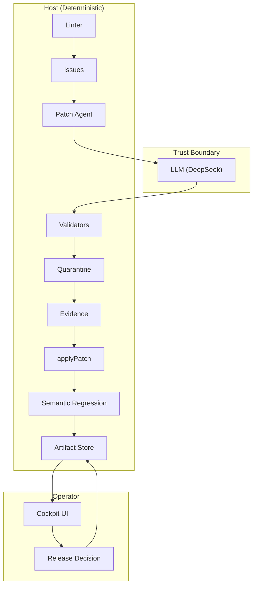
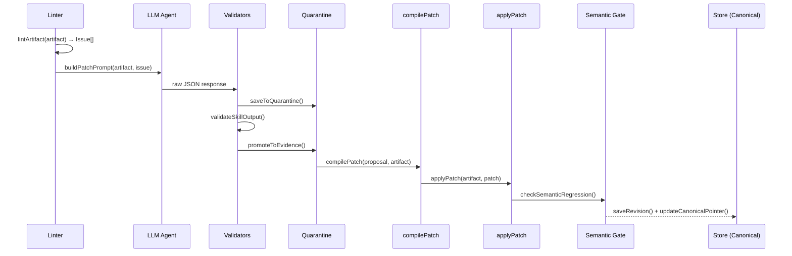
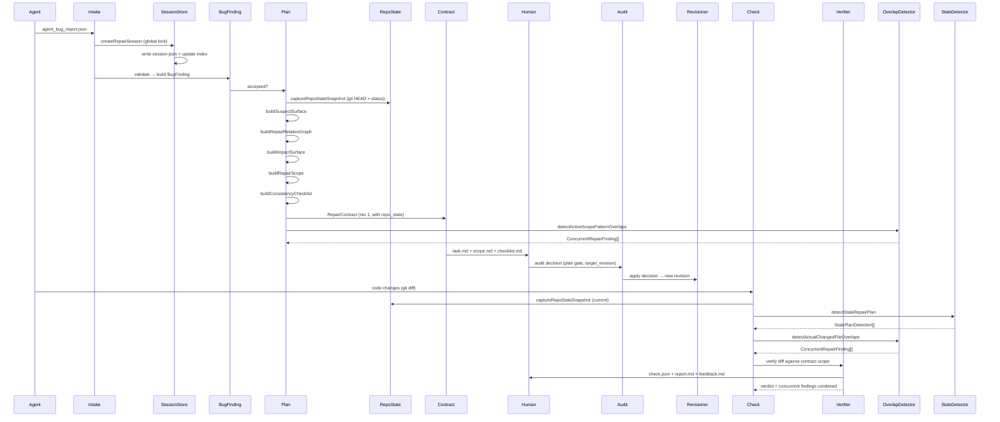

```mermaid
graph LR
    L1["Layer 1: Types"] --> L2["Layer 2: Hash"]
    L2 --> L3["Layer 3: Store"]
    L3 --> L4["Layer 4: Gates"]
    L4 --> L5["Layer 5: Pipeline"]
    L5 --> L6["Layer 6: Trial"]
    L6 --> L7["Layer 7: Cockpit"]
    L7 --> L8["Layer 8: Handoff"]
    L8 --> L9["Layer 9: Codegen"]
    L9 --> L10["Layer 10: Boundary"]
    L10 --> L11["Layer 11: Blast Radius"]
    L11 --> L12["Layer 12: Repo Observation"]
    L12 --> L13["Layer 13: Diff Workflow"]
    L13 --> L14["Layer 14: Agent Feedback"]
    L14 --> L15["Layer 15: Repair Protocol"]
    L15 --> L16["Layer 16: Repair Concurrency"]
```

# Pantheon — 系统架构文档

> **生成日期**: 2026-05-02 | **当前阶段**: P29.5 | **测试**: 2,125 Vitest | **源文件**: 244 (.ts) | **源 LoC**: ~51,500 | **测试文件**: 222 | **测试 LoC**: ~36,200 | **脚本**: 88 | **总 LoC**: ~103,500

---

## 1. 系统概述

Pantheon 是一个为 AI 编码代理设计的确定性修复治理系统。它不证明语义正确性，也不盲目执行任意模型输出。其核心职责是：

1. 观察仓库结构
2. 构建修复或边界合约
3. 约束代理编辑
4. 记录治理证据
5. 暴露人工审查和阻断状态
6. 将结果投射到 CLI、本地制品和 GitHub PR 工作流

**核心不变量**: LLM 输出永远不会直接修改规范状态。所有 LLM 输出进入隔离区，由宿主导出验证，并在晋升前通过确定性门禁。



---

## 2. 仓库布局

```text
pantheon/
  src/
    cli/                  Pantheon CLI 和 alpha 包装命令
    github/               GitHub Action 入口、解析器、渲染器、修复门禁
    alpha/                代理可安装的 alpha 治理工具（init, doctor, templates）
    repair/               修复摄入、计划、审计、范围、验证
    repair/session/       会话存储、修订、过期计划和重叠检查
    governance/           字段行为和门禁注册表
    governanceLog/        本地治理事件账本
    review/               本地人工审查队列和审查请求渲染
    metrics/              本地每日治理指标和报告
    repoObservation/      引导仓库扫描器和观测管线
    repoObservation/python/
                          Python 专项观测、分类、预设和映射（14 模块）
    repoObservation/typescript/
                          TypeScript 专项观测、分类、预设和映射（7 模块）
    changeContract/       确定性变更合约构建器和验证器
    changeContract/lite/  引导模式精简合约构建器和验证器
    diffWorkflow/         Diff 解析、代理范围精简生成、审查者报告
    scopeDiff/            范围 diff 验证和反向问题检测
    scopedHandoff/        范围化实现移交导出器和验证器
    handoff/              移交包投射和不确定性注册表
    agentFeedback/        代理反馈协议（违规映射、验证、渲染）
    agentTrial/           代理协议可用性试验（任务包、跨尝试比较）
    boundary/             边界映射图和爆炸半径引擎
    codegen/              确定性 Kotlin 代码生成
    cockpit/              面向操作员的发布和试验报告工具
    trial/                狗粮和实时试验工具
    contract/             活跃合约解析器
    policy/               合约门禁评估和策略加载
    trust/                PR 授权制品门禁和可信批准解析
    artifacts/            制品安全扫描器和公共策略
    i18n/                 双语术语表和本地化渲染
    demo/                 演示 fixtures 和示例
  test/                   Vitest 套件、fixtures、狗粮断言（216 文件）
  scripts/                阶段运行器、矩阵编排器、维护工具（88 脚本）
  docs/
    audit/                输入审计文档
    closed-alpha/         封闭 alpha 测试者和 GitHub 修复文档
    internal/             阶段报告、清单、关闭报告
    pantheon/             面向代理的本地治理文档
    phases/               历史阶段摘要
    reports/              语言主线治理就绪报告
  action/                 打包的 GitHub Action 运行时
  data/                   策划的基准和狗粮证据
  .pantheon/              本地生成的运行时状态（非真实来源）
  dist/                   生成的 CLI 构建输出
```

---

## 3. 架构分层（16 层）



### Layer 1 — 类型系统

| 文件 | 用途 | 关键导出 |
|---|---|---|
| `src/types.ts` | 核心数据模型 | `Artifact`, `CommitmentBlock`, `Issue`, `PatchProposal`, `CanonicalPointer`, `AuditEntry` |

**边界**: 纯类型，无逻辑，无导入。所有其他模块依赖此层。

### Layer 2 — 哈希与序列化

| 文件 | 用途 | 关键导出 |
|---|---|---|
| `src/deterministic.ts` | 统一 SHA-256 哈希体系 | `shortStableId()`, `stableHash()`, `stableHexDigest()`, `stableTextHash()` |
| `src/stableSerialize.ts` | 确定性 JSON 键排序 | `stableSerialize()` |
| `src/globMatch.ts` | 统一 glob 匹配 | `globToRegex()`, `matchesGlob()` |

**边界**: 仅依赖 Layer 1。所有哈希计算是确定性的：相同内容 → 相同哈希。

### Layer 3 — 存储

| 文件 | 用途 | 关键导出 |
|---|---|---|
| `src/artifactStore.ts` | 文件系统 JSON 存储 | `saveRevision()`, `loadRevision()`, `updateCanonicalPointer()`, `saveToQuarantine()`, `promoteToEvidence()` |
| `src/schemaRegistry.ts` | Zod schema 验证 | `validateForWrite()`, `validateForRead()`, `getCurrentVersion()` |

存储布局：
```
data/revisions/{artifact_id}/{revision_id}.json   # 不可变
data/canonical/{artifact_id}.json                  # 仅指针
data/quarantine/{filename}.json                    # 不可信 LLM 输出
data/evidence/{filename}.json                      # 已验证输出
data/audit/{artifact_id}.jsonl                     # 追加
```

### Layer 4 — 门禁（确定性验证）

| 文件 | 用途 | 关键导出 |
|---|---|---|
| `src/validators.ts` | 隔离区 → 证据门禁 | `validateSkillOutput()` |
| `src/linter.ts` | 单制品 lint 规则 | `lintArtifact()` |
| `src/crossArtifactLinter.ts` | 跨制品链接检查 | `crossLintArtifacts()` |
| `src/issuePrioritizer.ts` | 确定性 issue 排序 | `prioritizeIssues()` |
| `src/applyPatch.ts` | 补丁编译 + 应用 | `compilePatch()`, `applyPatch()` |
| `src/applyOverridePatch.ts` | 人工覆盖补丁 | `applyOverridePatch()` |
| `src/semanticRegression.ts` | 语义回归检测 | `checkSemanticRegression()` |
| `src/integrityCheck.ts` | 全存储完整性扫描 | `integrityCheck()` |
| `src/draftValidator.ts` | LLM 草稿结构门禁 | `validateDraft()` |

**边界**: 所有门禁是**确定性的**——无 LLM 调用。它们只读/比较，永远不写规范状态。

### Layer 5 — 管线与晋升

| 文件 | 用途 |
|---|---|
| `src/pipeline.ts` | 完整 lint→patch→apply→regress 管线 |
| `src/ideaToDraft.ts` | Idea → 隔离草稿 |
| `src/promoteDraft.ts` | 隔离 → 规范（唯一路径） |
| `src/renderMarkdown.ts` | 制品 → 人类可读 Markdown |

### Layer 6 — 试验基础设施

| 文件 | 用途 |
|---|---|
| `src/trial/llmClient.ts` | LLM 接口 |
| `src/trial/deepseekAdapter.ts` | DeepSeek HTTP 适配器（30s 超时） |
| `src/trial/llmPatchAgent.ts` | 补丁提示构建器 |
| `src/trial/draftAgent.ts` | 草稿生成提示 |
| `src/trial/trialRunner.ts` | 单制品试验循环 |
| `src/trial/multiArtifactTrialRunner.ts` | 多制品试验循环 |

**边界**: 唯一调用 LLM 的层。所有 LLM 输出在影响状态前通过 Layer 4 门禁。

### Layer 7 — Cockpit（操作员 UI）

| 文件 | 用途 |
|---|---|
| `src/cockpit/releaseServer.ts` | Fastify HTTP 服务器 |
| `src/cockpit/reportGenerator.ts` | 试验数据 → 报告（1s TTL 缓存） |
| `src/cockpit/backlogExport.ts` | 残留 → 待办导出 |
| `src/cockpit/decisionLog.ts` | 决策 JSONL 账本 |
| `src/cockpit/riskRegister.ts` | 风险 JSONL 账本 |

**边界**: 面向人类。所有决策需要操作员签名。

### Layer 8 — 移交投射（P11）

11 个文件，将规范制品投射为面向实现的移交包。所有结构内容（字段、枚举、状态）是确定性的——无 LLM 参与。源块溯源将每个条目链接回 P10 架构/接口/模块块。

### Layer 9 — 代码生成（P12/P13）

`src/codegen/kotlinGenerator.ts` — 从 `handoff_package.json` 确定性生成 Kotlin。无 LLM，无启发式，无推断。每个 `.kt` 文件带有包哈希的 `generated_from` 溯源头。

### Layer 10-11 — 边界图与爆炸半径（P14/P15）

| 文件 | 用途 |
|---|---|
| `src/boundary/boundaryTypes.ts` | 节点/边/图类型 |
| `src/boundary/boundaryGraph.ts` | 图构建器（185 节点, 1233 边, 6 层） |
| `src/boundary/boundaryGatesAndQueries.ts` | 6 个一致性门禁 + 查询 |
| `src/boundary/blastRadius.ts` | 爆炸半径引擎（确定性图遍历） |

6 个一致性门禁：接口-架构覆盖 / 实现-接口覆盖 / 模块-移交覆盖 / 移交-生成覆盖 / 风险+FA-测试覆盖 / 生成反向溯源。

### Layer 12 — 仓库观测（P20a/P25/P27/P28c）

`src/repoObservation/` 是边界和修复流程使用的引导扫描器。它对文件、导入、测试映射、敏感路径、包清单和质量元数据进行分类，无需预先存在的 Pantheon 制品。

Python 观测栈（`src/repoObservation/python/`，14 个模块）支持 P27/P27.5 基准证据，是 P28b Python 主线治理的主要依赖。覆盖：布局分类、框架检测、项目角色、依赖提取、导入观测、敏感区域检测、风险预设、测试映射、未知分类、治理渲染。

TypeScript/JS 观测栈（`src/repoObservation/typescript/`，7 个模块）镜像 Python 架构，覆盖：框架检测、项目分类、风险预设验证、支持度评估、测试映射。侧重 manifest/config/path 级观测，不含完整编译器 API 分析。与 Python 侧车在修复范围构建器中双轨共存。

### Layer 13-14 — Diff 工作流与代理反馈（P21/P22）

| 模块 | 职责 |
|---|---|
| `src/diffWorkflow/gitDiffReader.ts` | Git diff 解析（`execFileSync` 安全调用） |
| `src/diffWorkflow/agentScopeLiteBuilder.ts` | 合约 → 代理范围 + violation_hints |
| `src/diffWorkflow/diffVerifier.ts` | Diff 合规性检查 |
| `src/diffWorkflow/reviewerReportRenderer.ts` | 审查者报告渲染 |
| `src/agentFeedback/diffFeedbackBuilder.ts` | 验证 → 结构化反馈 |
| `src/agentFeedback/agentFeedbackValidator.ts` | Schema + 不变量检查 |
| `src/agentFeedback/agentFeedbackRenderer.ts` | 反馈 → Markdown |

**核心不变量**: 无反馈构建器解析自由格式的原因/错误/警告字符串。所有违规从结构化字段派生。

### Layer 15 — 修复协议（P28/P28c）

25 个文件，~2,850 LoC。完整修复生命周期：

```
AgentBugReport → BugFinding → Suspect Surface → Relation Graph
→ Impact Surface → 3-Bucket Scope → Consistency Checklist
→ RepairContract → Human Audit Gates → Contract Revision
→ Diff Verification → Verdict
```

3 桶范围：allowed / review_required / forbidden。优先级：forbidden > review > allowed。裁决纯基于桶，`audit_weight` 仅用于排序。

`buildRepairScope()` 支持双语言侧车共存——同时接收 `PythonObservationSidecar` 和 `TypeScriptObservationSidecar`，将两者的风险预设建议合并到 review/forbidden 桶中，确定性去重。

### Layer 16 — 修复并发（P29）

7 个文件，656 LoC。16 状态 FSM，两级文件锁（全局索引锁 + 每会话锁），范围重叠检测（计划时模式级 + 检查时文件级），过期计划检测。

锁原语：`openSync(path, "wx")` 排他创建，25ms 轮询，5s 超时。会话级制品隔离在 `runs/<repairId>/` 下。

---

## 4. 信任边界图

```
┌──────────────────────────────────────────────────────────┐
│                    UNTRUSTED (LLM)                        │
│  generatePatchProposal()    generateDraft()               │
│  Raw JSON string output                                   │
└────────────────────────┬─────────────────────────────────┘
                         │ raw string
                         ▼
┌──────────────────────────────────────────────────────────┐
│                QUARANTINE (Host Gate)                     │
│  validateSkillOutput()   validateDraft()                   │
│  JSON parse → schema check → structural check             │
│  Host recomputes: content_hash, revision_id               │
│  Host ignores: LLM-provided hashes, revision IDs          │
└────────────────────────┬─────────────────────────────────┘
                         │ validated object
                         ▼
┌──────────────────────────────────────────────────────────┐
│             DETERMINISTIC GATES (Host)                    │
│  compilePatch()  applyPatch()  checkSemanticRegression()  │
│  All checks are pure functions: same input → same output  │
└────────────────────────┬─────────────────────────────────┘
                         │ candidate revision
                         ▼
┌──────────────────────────────────────────────────────────┐
│               CANONICAL (Immutable Store)                 │
│  saveRevision()  updateCanonicalPointer()                 │
│  Revisions are write-once, never overwritten              │
│  Canonical pointer is the ONLY mutable reference          │
└──────────────────────────────────────────────────────────┘
```

---

## 5. 数据流图

### Patch Cycle



### 修复生命周期（P28 + P29）



---

## 6. 阶段历史

当前栈是分层阶段的成果，非一次构建：

| 阶段 | 目标 | 关键交付 | 状态 |
|---|---|---|---|
| P2–P7 | 基础治理 | Hash, store, schema, types, linter, pipeline, trial | ✅ Clean |
| P8 | Idea-to-Draft | DraftValidator, Draft Agent, promoteDraft | ✅ Clean |
| P9 | 草稿质量与领域对齐 | DomainProfile, Quality Evaluator (7 rules), A/B Trial | ✅ Clean |
| P10 | Pet Triage 离线迁移狗粮 | Migration prompt, A→I→M 制品族, release decision | ✅ Complete |
| P11 | 实现移交投射 | Handoff package (11 files), readiness evaluator | ✅ Complete |
| P12–P13 | 确定性代码生成 | Kotlin codegen (12 files), boundary contracts, compile PASS | ✅ Complete |
| P14 | 边界映射图 | 185 nodes, 1233 edges, 6 layers, 6 gates all PASS | ✅ Complete |
| P15 | 爆炸半径引擎 | 确定性遍历, 风险放大, 关键路径, markdown + JSON | ✅ Complete |
| P17 | 范围化实现边界协议 | ScopedHandoff, .pantheon/ + .cursor/ 协议 | ✅ Complete |
| P18 | Scope Diff 验证器 | 边界合规检查, reverse issue 检测, 4 scenarios | ✅ Complete |
| P18.1 | 治理加固 | Gate Registry (14 gates), E2E Dogfood Chain (8 stages) | ✅ Complete |
| P19 | 变更合约治理 | 7 lifecycle statuses, scope_hash, decision semantics | ✅ Complete |
| P19.1 | 合约产品闭环 | Validator embedded, Renderer deployed, JSON authoritative | ✅ Complete |
| P20a | 仓库观测 | 确定性扫描器, 引导管线, golden baseline | ✅ Complete |
| P21 | Diff-to-ChangeContract 工作流 | plan → scope → verify → report 管线 | ✅ Complete |
| P22 | 代理反馈协议 | 结构化违规, repair_plan, 4 retry modes | ✅ Complete |
| P23 | 代理协议可用性试验 | 真实 Claude Code 代理验证, feedback recovery | ✅ Complete |
| P24 | 公共 CLI 接口 | pantheon init/guard/check/feedback/report | ✅ Complete |
| P25a-h | Saleor 规模 Python 治理 | 8 个子阶段, 真实代理试验, 对抗套件 | ✅ Complete |
| P26 | GitHub PR 边界门禁 | 编译运行时, base-sha diff, PR comment, 托管验证 | ✅ Complete |
| P27/P27.5/P27.6 | Python 基准扩展 | Core 3 + 扩展 smoke pack (8-class), 冻结基线 | ✅ Complete |
| P28/P28.1/P28.2 | 修复协议 | 25 files, 3 repos × 18 cases dogfood | ✅ Complete |
| P29 | 多代理并发治理 | 16-state FSM, 2-tier locking, overlap detection | ✅ Complete |
| P26.5 | GitHub 修复门禁 | 修复会话的 GitHub PR 集成 | ✅ Complete |
| P28-0 | 本地治理表面 | governanceLog, review, metrics, cmdAlpha | ✅ Complete |
| **Phase BUG** | 核心信任与稳定化 | SHA-256 统一, FSM 强制, shell 注入修复, fail-closed | ✅ Complete |
| **Phase BUG-FULL** | 公共表面与产品就绪 | 110 issues → 83 fixed, 25 deferred, 0 critical open | ✅ Complete |
| **P28b** | Python 主线治理 | 50→150→400 repo sweep, 8 archetypes, 400/400 PASS | ✅ Complete |
| **P28c** | TypeScript/JS 主线治理 | 7 adapter modules, 400-repo sweep, 双 sidecar 共存 | ✅ Complete |
| **P29.5** | 合约强制门禁与防篡改 | 14 files, 5-stage gate pipeline, base-branch policy, trusted approval | ✅ Complete |

### 产品状态

```
完整治理模式 (Full Governance Mode):
  canonical artifacts → boundary graph → full ChangeContract → verification

引导模式 (Bootstrap Mode):
  repo scan → observations → ChangeContract Lite
  → agent scope → diff verification → structured agent feedback → reviewer report

修复治理模式 (Repair Governance Mode):
  agent bug report → BugFinding → suspect surface → relation graph
  → impact surface → repair scope → consistency checklist → repair contract
  → human audit → contract revision → diff verification → verdict

修复并发模式 (Repair Concurrency Mode):
  session lifecycle → 16-state FSM → per-run isolation
  → 2-tier file locking → scope overlap detection → stale-plan detection

Alpha 治理模式 (Alpha Harness Mode):
  pantheon-alpha init → doctor → repair/review/metrics
  → AGENTS.md + pantheon.agent.json + pantheon.alpha.json

语言主线治理模式 (Mainline Governance Mode):
  Python (14 modules) + TypeScript (7 modules) 双观测栈
  → 风险预设验证 → 修复范围构建（双 sidecar 共存）
  → 400 repo 矩阵 sweep → gap taxonomy → 就绪报告
```

---

## 7. 关键设计决策

1. **LLM 生成主体，宿主生成结构** — revision_id, content_hash, schema_version 始终由宿主计算
2. **隔离区优先** — 所有 LLM 输出进入隔离区；规范状态从不被 LLM 路径直接写入
3. **确定性门禁** — 验证/检查中无 LLM；相同输入始终产生相同结果
4. **不可变修订** — `saveRevision()` 在文件存在时抛出；canonical 是指针，非内容
5. **`promoteDraft()` 是 LLM 草稿的唯一规范入口** — 需要明确的操作员批准
6. **SHA-256 统一哈希** — `src/deterministic.ts` 提供 `shortStableId`/`stableHash`/`stableHexDigest`/`stableTextHash`
7. **Fail-closed 配置** — `pantheonConfig.ts` 在损坏时抛出异常，而非静默回退
8. **16 状态 FSM 强制** — `ALLOWED_SESSION_TRANSITIONS` 完整转换表，`validateNextSession()` 强制校验
9. **Shell 注入安全** — `execFileSync("git", [...args])` 参数数组化，全面替换 `execSync`
10. **路径包容** — `src/safePath.ts` 提供 `resolveTrustedPath`/`assertInsideRoot`/`sanitizeFileNameSegment`
11. **两级文件锁** — 外层全局索引锁，内层每会话锁；`openSync("wx")` 排他创建
12. **Bucket-based verdict, not audit_weight** — audit_weight 仅是咨询性排序；裁决由文件所属桶驱动
13. **Human audit is append-only** — 决策是独立 JSON 文件；合约通过 repairPlanRevisioner 重新派生
14. **Bootstrap Conservative only** — `evidence_level` 始终为 `"bootstrap_conservative"`；不承诺完整调用图
15. **Agent hypothesis → unverified_claims** — AgentBugReport 的 hypothesis 从不进入 confirmed_facts
16. **确定性 repair ID** — `createRepairSession()` 使用基于 report_id + finding_id + intent 的确定性 ID
17. **性能上限** — globToRegex cache (2000 entries), relation graph caps (8 siblings, 50/suggestion, 200/suspect)
18. **Index as denormalized cache** — `sessions.json` 从独立 `session.json` 文件派生；每运行 session.json 是权威的
19. **Atomic writes for crash safety** — 所有 session/index 写入使用 temp-then-rename 防止崩溃时部分写入

---

## 8. Bug 总账（摘要）

### 发现与修复趋势

```
P2–P7:    Gate bypass / structural integrity        (治理绕过)       — 5 bugs
P8–P11:   Protocol format / wiring gaps             (协议格式)       — 20 bugs
P14–P17:  Provenance chain / boundary mapping       (溯源链路)       — 9 bugs
P18:      Compliance validator / workflow sync       (合规校验)       — 5 bugs
P18.1:    E2E chain integrity / golden number drift  (回归防御)       — 4 bugs
P19a:     Lifecycle state machine / event semantics   (状态机纪律)     — 5 bugs
P19b:     Upstream binding / scope identity / risk     (上游绑定)      — 4 bugs
P19c:     Scope projection / per-file precision        (边界精度)      — 3 bugs
P19d:     Verification decision / obligation semantics (验证决策)      — 4 bugs
P19.1:    Validator lifecycle consistency / authority  (校验闭环)      — 2 bugs
P20a:     Observation unknown surfacing / scan limits  (观测诚实)      — 2 bugs
P22:      Freeform string parsing / structured facts   (结构化事实)    — 2 bugs
System:   External call defense / error handling       (外部防御)      — 4 bugs
P28:      Repair dogfood + test path conflicts         (修复狗粮)      — 4 bugs
Phase BUG-FULL: Public surface + security audit        (公共表面审计)  — 83 fixes + 25 deferred
```

**总计: 75 bugs 在阶段中发现并修复，0 escapes。Phase BUG-FULL 修复 83 条，推迟 25 条。**

完整 bug 细节见旧版 ARCHITECTURE.md (commit ca82c00) 和 `docs/audit/BUGS_AND_DEBT.md`。

---

## 9. 关键结果摘要

### P9 A/B 试验结果

| 指标 | v1 (no profile) | v2 (with profile) | Δ |
|---|---|---|---|
| Score | 0 | 97 | +97 |
| Concept coverage | 13% | 88% | +75pp |
| Recommendation | reject_draft | accept_as_seed | ↑ |

### P14 边界图结果

| 指标 | 值 |
|---|---|
| 节点 | 185 |
| 边 | 1233 |
| 层 | 6 (architecture, interface, module, handoff, generated, test) |
| 门禁 | 6/6 PASS |
| 关键孤儿节点 | 0 |

### P23 真实代理试验

| Trial | Prompt Type | Verdict | Violations |
|---|---|---|---|
| Trial A | Standard | **pass** | 0 |
| Trial B | Adversarial | **pass** | 0 |
| Recovery Attempt 1 | Synthetic violation | requires_reverse_issue | 2 |
| Recovery Attempt 2 | After feedback | **pass** | 0 (both reverted) |

### P25g 真实代理试验 (Saleor)

- **Claude Code 2.1.121** 收到 `.pantheon/task.md` 实现 eco-packaging fee
- 修改了 4 个文件，0 forbidden violations
- Agent 完美遵循了 3 层边界

### P28-2 修复狗粮

| 仓库 | 原型 | 已验证裁决 |
|---|---|---|
| httpx | SDK/library | pass / requires_review / fail / requires_scope_expansion |
| fastapi-realworld | API service | pass / requires_review / fail / requires_scope_expansion |
| Saleor | Django commerce | requires_review / review / fail / requires_scope_expansion |

关键发现：Saleor 商业后台产生**零 allowed 源文件** — 所有源代码被正确分类为 review_required 或 forbidden。

### P28b Python 主线治理（400 仓库）

| 子阶段 | 规模 | 结果 |
|---|---|---|
| P28b-1 Baseline | 50 repos | 通过率基准建立 |
| P28b-2 Repair Dogfood | 3 repos × 6 cases | 修复管线验证 |
| P28b-3 Validation | 150 repos | **PASS WITH DOCUMENTED VARIANCE (144/150)** |
| P28b-4 Full Sweep | 400 repos | **400/400 PASS** |

8 原型覆盖：django_commerce, fastapi_service, flask_framework, python_sdk_library, python_cli_tool, data_pipeline, ml_scientific, packaging, python_monorepo

### P28c TypeScript/JS 主线治理

| 组件 | 规模 |
|---|---|
| TS 观测适配器 | 7 模块（框架检测、项目分类、风险预设、支持评估、测试映射） |
| 双 sidecar 共存 | `buildRepairScope()` 同时接受 Python + TypeScript sidecar |
| 矩阵 sweep | 400 repos, 多原型覆盖 |

---

## 10. 生成状态 vs 真实来源

Pantheon 使用多个生成目录。它们的角色不同：

- `dist/` 是生成的构建输出
- `action/dist/` 是生成的 GitHub Action 打包输出
- `.pantheon/` 是修复会话、指标和审查的本地运行时状态
- `data/dogfood/` 是有意提交时的策划证据

权威源文件位于 `src/`、`test/`、`scripts/`、`docs/` 和 `data/` 下的选定提交证据。

索引文件永远不是最终真实来源：

- `.pantheon/repair/sessions.json` 是索引，非权威修复状态
- `.pantheon/reviews/review_queue.json` 是索引，非权威审查历史
- `repair_contract.latest.json` 仅是便利指针；修订版合约是权威的

---

## 11. 脚本与证据策略

脚本在 `docs/internal/script_status_inventory.md` 中分类为：

- `active` — 回归或狗粮证据生成的一部分
- `internal` — 内部维护工具
- `deprecated` — 已弃用但保留以供参考
- `historical` — 保留以供可重放性，不应用于当前封闭 alpha 入口

---

## 12. 安全基础设施（Phase BUG-FULL 新增）

| 模块 | 用途 |
|---|---|
| `src/deterministic.ts` | 统一 SHA-256 哈希体系 |
| `src/globMatch.ts` | 统一 glob 匹配（消除 3 份重复实现） |
| `src/safePath.ts` | 路径包容安全工具 |
| `src/repair/session/atomicWrite.ts` | 崩溃安全写入（temp-then-rename） |

核心修复：
1. **SHA-1 → SHA-256** — 全面迁移到统一哈希体系
2. **FSM 强制执行** — `ALLOWED_SESSION_TRANSITIONS` 完整转换表
3. **Shell 注入修复** — `execFileSync` 全面替换 `execSync`
4. **文件锁修复** — 只重试 EEXIST，两级锁顺序一致
5. **配置 fail-open → fail-closed** — 从静默回退改为抛异常
6. **确定性 ID** — scope_id / contract_id / feedback_id 全部基于内容哈希

---


---

## 13. 当前就绪声明

在 Phase BUG-FULL 结束时，Pantheon 已准备好用于：

- 封闭 alpha 本地代理使用
- 封闭 alpha GitHub 修复门禁测试
- 确定性修复会话治理
- 本地审查队列和指标工作流

Pantheon 尚未声称：

- 任意外部仓库一键式接入
- 云托管仪表板
- 补丁的语义正确性证明
- 超出已记录证据的语言主线就绪

**P29.5 就绪裁决: cleared。**

此文档之后的下一个就绪门禁将建立在严格的合约门禁和信任模型（P29.5）之上，保证高风险变更始终受到合约约束或得到代码库核心维护者的审查。

---

## 14. P29.5 — Contract Required Gate & Policy Tamper Protection（已完成）

**当前阶段**: P29.5 — Closeout (Local + Hosted Enforcement Validated)

**设计文档**: [`docs/phases/p29-5-contract-required-gate.md`](docs/phases/p29-5-contract-required-gate.md)

### P29.5 阶段概览

系统现已由**代理配合模式**正式转入**严格强制门禁模式 (Enforcement-First Model)**。
高风险文件变更现在强制要求以下二者之一，否则拦截并报错：
1. 拥有**有效且无篡改**的修复/变更合约 (Contract)
2. 获得当前代码库**可信维护者**的人工审查批准 (Trusted Approval)

### 核心实现组件 (14 Modules)

- **Gate Orchestrator**: `contractGateEvaluator.ts` 实现了 5 阶段管线（策略加载、防篡改、工件拦截、合约验证、可信批准）。
- **Risk-Based Policy**: `contractRequirementPolicy.ts` 基于 Diff 风险进行分类，并能正确处理 Low-Risk Bypass。
- **Tamper Protection**: `baseBranchPolicyLoader.ts` 确保门禁规则始终来自 Base Branch，防止 PR 中篡改策略；`prAuthoredArtifactGuard.ts` 与 `policyTamperDetector.ts` 拒绝由 PR 伪造的审批工件或配置文件。
- **GitHub Trust Integration**: `trustedApprovalResolver.ts` 利用 GitHub API 判定审查者权限及 Label 标签的有效性。

### 测试矩阵与验证

| 测试类别 | 覆盖范围 | 结果 |
|---|---|---|
| 单元测试 | 策略篡改、风险分级、审批校验、PR评论生成 | 93/93 PASS |
| Dogfood Matrix | 14 Case 本地决策引擎 (覆盖 fake approval/tamper/bypass) | PASS |
| Hosted Validation | 远程 Action 执行（私有 `test` 仓库 3 个 PR 现场拦截验证） | PASS |

**结论**: Local + hosted enforcement validated.

---

*此文档合并了旧版 ARCHITECTURE.md (ca82c00, 2440 lines) 的深度与 Phase BUG-FULL 后的准确性。完整机器可读处置见 `data/audit/phase_bug_full_issue_index.json`。Phase BUG-FULL 关闭报告见 `docs/internal/phase_bug_full_closure_report.md`。*


