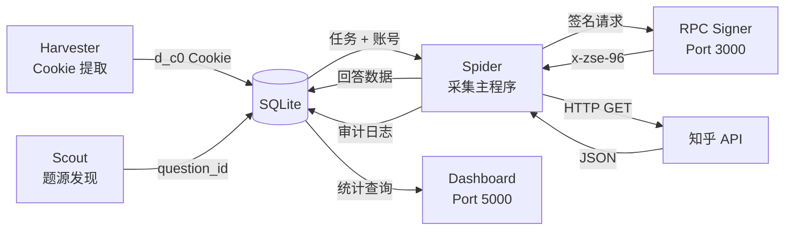

# 01 · 系统架构总览

## 1.1 系统定位

本系统是一套面向知乎平台的 **RPC 签名驱动型数据采集平台**。核心设计目标：

- **可回放**：任何失败都有审计记录 (`task_attempts`)，可按版本、账号、错误类追溯
- **可补数**：任何缺口都有记录 (`replay_gaps`)，不静默丢数
- **可解释**：8 类错误精确归因，账号/签名器/网络分层处罚

---

## 1.2 架构全景

```
┌───────────────────────────────────────────────────────────────────────┐
│                        Operator / Dashboard                          │
│                    http://127.0.0.1:5000 (Flask)                     │
└───────────────────────┬───────────────────────────────────────────────┘
                        │ SSE + REST API
                        ▼
┌──────────────┐   ┌──────────────┐   ┌──────────────────────────────┐
│  Scout       │   │  Spider      │   │  Harvester                   │
│  (scout.py)  │──▶│  (spider.py) │   │  (harvester.py)              │
│  题源发现     │   │  采集主程序   │   │  Cookie 提取器               │
└──────┬───────┘   └──────┬───────┘   └──────────────┬───────────────┘
       │                  │                           │
       │ Search API       │ Answer API                │ Login + Extract
       │ + 签名           │ + 签名                    │ (Playwright)
       ▼                  ▼                           │
┌──────────────────────────────┐                      │
│  RPC Signer                  │                      │
│  (rpc_server.js)             │                      │
│  Node.js + Playwright        │                      │
│  Port 3000                   │                      │
│  __g._encrypt Hook           │                      │
└──────────────────────────────┘                      │
                                                      │
       ┌──────────────────────────────────────────────┘
       ▼
┌──────────────────────────────────────────────────────────────────────┐
│                       SQLite Database                                 │
│                    bot_database.db (WAL mode)                         │
│                                                                       │
│  ┌─────────────┐ ┌──────────────┐ ┌────────────┐ ┌──────────────┐   │
│  │question_tasks│ │task_attempts │ │replay_gaps │ │  accounts    │   │
│  │(状态机)      │ │(审计表)      │ │(缺口队列)  │ │(账号池)      │   │
│  └─────────────┘ └──────────────┘ └────────────┘ └──────────────┘   │
│  ┌─────────────┐                                                     │
│  │ raw_answers │                                                     │
│  │(原始回答)    │                                                     │
│  └─────────────┘                                                     │
└──────────────────────────────────────────────────────────────────────┘
```

---

## 1.3 数据流



---

## 1.4 模块职责矩阵

| 模块 | 语言 | 进程 | 职责 | 依赖 |
|---|---|---|---|---|
| `rpc_server.js` | Node.js | 独立进程 (port 3000) | 知乎 `x-zse-96` 签名计算 | Playwright, Express |
| `spider.py` | Python | 主进程 (5 Worker 线程) | 任务调度、数据采集、审计、告警 | requests, sqlite3 |
| `scout.py` | Python | 一次性脚本 | 搜索 API 发现高价值问题 | requests |
| `harvester.py` | Python | 交互式脚本 | 浏览器登录提取账号 Cookie | Playwright, pyotp |
| `dashboard.py` | Python | 独立进程 (port 5000) | 实时监控 Web UI | Flask |
| `init_assets.py` | Python | 一次性脚本 | 数据库初始化/迁移 | sqlite3 |

---

## 1.5 技术栈

| 层 | 技术 |
|---|---|
| **签名引擎** | Node.js 20+ / Playwright (Chromium headless) |
| **采集引擎** | Python 3.10+ / requests / concurrent.futures |
| **数据存储** | SQLite 3 (WAL mode, busy_timeout=5000) |
| **监控面板** | Flask / SSE / 原生 HTML+CSS+JS |
| **Cookie 提取** | Playwright (有头模式) / playwright-stealth / pyotp |

---

## 1.6 文件树

```
zhihu/
├── rpc_server.js      # RPC 签名工厂
├── spider.py          # 爬虫主程序（状态机 + Worker + 审计）
├── scout.py           # 侦察兵 — 题源发现
├── harvester.py       # Cookie 提取器
├── dashboard.py       # 实时监控仪表盘
├── init_assets.py     # 数据库初始化与迁移
├── package.json       # Node.js 依赖声明
├── bot_database.db    # SQLite 数据库
├── node_signer.log    # Signer 运行日志
├── docs/              # 架构文档（本目录）
└── node_modules/      # Node.js 依赖
```
