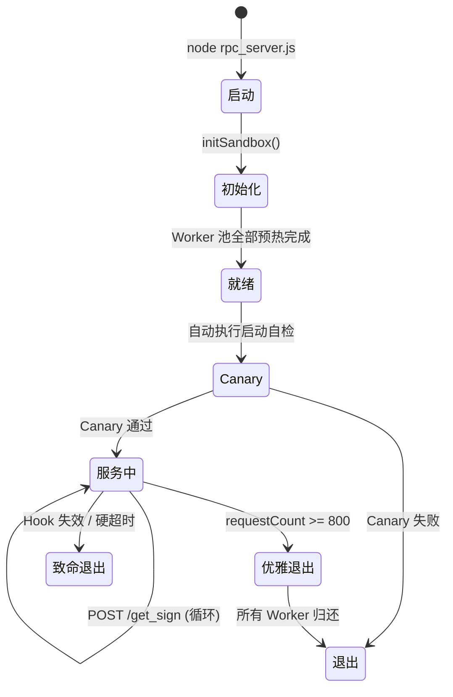

# 02 · RPC 签名工厂 (`rpc_server.js`)

## 2.1 模块概述

RPC Signer 是整个系统的密码学核心。它通过 Playwright 启动 headless Chromium，加载知乎前端 JS bundle，hook 其内部加密模块 `__g._encrypt`（SM4 算法），对外提供 HTTP API 计算 `x-zse-96` 签名。

**源文件**: `rpc_server.js` (385 行)  
**运行端口**: `3000`  
**依赖**: Express 5.x, Playwright 1.59+

---

## 2.2 架构设计

```
┌─ Express HTTP Server (:3000) ─────────────────────────────┐
│                                                            │
│  POST /get_sign ──▶ taskQueue ──▶ processQueue()           │
│  GET  /health   ──▶ 即时返回状态                            │
│  GET  /canary   ──▶ 执行真实签名验活                        │
│                                                            │
│  ┌─ Worker Pool (CONCURRENCY=2) ──────────────────────┐    │
│  │  Worker 0: [BrowserContext → Page → __g Hook]      │    │
│  │  Worker 1: [BrowserContext → Page → __g Hook]      │    │
│  └────────────────────────────────────────────────────┘    │
│                                                            │
│  ┌─ Lifecycle ────────────────────────────────────────┐    │
│  │  MAX_REQUESTS = 800 → 优雅退出 → spider 重启       │    │
│  └────────────────────────────────────────────────────┘    │
└────────────────────────────────────────────────────────────┘
```

---

## 2.3 签名算法

知乎反爬签名协议 `x-zse-96` 的计算链路：

```
输入: API path (如 "/api/v4/questions/123/answers?limit=20&offset=0")
      d_c0 Cookie (用户身份)

步骤:
  1. zse93 = "101_3_3.0"        // appId=101, encryptor=3, version=3.0
  2. path  = pathname + search  // 从完整 URL 提取
  3. source = "101_3_3.0+{path}+{dc0}"
  4. md5hex = MD5(source)       // 32 位十六进制
  5. encrypted = __g._encrypt(encodeURIComponent(md5hex))  // SM4
  6. signature = "2.0_" + encrypted

输出: x-zse-96 = signature
```

---

## 2.4 Hook 机制

系统通过 Playwright 的 `page.route()` 拦截知乎 JS bundle：

```javascript
// 匹配 .app.{hash}.js 格式的 JS 文件
if (/\.app\.[a-f0-9]+\.js/i.test(url)) {
    // 在包含 __g._encrypt 的 JS 中注入 window 暴露
    // 模式 1: 逗号分隔 var 列表  ", __g={"  → ", __g=window.__g={"
    // 模式 2: 独立声明             "var __g=" → "var __g=window.__g="
}
```

同时拦截 HTML 清除 SRI `integrity` 和 CSP 头，确保修改后的 JS 能正常加载。

---

## 2.5 HTTP API

### `POST /get_sign`

签名计算端点。

**请求**:
```json
{
  "url": "/api/v4/questions/123/answers?limit=20&offset=0",
  "dc0": "用户的 d_c0 Cookie 值"
}
```

**响应 (200)**:
```json
{
  "signature": "2.0_ePThqCh4CnklYm0K..."
}
```

**错误响应**:
| 状态码 | 含义 |
|---|---|
| `400` | 参数缺失或类型错误 |
| `500` | 签名计算失败（Hook 未生效 / 超时） |
| `503` | 节点正在回收 或 队列满载（>500） |

---

### `GET /health`

健康检查端点。

**响应 (200)**:
```json
{
  "ok": true,
  "ready": true,
  "availableWorkers": 2,
  "queueDepth": 0,
  "totalResolved": 42,
  "ttlLimit": 800,
  "signer_version": "browser_hook_v16",
  "last_canary_ok": 1776497292
}
```

| 字段 | 类型 | 说明 |
|---|---|---|
| `ok` | bool | `false` 表示正在关闭 |
| `ready` | bool | 所有 Worker 是否初始化完成 |
| `availableWorkers` | int | 当前空闲 Worker 数 |
| `queueDepth` | int | 排队中的签名请求数 |
| `totalResolved` | int | 已完成的签名总数 |
| `ttlLimit` | int | TTL 上限（到达后自动退出） |
| `signer_version` | string | 签名驱动版本标识 |
| `last_canary_ok` | int | 上次 Canary 验活成功的 Unix 时间戳 |

---

### `GET /canary`

Canary 验活端点。用一个已知 URL 执行真实签名，验证 Hook 是否正常工作。

**响应 (成功)**:
```json
{
  "ok": true,
  "signature": "2.0_xxxx...",
  "latency_ms": 128,
  "signer_version": "browser_hook_v16"
}
```

**响应 (失败)**:
```json
{
  "ok": false,
  "error": "canary timeout",
  "latency_ms": 10001,
  "signer_version": "browser_hook_v16"
}
```

---

## 2.6 生命周期



---

## 2.7 配置项

| 常量 | 默认值 | 说明 |
|---|---|---|
| `CONCURRENCY` | `2` | Worker 并发池大小 |
| `MAX_REQUESTS_BEFORE_DEATH` | `800` | 签名 TTL 上限 |
| `EVALUATE_TIMEOUT_MS` | `15000` | 单次签名超时(ms) |
| `SIGNER_VERSION` | `"browser_hook_v16"` | 版本标识，写入审计表 |
