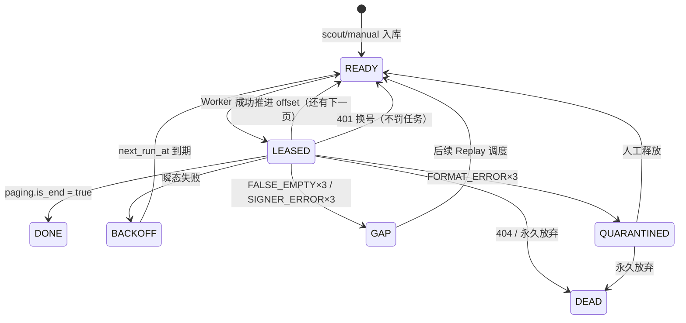

# 03 · 爬虫主程序 (`spider.py`)

## 3.1 模块概述

Spider 是系统的核心执行引擎。它从 `question_tasks` 表中按优先级领取任务，通过 RPC Signer 获取签名后请求知乎 API，将回答数据写入 `raw_answers`，并将每次请求的完整审计信息记录到 `task_attempts`。

**源文件**: `spider.py` (932 行)  
**运行方式**: `python spider.py`  
**内部线程**: Worker×5 + Maintenance×1 + Dashboard×1

---

## 3.2 核心类

### `NodeSupervisor`

管理 RPC Signer (`rpc_server.js`) 的生命周期。

| 方法 | 说明 |
|---|---|
| `__init__()` | 清理孤儿进程 → 启动 Signer → 启动 watchdog 线程 |
| `_start()` | 执行 `node rpc_server.js`，stderr 重定向到 `node_signer.log` |
| `kill_all()` | `taskkill /F /T` 终止进程树 |
| `run_canary()` | 调用 `/canary` 验活，返回 `bool` |
| `_watchdog_loop()` | 每 5s 健康检查；连续 3 次失败重启；每 10 分钟 canary 验活 |

**关键属性**:

| 属性 | 类型 | 说明 |
|---|---|---|
| `is_ready` | bool | Worker 是否可以开始签名请求 |
| `signer_version` | str | 当前签名驱动版本 |
| `last_canary_ok` | int | 上次 canary 成功的 Unix 时间戳 |
| `restart_count` | int | 累计重启次数（>8 则 Fail Fast） |

---

### `AccountManager`

账号资源池管理器。

| 方法 | 签名 | 说明 |
|---|---|---|
| `lock_and_get_weapon()` | `→ str \| None` | 从高信任分账号池中加权随机选取一个可用账号，设置 `is_in_use=1` |
| `release_weapon(dc0)` | `→ None` | 释放账号锁, 设置 `is_in_use=0` |
| `report_damage(dc0, error_class)` | `→ None` | 按错误分类精确处罚账号 (详见 [08_error_taxonomy](08_error_taxonomy.md)) |
| `_rescue_cooldowns()` | `→ None` | 将 `cooldown_until < now` 的账号恢复为 ACTIVE |
| `_clear_dead_locks()` | `→ None` | 将 `is_in_use=1 超过 300s` 的账号强制释放 |

**账号选取 SQL**:
```sql
SELECT dc0 FROM (
    SELECT dc0, trust_score FROM accounts
    WHERE status = 'ACTIVE' AND is_in_use = 0 AND cooldown_until < ?
    ORDER BY trust_score DESC LIMIT 10
) ORDER BY RANDOM() LIMIT 1
```

---

### `TaskManager`

任务状态机调度器。

| 方法 | 签名 | 说明 |
|---|---|---|
| `lock_and_get_target(worker_id)` | `→ dict \| None` | 按优先级从 READY/BACKOFF 队列中租出任务 |
| `transition_state(qid, state, **kw)` | `→ None` | 统一状态流转入口 |
| `record_attempt(...)` | `→ int` | 写入 `task_attempts` 审计表，返回 attempt_id |
| `create_gap(qid, offset, reason, aid)` | `→ None` | 写入 `replay_gaps` 缺口记录 |
| `save_raw_answers(qid, answers)` | `→ None` | 批量保存回答数据到 `raw_answers` |
| `get_remaining_count()` | `→ int` | 返回未完成任务数 |
| `_recover_stale_leases()` | `→ None` | 启动时清理过期租约 |

**任务选取 SQL**:
```sql
SELECT question_id, current_offset, retry_count, attempt_count
FROM question_tasks
WHERE state IN ('READY')
   OR (state = 'BACKOFF' AND next_run_at <= ?)
ORDER BY priority DESC, retry_count ASC, RANDOM()
LIMIT 1
```

---

## 3.3 任务状态机



| 状态 | 含义 | 可生存时间 |
|---|---|---|
| `READY` | 待采，可被 Worker 租出 | 无限 |
| `LEASED` | 已被某 Worker 租出 | `LEASE_TIMEOUT_SEC` (300s) |
| `BACKOFF` | 暂时失败，等待退避到期 | `next_run_at` |
| `GAP` | 缺口，需要回补 | 混入低优先级队列 |
| `DONE` | 确认完成 | 永久 |
| `QUARANTINED` | 异常，需人工审查 | 等待手动释放 |
| `DEAD` | 明确放弃 | 永久 |

---

## 3.4 Worker 循环

```
while True:
    ① 等待 Signer ready
    ② lock_and_get_target(worker_id) → task
    ③ lock_and_get_weapon() → dc0
    ④ POST /get_sign → signature
    ⑤ GET zhihu API (headers: x-zse-93 + x-zse-96 + d_c0)
    ⑥ 分类响应:
       - 200 + data → 保存回答 → transition_state(READY/DONE)
       - 200 + data=[] + is_end=false → FALSE_EMPTY 三级退避
       - 200 + 非 JSON → CAPTCHA_HTML 处理
       - 401 → 账号 DEAD，任务回 READY
       - 403/429 → 账号冷却，任务 BACKOFF
       - 404 → 任务 DEAD
    ⑦ record_attempt() → 审计落盘
```

---

## 3.5 后台线程

### Maintenance Thread (每 30 秒)
- 账号冷却恢复 (`COOLDOWN → ACTIVE`)
- 账号死锁清理 (`is_in_use=1 超过 300s → 释放`)
- 租约超时回收 (`LEASED + lease_until < now → READY`)

### Dashboard Thread (每 10 秒)
- 终端打印请求统计、状态分布、账号余量

---

## 3.6 配置项

| 常量 | 默认值 | 说明 |
|---|---|---|
| `CONCURRENCY` | `5` | Worker 线程数 |
| `LEASE_TIMEOUT_SEC` | `300` | 任务租约超时(秒) |
| `GAP_THRESHOLD` | `3` | 连续失败转 GAP 的阈值 |
| `SIGNER_VERSION` | `"browser_hook_v16"` | 签名版本标识 |
| `RPC_SERVER` | `"http://127.0.0.1:3000"` | Signer 地址 |
| `TUNNEL_PROXY_URL` | `None` | 隧道代理（留空不用） |
