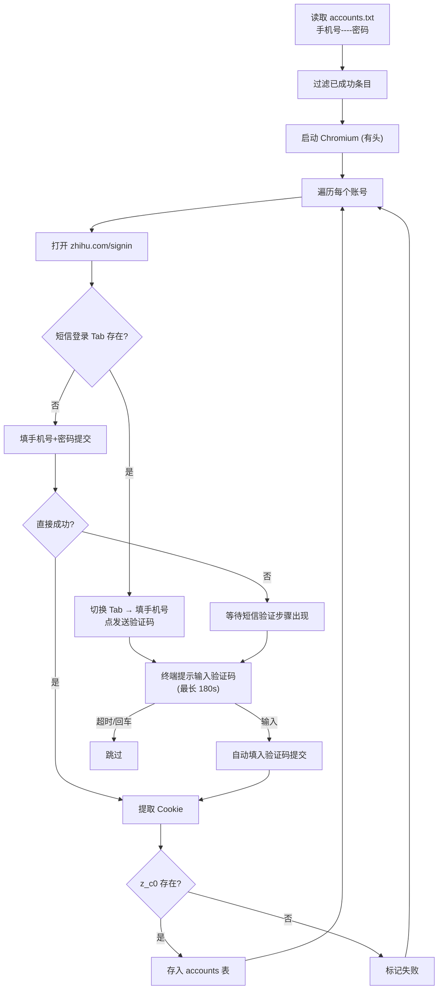

# 05 · Cookie 提取器 (`harvester.py`)

## 5.1 模块概述

Harvester 是账号 Cookie 批量提取工具。它使用 Playwright **有头模式** 打开知乎登录页，自动填入账号密码，支持 2FA 动态口令自动填写和手动验证码介入，登录成功后提取 `d_c0` / `z_c0` Cookie 并存入数据库。

**源文件**: `harvester.py` (171 行)  
**运行方式**: `python harvester.py`（交互式，需操作员在场）  
**依赖**: Playwright (有头), playwright-stealth, pyotp

---

## 5.2 登录流程



---

## 5.3 输入格式

`accounts.txt`（每行一个账号）：
```
手机号----密码
手机号----密码
```

分隔符: `----`（四个减号）。不再需要 2FA 密钥字段。

---

## 5.4 反检测措施

| 措施 | 实现 |
|---|---|
| 浏览器指纹抹除 | `playwright-stealth` 注入 |
| 自动化标头移除 | `--disable-blink-features=AutomationControlled` |
| 真实 User-Agent | Chrome/120 UA 字符串 |
| 真实视口 | 1280×800 |
| 换号冷却 | 每个账号之间 `sleep(3)` |

---

## 5.5 核心函数

| 函数 | 签名 | 说明 |
|---|---|---|
| `extract_cookies(page)` | `→ (str, bool)` | 提取所有 Cookie 并检查 z_c0 是否存在 |
| `save_to_db(cookie_str)` | `→ None` | 将完整 Cookie 字符串写入 accounts 表 |
| `mark_success(line)` | `→ None` | 写入 success.txt 实现断点续传 |
| `read_accounts()` | `→ list` | 读取 accounts.txt 并剔除已成功的 |
| `run_harvester()` | `→ None` | 主函数 |

---

## 5.6 数据输出

```sql
INSERT OR IGNORE INTO accounts (dc0, status, trust_score)
VALUES (?, 'ACTIVE', 100)
```

> **注意**: Harvester 目前将完整 Cookie 字符串存入 `dc0` 字段。Spider 使用时仅提取其中的 `d_c0` 值。

---

## 5.7 文件交互

| 文件 | 读/写 | 说明 |
|---|---|---|
| `accounts.txt` | 读 | 待处理账号列表 |
| `success.txt` | 读写 | 已成功提取的账号（断点续传） |
| `bot_database.db` | 写 | accounts 表 |
