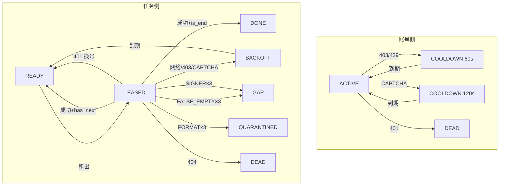

# 08 · 错误分类与响应策略

## 8.1 设计原则

1. **分层处罚**：区分"账号问题"和"任务问题"和"基础设施问题"
2. **不误杀**：网络抖动不罚账号；401 不罚任务
3. **不漏罚**：持续失败的任务有 retry_count 上限，不会无限循环
4. **可归因**：每次失败都写入 `task_attempts` 审计表

---

## 8.2 错误分类表

| Error Class | 触发条件 | 含义 |
|---|---|---|
| `TRANSIENT_NETWORK` | `requests.RequestException` (超时/DNS/连接被拒) | 网络瞬态故障 |
| `HTTP_403_429` | HTTP 状态码 403 或 429 | 频率限制 / IP 级风控 |
| `HTTP_401` | HTTP 状态码 401 | 账号身份过期或无效 |
| `CAPTCHA_HTML` | HTTP 200 但响应体是 HTML（含验证码/挑战页） | 被要求人机验证 |
| `FORMAT_ERROR` | HTTP 200 但 JSON 结构不符合预期 | API 结构变更或数据异常 |
| `SIGNER_ERROR` | RPC Signer 返回非 200 / 签名为空 / 签名请求超时 | 签名工厂故障 |
| `FALSE_EMPTY` | HTTP 200, `data=[]`, 但 `paging.is_end=false` | 假空页（已知知乎反爬手段） |
| `PERMANENT_404` | HTTP 状态码 404 | 问题被删除或不存在 |

---

## 8.3 响应策略矩阵

| Error Class | 罚账号 | 账号处罚方式 | 罚任务 | 任务状态变更 |
|---|---|---|---|---|
| `TRANSIENT_NETWORK` | ❌ | — | ✅ | `BACKOFF` 30s |
| `HTTP_403_429` | ✅ | 冷却 60s, ban_score+20 | ✅ | `BACKOFF` 60s |
| `HTTP_401` | ✅ | **status=DEAD** | ❌ | `READY` (换号重试) |
| `CAPTCHA_HTML` | ✅ | 冷却 120s, ban_score+30 | ✅ | `BACKOFF` 120s |
| `FORMAT_ERROR` | ❌ | — | ✅ | retry_count+1, ×3→`QUARANTINED` |
| `SIGNER_ERROR` | ❌ | — | ✅ | retry_count+1, ×3→`GAP` |
| `FALSE_EMPTY` | ⚠️ | 冷却 60s | ✅ | 三级退避 (见下) |
| `PERMANENT_404` | ❌ | — | ✅ | `DEAD` |

---

## 8.4 FALSE_EMPTY 三级退避

假空页是知乎常见的反爬手段：返回 200 + 空列表 + `is_end=false`。

```
第 1 次：BACKOFF 5 分钟（retry_count=1）
第 2 次：BACKOFF 30 分钟（retry_count=2）
第 3 次：创建 replay_gap → 任务状态 GAP
```

每级退避同时对当前账号冷却 60 秒（怀疑账号级别的问题）。

---

## 8.5 账号信任分 (trust_score)

| 事件 | 分值变化 |
|---|---|
| 初始 | 100 |
| `HTTP_403_429` | ban_score +20, trust_score = 100 - ban_score |
| `CAPTCHA_HTML` | ban_score +30, trust_score = 100 - ban_score |
| `HTTP_401` | → **status = DEAD** (无论 trust_score) |
| trust_score ≤ 0 | → **status = DEAD** |

> trust_score 影响选取优先级：越高越容易被选中（前 10 名随机取 1）。

---

## 8.6 状态流转总结图


